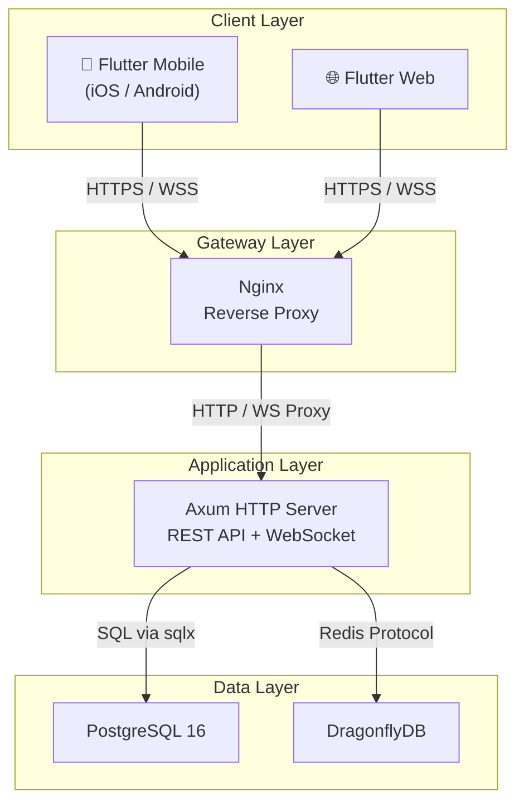

🇬🇧 **English** | 🇻🇳 [Tiếng Việt](README.vi.md)


# SmartMath Kids

SmartMath Kids is an interactive math learning platform designed for children aged 4 to 18. The platform combines adaptive learning techniques with real-time competitive elements and gamification to provide an engaging educational experience. It is a production-ready solution featuring a high-performance Rust backend and a cross-platform Flutter frontend, supported by robust data persistence and caching layers.

## Project Overview

SmartMath Kids is built to scale and provide a seamless learning journey:
- **Interactive Learning**: Combines adaptive practice, real-time competition, and progress tracking.
- **Engagement**: High focus on gamification with levels, achievements, and unlockables.
- **Performance**: Powered by a Rust backend using Axum for high concurrency and a responsive Flutter frontend.
- **Reliability**: Uses PostgreSQL for relational data and DragonflyDB for high-speed caching and real-time features.

## Features List

- 🧮 Adaptive Practice — AI-driven question generation with difficulty scaling
- ⚔️ Real-Time Competition — WebSocket-powered head-to-head math battles
- 📊 Progress Tracking — Accuracy charts, speed metrics, skill breakdowns
- 🏆 Gamification — XP/Level system, achievements, combo multipliers, unlockable themes
- 👨‍👩‍👧 Parental Oversight — Parent dashboard with child progress monitoring and goal setting
- 💡 Learning Tips — Animated tutorials with fast calculation tricks
- 🏅 Leaderboards — Daily, weekly, all-time rankings with pagination

## Tech Stack

| Layer | Technology | Version |
|---|---|---|
| Backend | Rust + Axum | 1.88 / 0.8 |
| Database | PostgreSQL | 16 |
| Cache | DragonflyDB | Latest |
| Frontend | Flutter | 3.29.3 |
| State Mgmt | Riverpod + Freezed | 2.x |
| CI/CD | GitHub Actions | — |
| Container | Docker + Compose | — |

## Architecture Summary

The system follows a 4-layer architecture (Client → Gateway → App → Data) to ensure separation of concerns and scalability. The backend implements the Clean Architecture pattern, decoupling business logic from external frameworks and data sources.

[Full Architecture Document](docs/architecture.md)



## Quick Start / Development Setup

### Prerequisites
- Rust 1.88+
- Flutter 3.29+
- Docker & Docker Compose

### Setup Steps
1. **Clone the repository**:
   ```bash
   git clone https://github.com/smartmath/smart-brain-vn.git
   cd smart-brain-vn
   ```
2. **Environment Configuration**:
   Copy `.env.example` to `.env` and update necessary variables.
3. **Infrastructure**:
   Start the database and cache services:
   ```bash
   docker compose up -d postgres dragonfly
   ```
4. **Run Backend**:
   ```bash
   cd backend
   cargo run
   ```
5. **Run Frontend**:
   ```bash
   cd frontend
   flutter run
   ```

**Access Points**:
- Backend: `http://localhost:3000`
- Frontend: `http://localhost:8080`

## Docker Usage

The project includes a full Docker Compose configuration for both development and production-like environments.

- **Full Stack Deployment**: `docker compose up -d`
- **Infrastructure Only**: `docker compose up -d postgres dragonfly`
- **Check Logs**: `docker compose logs -f backend`
- **Cleanup**: `docker compose down -v`

**Service Ports**:
- PostgreSQL: `5432`
- DragonflyDB: `6379`
- Backend: `3000`
- Frontend: `8080`

## API Documentation

The SmartMath Kids API provides a robust set of features for learning and competition.

- **REST API**: 24 endpoints across 11 modules covering authentication, practice, competition, and user management.
- **WebSocket**: Real-time competition events and notifications at `/api/v1/ws`.
- **Swagger UI**: Interactive API documentation is available at `/docs/backend-apis` when the server is running.

**Related Documentation**:
- [API Reference](docs/api.md) — Full endpoint documentation with examples.
- [Database Schema](docs/database.md) — ER diagram and table descriptions.
- [Architecture](docs/architecture.md) — System design and patterns.

## Documentation Links

| Document | Description |
|---|---|
| [API Reference](docs/api.md) | REST endpoints, auth flow, request/response examples |
| [Database Schema](docs/database.md) | ER diagram, 16 tables, indexes, seed data |
| [Development Guide](docs/development.md) | Environment setup, conventions, branching |
| [Deployment Guide](docs/deployment.md) | Docker build, env vars, scaling strategy |
| [Architecture](docs/architecture.md) | System design, Clean Architecture, data flow |

## Demo

### App Walkthrough


### Screenshots


> Screenshots and demo GIFs will be added once the UI is finalized.

## Usage Walkthrough

1. **Registration**: Register a student account via `POST /api/v1/auth/register`.
2. **Authentication**: Login to obtain JWT tokens for subsequent requests.
3. **Practice**: Start an adaptive practice session using `GET /practice/questions`.
4. **Progress**: Submit answers via `POST /practice/submit` to earn XP and update skill metrics.
5. **Monitoring**: View performance summaries and charts at `GET /progress/summary`.
6. **Social**: Compete with others and check your rank via `GET /leaderboard`.
7. **Parental Controls**: Parents can link and monitor child accounts via `GET /parent/children`.

## Project Structure

```
smart-brain-vn/
├── backend/               # Rust API server
│   ├── src/
│   │   ├── handlers/      # Route handlers
│   │   ├── services/      # Business logic
│   │   ├── repository/    # Data access layer
│   │   ├── models/        # Database models
│   │   ├── dto/           # Request/Response DTOs
│   │   └── middleware/    # Auth, rate limiting
│   ├── migrations/        # SQL migrations
│   └── Cargo.toml
├── frontend/              # Flutter app
│   ├── lib/
│   │   ├── features/      # Feature modules
│   │   ├── core/          # Shared utilities
│   │   └── main.dart
│   └── pubspec.yaml
├── docs/                  # Documentation
├── docker-compose.yml
└── .github/workflows/    # CI/CD pipelines
```

## Contributing

1. Fork the repository.
2. Create your feature branch (`git checkout -b feature/amazing-feature`).
3. Commit your changes (`git commit -m 'Add amazing feature'`).
4. Push to the branch (`git push origin feature/amazing-feature`).
5. Open a Pull Request.

## License

This project is licensed under the MIT License — see the [LICENSE](LICENSE) file for details.
