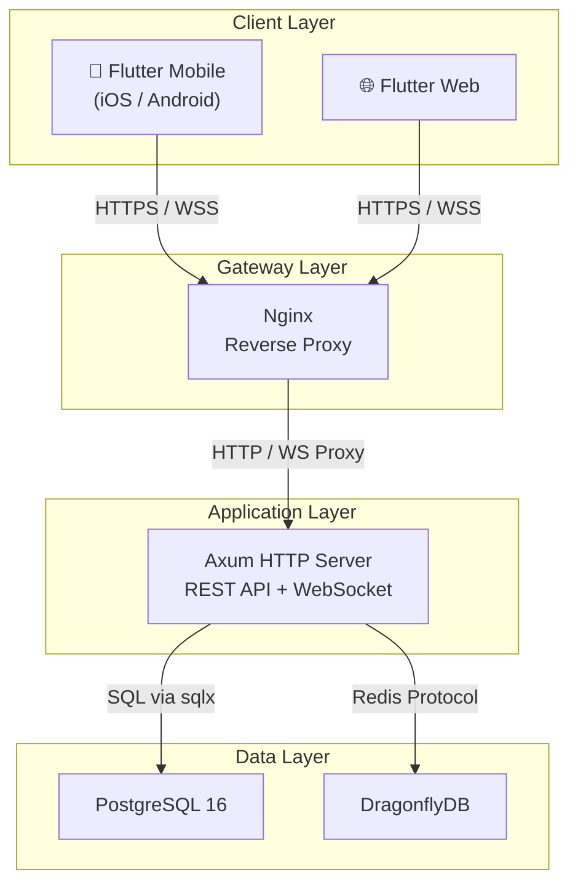

🇬🇧 [English](README.md) | 🇻🇳 **Tiếng Việt**


# SmartMath Kids

SmartMath Kids là một nền tảng học toán tương tác được thiết kế cho trẻ em từ 4 đến 18 tuổi. Nền tảng này kết hợp các kỹ thuật học tập thích ứng với các yếu tố cạnh tranh thời gian thực và trò chơi hóa (gamification) để mang lại trải nghiệm giáo dục hấp dẫn. Đây là một giải pháp sẵn sàng cho sản xuất với backend Rust hiệu suất cao và frontend Flutter đa nền tảng, được hỗ trợ bởi các lớp lưu trữ dữ liệu và bộ nhớ đệm mạnh mẽ.

## Tổng quan dự án

SmartMath Kids được xây dựng để mở rộng và cung cấp một hành trình học tập liền mạch:
- **Học tập tương tác**: Kết hợp thực hành thích ứng, thi đấu thời gian thực và theo dõi tiến độ.
- **Sự gắn kết**: Tập trung cao độ vào trò chơi hóa với các cấp độ, thành tích và các vật phẩm có thể mở khóa.
- **Hiệu suất**: Được vận hành bởi backend Rust sử dụng Axum cho khả năng xử lý đồng thời cao và frontend Flutter phản hồi nhanh.
- **Độ tin cậy**: Sử dụng PostgreSQL cho dữ liệu quan hệ và DragonflyDB cho bộ nhớ đệm tốc độ cao và các tính năng thời gian thực.

## Danh sách tính năng

- 🧮 Thực hành thích ứng — Tạo câu hỏi bằng AI với khả năng điều chỉnh độ khó
- ⚔️ Thi đấu thời gian thực — Các trận đấu toán học đối kháng trực tiếp dựa trên WebSocket
- 📊 Theo dõi tiến độ — Biểu đồ độ chính xác, chỉ số tốc độ, phân tích kỹ năng
- 🏆 Trò chơi hóa — Hệ thống XP/Cấp độ, thành tích, hệ số nhân combo, các chủ đề có thể mở khóa
- 👨‍👩‍👧 Giám sát của phụ huynh — Bảng điều khiển cho phụ huynh với tính năng theo dõi tiến độ của trẻ và thiết lập mục tiêu
- 💡 Mẹo học tập — Các hướng dẫn hoạt hình với các mẹo tính toán nhanh
- 🏅 Bảng xếp hạng — Xếp hạng hàng ngày, hàng tuần, mọi thời đại với tính năng phân trang

## Công nghệ sử dụng

| Lớp | Công nghệ | Phiên bản |
|---|---|---|
| Backend | Rust + Axum | 1.88 / 0.8 |
| Cơ sở dữ liệu | PostgreSQL | 16 |
| Bộ nhớ đệm | DragonflyDB | Latest |
| Frontend | Flutter | 3.29.3 |
| Quản lý trạng thái | Riverpod + Freezed | 2.x |
| CI/CD | GitHub Actions | — |
| Container | Docker + Compose | — |

## Tóm tắt kiến trúc

Hệ thống tuân theo kiến trúc 4 lớp (Client → Gateway → App → Data) để đảm bảo sự tách biệt giữa các thành phần và khả năng mở rộng. Backend triển khai mô hình Clean Architecture, tách biệt logic nghiệp vụ khỏi các khung làm việc (framework) và nguồn dữ liệu bên ngoài.

[Tài liệu kiến trúc đầy đủ](docs/architecture.vi.md)



## Bắt đầu nhanh / Thiết lập phát triển

### Điều kiện tiên quyết
- Rust 1.88+
- Flutter 3.29+
- Docker & Docker Compose

### Các bước thiết lập
1. **Sao chép kho lưu trữ**:
   ```bash
   git clone https://github.com/smartmath/smart-brain-vn.git
   cd smart-brain-vn
   ```
2. **Cấu hình môi trường**:
   Sao chép `.env.example` thành `.env` và cập nhật các biến cần thiết.
3. **Cơ sở hạ tầng**:
   Khởi động các dịch vụ cơ sở dữ liệu và bộ nhớ đệm:
   ```bash
   docker compose up -d postgres dragonfly
   ```
4. **Chạy Backend**:
   ```bash
   cd backend
   cargo run
   ```
5. **Chạy Frontend**:
   ```bash
   cd frontend
   flutter run
   ```

**Các điểm truy cập**:
- Backend: `http://localhost:3000`
- Frontend: `http://localhost:8080`

## Sử dụng Docker

Dự án bao gồm cấu hình Docker Compose đầy đủ cho cả môi trường phát triển và môi trường giống như sản xuất.

- **Triển khai toàn bộ (Full Stack)**: `docker compose up -d`
- **Chỉ cơ sở hạ tầng**: `docker compose up -d postgres dragonfly`
- **Kiểm tra nhật ký (Logs)**: `docker compose logs -f backend`
- **Dọn dẹp**: `docker compose down -v`

**Cổng dịch vụ**:
- PostgreSQL: `5432`
- DragonflyDB: `6379`
- Backend: `3000`
- Frontend: `8080`

## Tài liệu API

SmartMath Kids API cung cấp một bộ tính năng mạnh mẽ cho việc học tập và thi đấu.

- **REST API**: 24 điểm cuối (endpoints) thuộc 11 mô-đun bao gồm xác thực, thực hành, thi đấu và quản lý người dùng.
- **WebSocket**: Các sự kiện thi đấu và thông báo thời gian thực tại `/api/v1/ws`.
- **Swagger UI**: Tài liệu API tương tác có sẵn tại `/docs/backend-apis` khi máy chủ đang chạy.

**Tài liệu liên quan**:
- [Tham chiếu API](docs/api.vi.md) — Tài liệu đầy đủ về các điểm cuối với ví dụ.
- [Sơ đồ cơ sở dữ liệu](docs/database.vi.md) — Sơ đồ ER và mô tả các bảng.
- [Kiến trúc](docs/architecture.vi.md) — Thiết kế hệ thống và các mô hình.

## Liên kết tài liệu

| Tài liệu | Mô tả |
|---|---|
| [Tham chiếu API](docs/api.vi.md) | Các điểm cuối REST, luồng xác thực, ví dụ yêu cầu/phản hồi |
| [Sơ đồ cơ sở dữ liệu](docs/database.vi.md) | Sơ đồ ER, 16 bảng, chỉ mục, dữ liệu mẫu (seed data) |
| [Hướng dẫn phát triển](docs/development.vi.md) | Thiết lập môi trường, quy ước, phân nhánh |
| [Hướng dẫn triển khai](docs/deployment.vi.md) | Xây dựng Docker, biến môi trường, chiến lược mở rộng |
| [Kiến trúc](docs/architecture.vi.md) | Thiết kế hệ thống, Clean Architecture, luồng dữ liệu |

## Demo

### Xem qua ứng dụng


### Ảnh chụp màn hình


> Ảnh chụp màn hình và GIF demo sẽ được thêm vào sau khi giao diện người dùng được hoàn thiện.

## Hướng dẫn sử dụng

1. **Đăng ký**: Đăng ký tài khoản học sinh qua `POST /api/v1/auth/register`.
2. **Xác thực**: Đăng nhập để nhận mã thông báo JWT cho các yêu cầu tiếp theo.
3. **Thực hành**: Bắt đầu một phiên thực hành thích ứng bằng cách sử dụng `GET /practice/questions`.
4. **Tiến độ**: Gửi câu trả lời qua `POST /practice/submit` để nhận XP và cập nhật các chỉ số kỹ năng.
5. **Theo dõi**: Xem tóm tắt hiệu suất và biểu đồ tại `GET /progress/summary`.
6. **Xã hội**: Thi đấu với những người khác và kiểm tra thứ hạng của bạn qua `GET /leaderboard`.
7. **Kiểm soát của phụ huynh**: Phụ huynh có thể liên kết và theo dõi tài khoản của trẻ qua `GET /parent/children`.

## Cấu trúc dự án

```
smart-brain-vn/
├── backend/               # Máy chủ Rust API
│   ├── src/
│   │   ├── handlers/      # Các trình xử lý tuyến đường (route handlers)
│   │   ├── services/      # Logic nghiệp vụ
│   │   ├── repository/    # Lớp truy cập dữ liệu
│   │   ├── models/        # Các mô hình cơ sở dữ liệu
│   │   ├── dto/           # Các DTO yêu cầu/phản hồi
│   │   └── middleware/    # Xác thực, giới hạn tốc độ
│   ├── migrations/        # Các tệp di chuyển SQL (SQL migrations)
│   └── Cargo.toml
├── frontend/              # Ứng dụng Flutter
│   ├── lib/
│   │   ├── features/      # Các mô-đun tính năng
│   │   ├── core/          # Các tiện ích dùng chung
│   │   └── main.dart
│   └── pubspec.yaml
├── docs/                  # Tài liệu
├── docker-compose.yml
└── .github/workflows/    # Các luồng công việc CI/CD
```

## Đóng góp

1. Fork kho lưu trữ.
2. Tạo nhánh tính năng của bạn (`git checkout -b feature/amazing-feature`).
3. Commit các thay đổi của bạn (`git commit -m 'Add amazing feature'`).
4. Push lên nhánh (`git push origin feature/amazing-feature`).
5. Mở một Pull Request.

## Bản quyền

Dự án này được cấp phép theo Giấy phép MIT — xem tệp [LICENSE](LICENSE) để biết thêm chi tiết.
