# SmartMath Kids — System Architecture Document

> **Version**: 1.0  
> **Last Updated**: March 2026  
> **Status**: Production-Ready

---

## Table of Contents

1. [Overview](#1-overview)
2. [High-Level System Architecture](#2-high-level-system-architecture)
3. [Backend Architecture](#3-backend-architecture)
4. [Database Design](#4-database-design)
5. [Frontend Architecture](#5-frontend-architecture)
6. [Service Communication](#6-service-communication)
7. [Deployment Architecture](#7-deployment-architecture)
8. [Security Considerations](#8-security-considerations)
9. [Scalability Considerations](#9-scalability-considerations)
10. [Gamification System](#10-gamification-system)

---

## 1. Overview

**SmartMath Kids** is an interactive math learning platform designed for children, combining adaptive practice, real-time competition, progress tracking, and gamification to create an engaging educational experience.

### Core Capabilities

| Capability | Description |
|---|---|
| **Adaptive Practice** | AI-driven question generation with difficulty scaling based on student performance |
| **Real-Time Competition** | WebSocket-powered head-to-head math battles with live score synchronization |
| **Progress Tracking** | Accuracy charts, speed metrics, skill breakdowns, and weekly improvement analysis |
| **Gamification** | XP/Level system, achievements, combo multipliers, unlockable themes, and leaderboards |
| **Parental Oversight** | Parent dashboard with child progress monitoring and goal setting |
| **Learning Tips** | Animated tutorials with fast calculation tricks and interactive mini-quizzes |

### Technology Stack

| Layer | Technology |
|---|---|
| **Backend** | Rust 1.88, Axum 0.8, Tokio async runtime |
| **Database** | PostgreSQL 16 |
| **Cache** | DragonflyDB (Redis-compatible) |
| **Frontend** | Flutter 3.29.3 (mobile + web) |
| **State Management** | Riverpod 2.x with Freezed models |
| **CI/CD** | GitHub Actions |
| **Containerization** | Docker + Docker Compose |

---

## 2. High-Level System Architecture

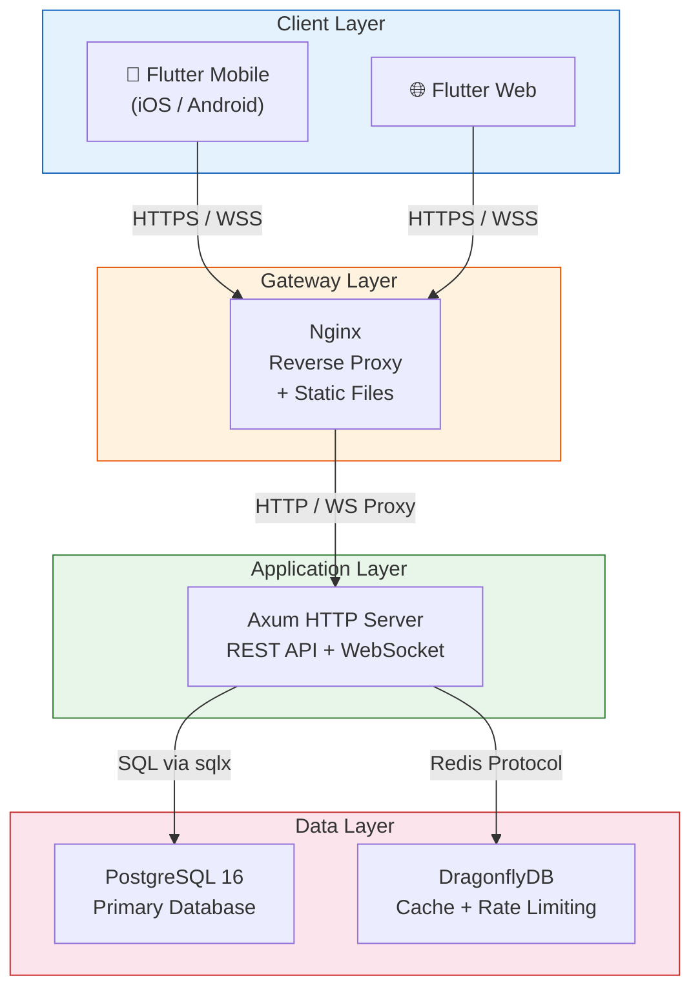

### Request Flow Summary

1. **Client** sends HTTPS request (REST) or upgrades to WSS (WebSocket)
2. **Nginx** terminates TLS, serves static Flutter web assets, proxies API/WS to backend
3. **Axum** processes request through middleware chain → handler → service → repository
4. **DragonflyDB** serves cached data (leaderboards, rate limits, refresh tokens)
5. **PostgreSQL** provides persistent storage with full ACID guarantees

---

## 3. Backend Architecture

### 3.1 Technology Stack

| Component | Version | Purpose |
|---|---|---|
| Rust | 1.88 | Systems language with memory safety guarantees |
| Axum | 0.8 | Async web framework built on Tokio + Tower |
| SQLx | 0.8 | Compile-time checked SQL queries |
| redis (crate) | 0.27 | Async Redis/DragonflyDB client |
| jsonwebtoken | 9.x | JWT token creation and validation |
| argon2 | 0.5 | Password hashing (Argon2id) |
| tower-http | 0.6 | Middleware: CORS, compression, tracing |
| tokio | 1.x | Async runtime with broadcast channels |

### 3.2 Module Structure

```
backend/src/
├── main.rs                 # Server bootstrap, service wiring, router composition
├── state.rs                # AppState struct with FromRef implementations
├── config/
│   └── mod.rs              # Environment-based configuration (Config struct)
├── auth/
│   ├── jwt.rs              # JWT encode/decode, token pair generation
│   ├── password.rs         # Argon2id hash + verify
│   └── extractor.rs        # AuthUser extractor from Authorization header
├── handlers/
│   ├── mod.rs              # Router construction (all route groups merged)
│   ├── auth.rs             # POST register/login/refresh/logout
│   ├── user.rs             # GET/PUT /users/me
│   ├── health.rs           # GET /health
│   ├── exercise.rs         # POST generate/submit, GET history
│   ├── practice.rs         # Practice session lifecycle
│   ├── progress.rs         # GET summary, GET topic/:topic
│   ├── leaderboard.rs      # GET leaderboard, GET leaderboard/me
│   ├── xp.rs               # Skill profile, themes, unlock/activate
│   ├── achievement.rs      # GET achievements
│   ├── parent.rs           # Parental oversight endpoints
│   └── competition.rs      # (Reserved for future REST competition endpoints)
├── services/
│   ├── adaptive_engine.rs  # Difficulty scaling, question selection (SM-2 algorithm)
│   ├── session_service.rs  # Practice session management
│   ├── leaderboard_service.rs  # Ranking computation with cache
│   ├── xp_service.rs       # XP calculation, level progression, achievement unlocking
│   ├── auth_service.rs     # Authentication orchestration
│   ├── scoring.rs          # Score computation utilities
│   └── elo.rs              # ELO rating calculation
├── repository/
│   ├── user_repository.rs          # Users CRUD
│   ├── exercise_repository.rs      # Exercise results
│   ├── progress_repository.rs      # Progress + topic mastery
│   ├── leaderboard_repository.rs   # Leaderboard entries
│   ├── achievement_repository.rs   # Achievements + user_achievements
│   └── gamification_repository.rs  # Skill profiles, themes, practice sessions/results
├── models/
│   └── mod.rs              # Domain models, request/response DTOs
├── error.rs                # ApiError enum → HTTP status mapping
├── middleware/
│   └── rate_limit.rs       # Redis-backed rate limiting
└── ws/
    └── handler.rs          # WebSocket upgrade, message routing, broadcast
```

### 3.3 AppState

The `AppState` struct is the central dependency injection container, constructed once at startup and shared across all handlers via Axum's state extraction:

```rust
pub struct AppState {
    pub db: PgPool,                          // PostgreSQL connection pool
    pub redis: RedisPool,                    // DragonflyDB connection pool
    pub config: Arc<Config>,                 // Immutable configuration
    pub ws_sender: broadcast::Sender<String>,// WebSocket broadcast (capacity: 1024)
    pub auth_service: Arc<AuthService>,
    pub adaptive_engine: Arc<AdaptiveEngine>,
    pub session_service: Arc<SessionService>,
    pub leaderboard_service: Arc<LeaderboardService>,
    pub xp_service: Arc<XpService>,
}
```

Each field implements `FromRef<AppState>`, allowing handlers to extract only the dependencies they need.

### 3.4 Middleware Stack

Requests flow through the middleware chain in order:

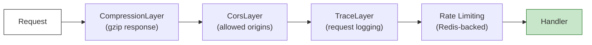

| Middleware | Configuration |
|---|---|
| **Compression** | Gzip encoding for all responses |
| **CORS** | Configurable allowed origins via environment variable |
| **Tracing** | Structured request/response logging with `tracing` |
| **Rate Limiting** | Redis-backed, per-IP: 5/min for auth endpoints, configurable for general |

### 3.5 API Route Table

#### Authentication (Rate Limited: 5 requests/minute)

| Method | Path | Auth | Description |
|---|---|---|---|
| `POST` | `/api/auth/register` | ✗ | Create new user account |
| `POST` | `/api/auth/login` | ✗ | Authenticate, return JWT pair |
| `POST` | `/api/auth/refresh` | ✗ | Refresh access token |
| `POST` | `/api/auth/logout` | ✓ | Invalidate refresh token |

#### User Profile

| Method | Path | Auth | Description |
|---|---|---|---|
| `GET` | `/api/users/me` | ✓ | Get current user profile |
| `PUT` | `/api/users/me` | ✓ | Update user profile |

#### Exercises

| Method | Path | Auth | Description |
|---|---|---|---|
| `POST` | `/api/exercises/generate` | ✓ | Generate adaptive exercise set |
| `POST` | `/api/exercises/submit` | ✓ | Submit exercise answer |
| `GET` | `/api/exercises/history` | ✓ | Get exercise history |

#### Practice Sessions

| Method | Path | Auth | Description |
|---|---|---|---|
| `GET` | `/api/practice/questions` | ✓ | Get practice question set |
| `POST` | `/api/practice/submit` | ✓ | Submit practice answers (batch) |
| `POST` | `/api/practice/start` | ✓ | Start timed practice session |
| `POST` | `/api/practice/answer` | ✓ | Submit individual answer in session |
| `GET` | `/api/practice/result/:id` | ✓ | Get practice session result |

#### Progress Tracking

| Method | Path | Auth | Description |
|---|---|---|---|
| `GET` | `/api/progress/summary` | ✓ | Get overall progress summary |
| `GET` | `/api/progress/topic/:topic` | ✓ | Get topic-specific mastery data |

#### Leaderboard

| Method | Path | Auth | Description |
|---|---|---|---|
| `GET` | `/api/leaderboard` | ✓ | Get leaderboard (query: `period=weekly\|global`) |
| `GET` | `/api/leaderboard/me` | ✓ | Get current user's rank |

#### Gamification (XP / Themes)

| Method | Path | Auth | Description |
|---|---|---|---|
| `GET` | `/api/xp/profile` | ✓ | Get XP, level, skill profile |
| `GET` | `/api/xp/themes` | ✓ | List all unlockable themes |
| `POST` | `/api/xp/themes/:id/unlock` | ✓ | Unlock theme with XP |
| `PUT` | `/api/xp/themes/:id/activate` | ✓ | Set active theme |

#### Achievements

| Method | Path | Auth | Description |
|---|---|---|---|
| `GET` | `/api/achievements` | ✓ | Get all achievements with unlock status |

#### Parental Oversight

| Method | Path | Auth | Description |
|---|---|---|---|
| `GET` | `/api/parent/children` | ✓ | List linked children |
| `GET` | `/api/parent/child/:id/progress` | ✓ | Get child's progress |
| `PUT` | `/api/parent/child/:id/goals` | ✓ | Set daily goals for child |

#### System

| Method | Path | Auth | Description |
|---|---|---|---|
| `GET` | `/health` | ✗ | Health check (DB + Redis connectivity) |
| `GET` | `/ws?token=<JWT>` | ✓ | WebSocket upgrade for real-time events |

### 3.6 Service Layer

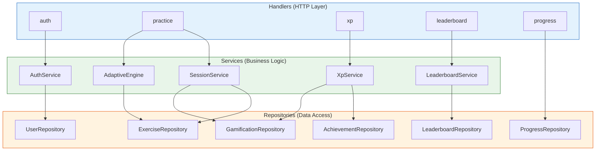

#### Service Descriptions

| Service | Responsibility |
|---|---|
| **AuthService** | Registration, login, JWT pair generation, token refresh, logout (revoke refresh token in Redis) |
| **AdaptiveEngine** | SM-2 spaced repetition algorithm, difficulty scaling based on accuracy/speed, question bank selection |
| **SessionService** | Practice session lifecycle: start → answer → complete, time tracking, result aggregation |
| **LeaderboardService** | Weekly/global ranking computation, Redis-cached rankings with 1-hour TTL, fallback to DB |
| **XpService** | XP calculation (base × difficulty × streak bonus), level progression, achievement condition evaluation, theme unlocking |

### 3.7 Authentication Flow

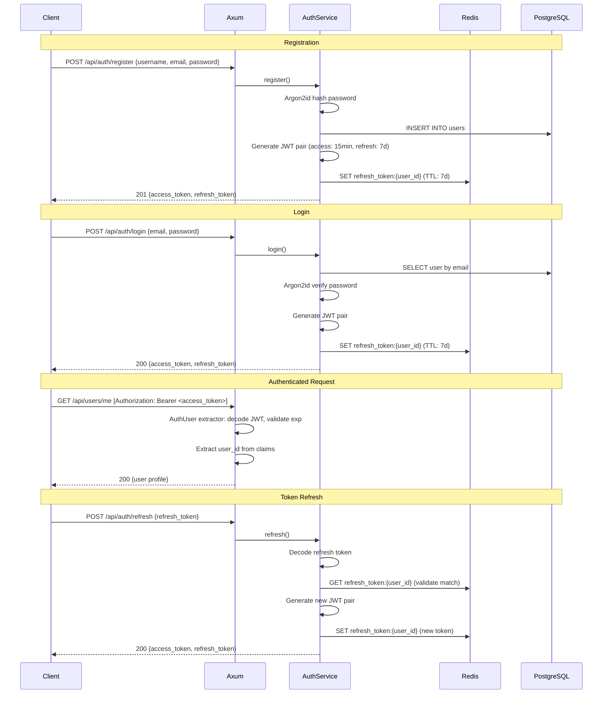

### 3.8 Error Handling

All errors flow through the `ApiError` enum which implements `IntoResponse`:

| Variant | HTTP Status | Description |
|---|---|---|
| `BadRequest(String)` | 400 | Invalid input / validation failure |
| `Unauthorized(String)` | 401 | Missing or invalid JWT |
| `Forbidden(String)` | 403 | Insufficient permissions |
| `NotFound(String)` | 404 | Resource not found |
| `Conflict(String)` | 409 | Duplicate entry (e.g., email already registered) |
| `TooManyRequests` | 429 | Rate limit exceeded |
| `Internal(String)` | 500 | Unexpected server error |

All error responses follow a consistent JSON format:

```json
{
  "error": "Human-readable error message"
}
```

---

## 4. Database Design

### 4.1 Entity-Relationship Diagram

```mermaid
erDiagram
    users ||--o{ exercise_results : "completes"
    users ||--o{ user_achievements : "earns"
    users ||--o{ daily_progress : "tracks"
    users ||--o{ topic_mastery : "masters"
    users ||--o{ leaderboard_entries : "ranks"
    users ||--o{ skill_profiles : "has"
    users ||--o{ practice_sessions : "starts"
    users ||--o{ user_themes : "owns"
    users ||--o{ parent_child_links : "child"
    users ||--o{ parent_child_links : "parent"
    achievements ||--o{ user_achievements : "unlocked_by"
    practice_sessions ||--o{ practice_results : "contains"
    unlockable_themes ||--o{ user_themes : "unlocked_as"
    users ||--o{ daily_goals : "has"

    users {
        uuid id PK
        varchar username
        varchar email UK
        varchar password_hash
        varchar role "student|parent|admin"
        int grade_level
        timestamp created_at
        timestamp updated_at
    }

    exercise_results {
        uuid id PK
        uuid user_id FK
        varchar topic
        varchar difficulty
        jsonb question
        varchar user_answer
        varchar correct_answer
        boolean is_correct
        int response_time_ms
        int xp_earned
        timestamp created_at
    }

    achievements {
        uuid id PK
        varchar name UK
        varchar description
        varchar icon
        varchar category
        jsonb condition
        int xp_reward
        timestamp created_at
    }

    user_achievements {
        uuid id PK
        uuid user_id FK
        uuid achievement_id FK
        timestamp unlocked_at
    }

    daily_progress {
        uuid id PK
        uuid user_id FK
        date date
        int problems_solved
        int problems_correct
        int total_time_seconds
        int xp_earned
        int streak_count
        timestamp created_at
        timestamp updated_at
    }

    topic_mastery {
        uuid id PK
        uuid user_id FK
        varchar topic
        decimal mastery_level
        int total_attempts
        int correct_attempts
        decimal avg_response_time
        timestamp last_practiced
        timestamp created_at
        timestamp updated_at
    }

    parent_child_links {
        uuid id PK
        uuid parent_id FK
        uuid child_id FK
        timestamp created_at
    }

    daily_goals {
        uuid id PK
        uuid user_id FK
        int target_problems
        int target_minutes
        int target_accuracy
        timestamp created_at
        timestamp updated_at
    }

    leaderboard_entries {
        uuid id PK
        uuid user_id FK
        varchar period "weekly|global"
        int score
        int rank
        varchar username
        timestamp week_start
        timestamp created_at
        timestamp updated_at
    }

    question_bank {
        uuid id PK
        varchar topic
        varchar difficulty
        varchar question_template
        varchar answer_formula
        jsonb parameters
        timestamp created_at
    }

    skill_profiles {
        uuid id PK
        uuid user_id FK UK
        int total_xp
        int current_level
        int current_streak
        int best_streak
        decimal elo_rating
        varchar preferred_difficulty
        jsonb topic_weights
        timestamp created_at
        timestamp updated_at
    }

    practice_sessions {
        uuid id PK
        uuid user_id FK
        varchar status "active|completed|abandoned"
        varchar topic
        varchar difficulty
        int total_questions
        int correct_answers
        int total_time_seconds
        int xp_earned
        timestamp started_at
        timestamp completed_at
        timestamp created_at
    }

    practice_results {
        uuid id PK
        uuid session_id FK
        int question_number
        jsonb question
        varchar user_answer
        varchar correct_answer
        boolean is_correct
        int response_time_ms
        timestamp created_at
    }

    unlockable_themes {
        uuid id PK
        varchar name UK
        varchar description
        varchar preview_color
        int xp_cost
        int required_level
        boolean is_default
        timestamp created_at
    }

    user_themes {
        uuid id PK
        uuid user_id FK
        uuid theme_id FK
        boolean is_active
        timestamp unlocked_at
    }
```

### 4.2 Table Details by Domain

#### User Domain (3 tables)

| Table | Records | Purpose |
|---|---|---|
| `users` | Core | User accounts with role-based access (student/parent/admin) |
| `parent_child_links` | Relationship | Links parent users to child users for oversight |
| `daily_goals` | Config | Per-child daily targets set by parents |

#### Practice Domain (4 tables)

| Table | Records | Purpose |
|---|---|---|
| `question_bank` | 40 templates | Pre-seeded question templates with parameterized formulas |
| `exercise_results` | Append-only | Individual exercise attempt records |
| `practice_sessions` | Per session | Timed practice session metadata and aggregated results |
| `practice_results` | Per answer | Individual answers within a practice session |

#### Progress Domain (2 tables)

| Table | Records | Purpose |
|---|---|---|
| `daily_progress` | Per user/day | Daily aggregated metrics (problems, accuracy, XP, streaks) |
| `topic_mastery` | Per user/topic | Topic-level mastery with SM-2 scheduling data |

#### Gamification Domain (5 tables)

| Table | Records | Purpose |
|---|---|---|
| `skill_profiles` | Per user (1:1) | XP, level, ELO rating, streak tracking |
| `achievements` | 14 seeded | Achievement definitions with JSON conditions |
| `user_achievements` | Per unlock | Tracks which achievements each user has earned |
| `leaderboard_entries` | Per user/period | Cached leaderboard positions (weekly + global) |
| `unlockable_themes` | 9 seeded | Theme definitions with XP cost and level requirements |
| `user_themes` | Per unlock | Tracks theme ownership and active theme selection |

### 4.3 Custom Types

```sql
CREATE TYPE user_role AS ENUM ('student', 'parent', 'admin');
CREATE TYPE session_status AS ENUM ('active', 'completed', 'abandoned');
```

### 4.4 Indexing Strategy

The database uses **40+ indexes** for optimal query performance:

| Pattern | Example | Purpose |
|---|---|---|
| **Foreign key indexes** | `idx_exercise_results_user_id` | Fast joins on all FK columns |
| **Composite indexes** | `idx_daily_progress_user_date` on `(user_id, date)` | Efficient date-range queries per user |
| **Unique constraints** | `idx_user_achievements_unique` on `(user_id, achievement_id)` | Prevent duplicate achievement unlocks |
| **Leaderboard** | `idx_leaderboard_period_score` on `(period, score DESC)` | Fast sorted leaderboard queries |
| **Topic lookups** | `idx_topic_mastery_user_topic` on `(user_id, topic)` | O(1) topic mastery lookups |
| **Question bank** | `idx_question_bank_topic_difficulty` on `(topic, difficulty)` | Fast question selection by criteria |

### 4.5 Triggers

Six `updated_at` auto-update triggers ensure timestamps stay current:

```sql
-- Applied to: users, daily_progress, topic_mastery, skill_profiles, daily_goals, leaderboard_entries
CREATE TRIGGER set_updated_at
    BEFORE UPDATE ON {table}
    FOR EACH ROW
    EXECUTE FUNCTION update_updated_at_column();
```

### 4.6 Caching Strategy (DragonflyDB)

| Key Pattern | TTL | Purpose |
|---|---|---|
| `rate_limit:auth:{ip}` | 60s | Auth endpoint rate limiting (5 req/min) |
| `rate_limit:general:{ip}` | 60s | General endpoint rate limiting |
| `problems:{topic}:{difficulty}:{hash}` | 5-10 min | Cached generated problem sets |
| `refresh_token:{user_id}` | 7 days | Refresh token storage for validation |
| `leaderboard:rank:{user_id}:{period}` | 1 hour | Cached user rank position |
| `leaderboard:{period}` | 1 hour | Full leaderboard data (weekly/global) |

**Cache Strategy**: Read-through with TTL expiration. On cache miss, query PostgreSQL and populate cache. Leaderboard uses a 1-hour TTL with background refresh capability.

---

## 5. Frontend Architecture

### 5.1 Technology Stack

| Component | Version | Purpose |
|---|---|---|
| Flutter | 3.29.3 | Cross-platform UI framework (mobile + web) |
| Riverpod | 2.x | Reactive state management with code generation |
| GoRouter | 14.x | Declarative routing with auth redirect |
| Dio | 5.x | HTTP client with interceptors |
| Hive | 4.x | Local key-value storage |
| fl_chart | 0.69.x | Charts for progress visualization |
| flutter_animate | 4.x | Declarative animations |
| Freezed | 2.x | Immutable models with union types |
| Lottie | 3.x | Vector animations (splash, celebrations) |
| Rive | 0.13.x | Interactive animations (learning tips) |
| web_socket_channel | 3.x | WebSocket client for real-time features |
| confetti_widget | 0.4.x | Celebration particle effects |

### 5.2 Clean Architecture Layers

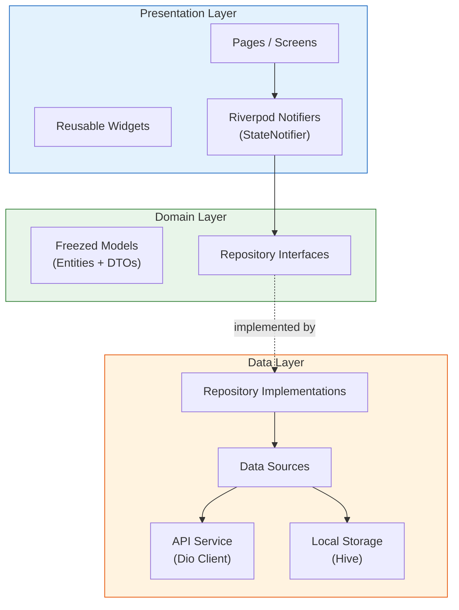

**Dependency Rule**: Outer layers depend on inner layers. Domain layer has zero external dependencies.

### 5.3 Project Structure

```
frontend/lib/
├── app.dart                        # SmartMathApp root (ProviderScope + MaterialApp.router)
├── main.dart                       # Entry point
├── core/
│   ├── constants/
│   │   └── api_constants.dart      # Base URL, all endpoint paths, WS config
│   ├── network/
│   │   ├── api_client.dart         # Typed ApiClient wrapping Dio (get/post/put/delete)
│   │   └── dio_provider.dart       # Dio instance with auth interceptor + token refresh
│   ├── router/
│   │   ├── app_router.dart         # GoRouter config with auth redirect guard
│   │   └── route_names.dart        # 20+ route name constants
│   ├── storage/
│   │   └── hive_service.dart       # Hive init + boxes: user_box, settings_box, cache_box
│   ├── theme/
│   │   └── app_theme.dart          # Material 3 child-friendly theme (rounded, colorful)
│   └── error/
│       └── error_handler.dart      # Global error handling + user-friendly messages
├── features/
│   ├── auth/                       # Login, registration, token management
│   ├── home/                       # Dashboard, navigation hub
│   ├── exercises/                  # Adaptive exercise flow
│   ├── practice/                   # Timed practice with animations
│   ├── progress/                   # Charts, skill breakdown, weekly comparison
│   ├── achievements/               # Achievement grid, badge popups
│   ├── leaderboard/                # Weekly/global rankings
│   ├── competition/                # Real-time WebSocket battles
│   ├── learning_tips/              # Animated tutorials + mini-quizzes
│   ├── gamification/               # XP display, level-up, theme selection
│   ├── parent/                     # Parental dashboard + goal setting
│   └── settings/                   # App preferences
└── shared/
    └── widgets/                    # Shared animated widgets
```

### 5.4 Feature Module Pattern

Each feature follows a consistent internal structure:

```
features/{feature_name}/
├── data/
│   ├── datasources/
│   │   └── {feature}_remote_data_source.dart
│   └── repositories/
│       └── {feature}_repository_impl.dart
├── domain/
│   ├── models/
│   │   └── {feature}_model.dart        # Freezed immutable models
│   └── repositories/
│       └── {feature}_repository.dart    # Abstract interface
├── presentation/
│   ├── notifiers/
│   │   └── {feature}_notifier.dart      # StateNotifier + Riverpod provider
│   ├── pages/
│   │   └── {feature}_page.dart          # Full screen page
│   └── widgets/
│       └── {feature}_widget.dart        # Feature-specific widgets
└── providers.dart                       # Feature-scoped Riverpod providers
```

### 5.5 Navigation (GoRouter)

```dart
GoRouter(
  initialLocation: '/splash',
  redirect: (context, state) {
    final isLoggedIn = /* check auth state */;
    final isAuthRoute = state.matchedLocation.startsWith('/auth');
    if (!isLoggedIn && !isAuthRoute) return '/auth/login';
    if (isLoggedIn && isAuthRoute) return '/home';
    return null;
  },
  routes: [
    GoRoute(path: '/splash', builder: (_,__) => SplashPage()),
    GoRoute(path: '/auth/login', builder: (_,__) => LoginPage()),
    GoRoute(path: '/auth/register', builder: (_,__) => RegisterPage()),
    ShellRoute(
      builder: (_,__,child) => BaseLayout(child: child),
      routes: [
        GoRoute(path: '/home', builder: (_,__) => HomePage()),
        GoRoute(path: '/practice', builder: (_,__) => PracticePage()),
        GoRoute(path: '/practice/result/:id', builder: ...),
        GoRoute(path: '/progress', builder: (_,__) => ProgressPage()),
        GoRoute(path: '/leaderboard', builder: (_,__) => LeaderboardPage()),
        GoRoute(path: '/achievements', builder: (_,__) => AchievementsPage()),
        GoRoute(path: '/competition', builder: (_,__) => CompetitionPage()),
        GoRoute(path: '/learning-tips', builder: (_,__) => LearningTipsPage()),
        GoRoute(path: '/gamification', builder: (_,__) => GamificationPage()),
        GoRoute(path: '/themes', builder: (_,__) => ThemeSelectionPage()),
        GoRoute(path: '/settings', builder: (_,__) => SettingsPage()),
        GoRoute(path: '/parent', builder: (_,__) => ParentDashboardPage()),
      ],
    ),
  ],
)
```

### 5.6 State Management (Riverpod)

**Pattern**: `StateNotifier<AsyncValue<T>>` with Riverpod providers.

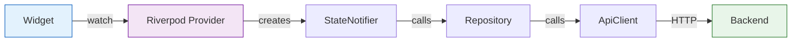

State is reactive — widgets rebuild automatically when providers emit new values. `AsyncValue` provides built-in loading/error/data states.

### 5.7 Network Layer

**Dio Configuration**:
- Base URL from environment/constants
- Auth interceptor: attaches `Authorization: Bearer <token>` header
- Token refresh interceptor: on 401, attempts refresh and retries original request
- Error interceptor: maps Dio errors to user-friendly messages
- Timeout: configurable connect/receive timeouts

**ApiClient** wraps Dio with typed methods:

```dart
class ApiClient {
  Future<T> get<T>(String path, {Map<String, dynamic>? queryParams, T Function(dynamic)? fromJson});
  Future<T> post<T>(String path, {dynamic data, T Function(dynamic)? fromJson});
  Future<T> put<T>(String path, {dynamic data, T Function(dynamic)? fromJson});
  Future<void> delete(String path);
}
```

### 5.8 WebSocket Integration

The competition feature uses WebSocket for real-time communication:

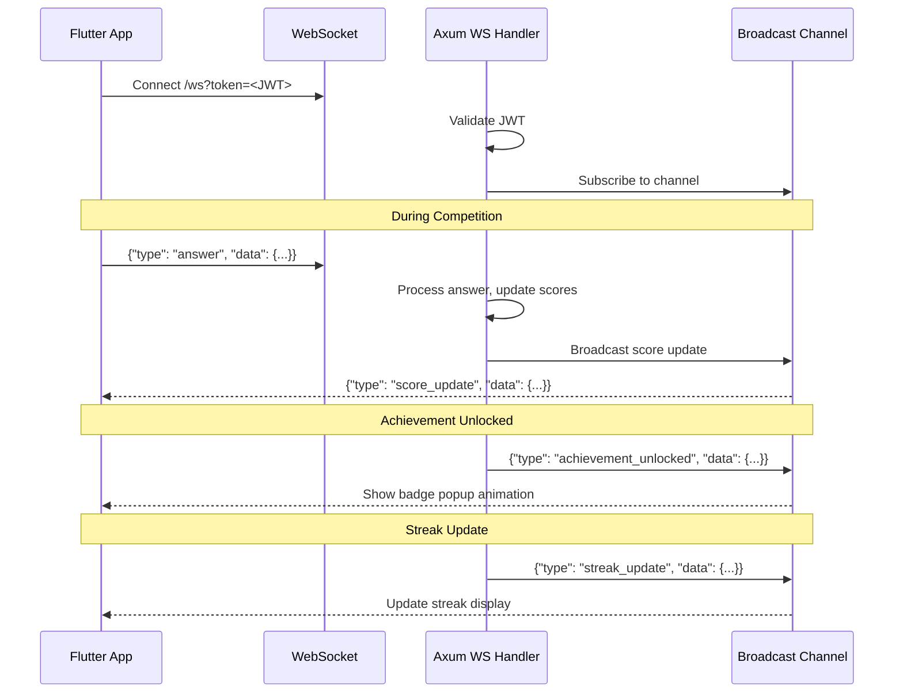

**WebSocket Events**:
- `achievement_unlocked` — Triggers animated badge popup
- `streak_update` — Updates streak counter in real-time
- `score_update` — Syncs competition scores between opponents

---

## 6. Service Communication

### 6.1 Full Request Lifecycle

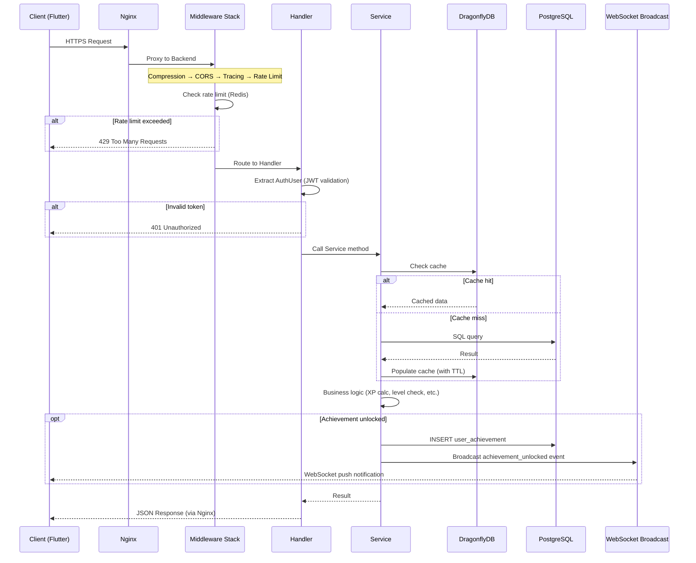

### 6.2 Practice Session Flow

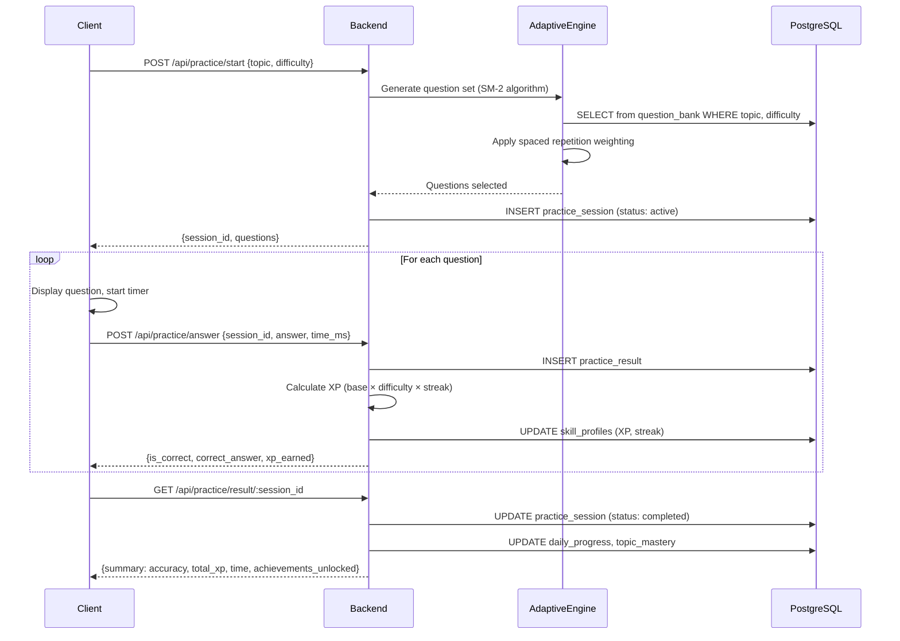

---

## 7. Deployment Architecture

### 7.1 Docker Compose Topology

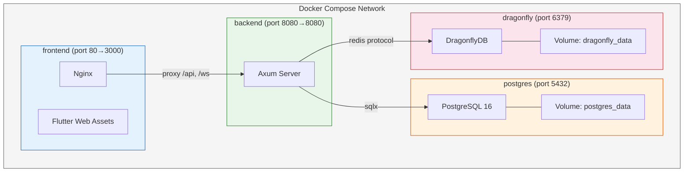

### 7.2 Service Configuration

| Service | Image | Ports | Dependencies | Health Check |
|---|---|---|---|---|
| `postgres` | `postgres:16-alpine` | 5432 | — | `pg_isready` |
| `dragonfly` | `docker.dragonflydb.io/dragonflydb/dragonfly` | 6379 | — | `redis-cli ping` |
| `backend` | Custom (4-stage build) | 8080 | postgres, dragonfly | `curl /health` |
| `frontend` | Custom (2-stage build) | 3000 | backend | — |

### 7.3 Backend Dockerfile (4-Stage Build)

```dockerfile
# Stage 1: Chef — prepare dependency recipe
FROM rust:1.88-slim AS chef
RUN cargo install cargo-chef
WORKDIR /app
COPY . .
RUN cargo chef prepare --recipe-path recipe.json

# Stage 2: Cache — build only dependencies (layer cached)
FROM rust:1.88-slim AS cacher
RUN cargo install cargo-chef
WORKDIR /app
COPY --from=chef /app/recipe.json recipe.json
RUN cargo chef cook --release --recipe-path recipe.json

# Stage 3: Build — compile application with cached deps
FROM rust:1.88-slim AS builder
WORKDIR /app
COPY --from=cacher /app/target target
COPY --from=cacher /usr/local/cargo /usr/local/cargo
COPY . .
RUN cargo build --release

# Stage 4: Runtime — minimal production image
FROM debian:bookworm-slim AS runtime
RUN apt-get update && apt-get install -y ca-certificates && rm -rf /var/lib/apt/lists/*
COPY --from=builder /app/target/release/smart-brain-backend /usr/local/bin/
EXPOSE 8080
CMD ["smart-brain-backend"]
```

**Key optimization**: `cargo-chef` separates dependency compilation from application compilation, enabling Docker layer caching for dependencies. Rebuilds only recompile application code.

### 7.4 Frontend Dockerfile (2-Stage Build)

```dockerfile
# Stage 1: Build Flutter web
FROM ghcr.io/cirruslabs/flutter:3.29.3 AS builder
WORKDIR /app
COPY . .
RUN flutter pub get && flutter build web --release

# Stage 2: Serve with Nginx
FROM nginx:alpine
COPY --from=builder /app/build/web /usr/share/nginx/html
COPY nginx.conf /etc/nginx/conf.d/default.conf
EXPOSE 80
```

**Nginx configuration**: SPA routing (fallback to `index.html`), API proxy (`/api` → backend:8080), WebSocket proxy (`/ws` → backend:8080 with upgrade headers).

### 7.5 CI/CD Pipelines (GitHub Actions)

#### Rust Pipeline (`.github/workflows/rust.yml`)

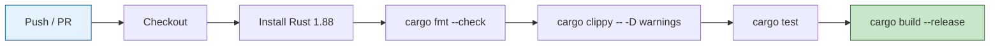

#### Flutter Pipeline (`.github/workflows/flutter.yml`)

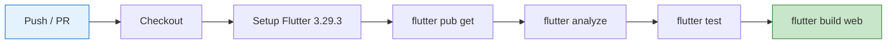

### 7.6 Environment Configuration

All configuration is injected via environment variables (12-factor app):

| Variable | Service | Default | Description |
|---|---|---|---|
| `DATABASE_URL` | backend | — | PostgreSQL connection string |
| `REDIS_URL` | backend | — | DragonflyDB connection string |
| `JWT_SECRET` | backend | — | HMAC secret for JWT signing |
| `JWT_EXPIRATION` | backend | `900` | Access token TTL (seconds) |
| `REFRESH_TOKEN_EXPIRATION` | backend | `604800` | Refresh token TTL (seconds) |
| `CORS_ORIGINS` | backend | `*` | Allowed CORS origins |
| `RUST_LOG` | backend | `info` | Log level filter |
| `SERVER_HOST` | backend | `0.0.0.0` | Bind address |
| `SERVER_PORT` | backend | `8080` | Bind port |
| `POSTGRES_USER` | postgres | — | Database user |
| `POSTGRES_PASSWORD` | postgres | — | Database password |
| `POSTGRES_DB` | postgres | — | Database name |
| `DRAGONFLY_PASSWORD` | dragonfly | — | Cache authentication |

---

## 8. Security Considerations

### 8.1 Authentication & Authorization

| Measure | Implementation |
|---|---|
| **Password Hashing** | Argon2id (memory-hard, GPU-resistant) |
| **Token Strategy** | Short-lived access (15 min) + long-lived refresh (7 days) |
| **Token Storage** | Refresh tokens stored in Redis with TTL enforcement |
| **Token Revocation** | Logout deletes refresh token from Redis immediately |
| **Route Protection** | `AuthUser` extractor on all protected endpoints |
| **Role-Based Access** | `user_role` ENUM (student/parent/admin) with role checks |

### 8.2 Network Security

| Measure | Implementation |
|---|---|
| **TLS Termination** | Nginx handles HTTPS (certificates via deployment environment) |
| **CORS** | Configurable allowed origins, not wildcard in production |
| **Rate Limiting** | Redis-backed per-IP limiting: 5/min auth, configurable general |
| **WebSocket Auth** | JWT required as query parameter on WS upgrade |
| **Internal Network** | Docker network isolates services; only Nginx exposed |

### 8.3 Data Security

| Measure | Implementation |
|---|---|
| **SQL Injection** | Compile-time checked queries via SQLx (parameterized) |
| **Input Validation** | Serde deserialization with type enforcement |
| **Secrets Management** | Environment variables, never hardcoded; `.env.example` has no real values |
| **Error Exposure** | Internal errors return generic message; details logged server-side only |
| **Cache Auth** | DragonflyDB requires password authentication |

### 8.4 Child Safety

| Measure | Implementation |
|---|---|
| **Minimal PII** | Only username, email stored; no real names required |
| **Parent Linking** | Explicit parent-child relationship with separate role |
| **Content Safety** | All content is math-only, no user-generated text visible to others |
| **Session Limits** | Practice sessions are bounded; no unlimited engagement loops |

---

## 9. Scalability Considerations

### 9.1 Current Architecture Scaling Points

| Component | Strategy | Details |
|---|---|---|
| **Backend** | Horizontal scaling | Stateless Axum servers behind load balancer; shared DB + Redis |
| **PostgreSQL** | Vertical + Read replicas | Connection pooling via `sqlx::PgPool`; read replicas for leaderboard/progress queries |
| **DragonflyDB** | Vertical scaling | Multi-threaded (vs. Redis single-threaded); handles high throughput natively |
| **Frontend** | CDN distribution | Static Flutter web assets served via Nginx / CDN |
| **WebSocket** | Broadcast channel | `tokio::sync::broadcast` with 1024 capacity; Redis Pub/Sub for multi-instance |

### 9.2 Performance Optimizations

| Optimization | Where | Impact |
|---|---|---|
| **Gzip Compression** | All responses | 60-80% bandwidth reduction |
| **Connection Pooling** | PostgreSQL, Redis | Eliminates connection overhead |
| **Query Indexing** | 40+ database indexes | Sub-millisecond lookups |
| **Cache Layer** | Leaderboards, rate limits, tokens | Reduces DB load by ~70% for hot paths |
| **cargo-chef Docker** | Build pipeline | 5-10x faster rebuilds (cached dependencies) |
| **4-Stage Dockerfile** | Backend image | Minimal runtime image (~50MB) |

### 9.3 Future Scaling Path

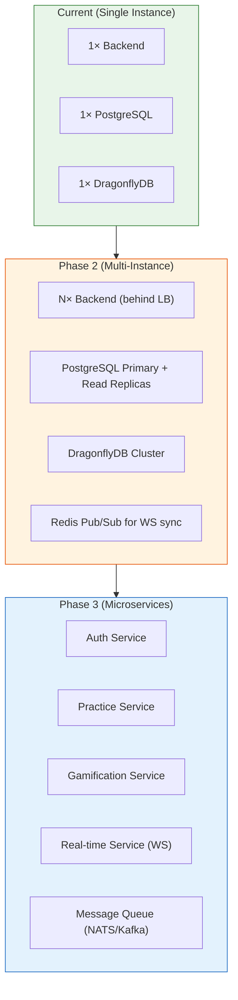

---

## 10. Gamification System

### 10.1 XP Calculation

```
XP = base_xp × difficulty_multiplier × streak_bonus
```

| Factor | Values |
|---|---|
| **base_xp** | 10 (per correct answer) |
| **difficulty_multiplier** | Easy: 1.0, Medium: 1.5, Hard: 2.0, Expert: 3.0 |
| **streak_bonus** | 1.0 + (streak_count × 0.1), capped at 2.0 |

### 10.2 Level Progression

```
XP required for level N = 100 × N^1.5
```

| Level | XP Required | Cumulative |
|---|---|---|
| 1 | 100 | 100 |
| 2 | 283 | 383 |
| 5 | 1,118 | 3,336 |
| 10 | 3,162 | 15,811 |
| 20 | 8,944 | 63,246 |
| 50 | 35,355 | — |

### 10.3 ELO Rating

Used for competitive matching and adaptive difficulty:

```
New Rating = Old Rating + K × (Actual - Expected)
Expected = 1 / (1 + 10^((Opponent - Player) / 400))
K-factor = 32 (default)
```

### 10.4 Achievement System

14 seeded achievements across categories:

| Category | Examples |
|---|---|
| **Practice** | First Practice, Practice Makes Perfect (100 sessions) |
| **Streak** | On Fire (7-day streak), Unstoppable (30-day streak) |
| **Accuracy** | Sharpshooter (90% accuracy over 50+ problems) |
| **Speed** | Lightning Fast (under 3s average) |
| **Mastery** | Topic Master (95% in any topic) |
| **Social** | First Competition Win |

Achievement conditions are stored as JSON in the `achievements` table, evaluated by `XpService` after each answer submission.

### 10.5 Unlockable Themes

9 themes with progressive unlock requirements:

| Theme | XP Cost | Required Level | Description |
|---|---|---|---|
| **Classic** | 0 | 0 | Default theme (pre-unlocked) |
| **Ocean Blue** | 500 | 3 | Cool ocean colors |
| **Forest Green** | 500 | 3 | Nature-inspired greens |
| **Sunset Orange** | 1,000 | 5 | Warm sunset palette |
| **Galaxy Purple** | 1,000 | 5 | Space-themed purple |
| **Candy Pink** | 2,000 | 8 | Sweet candy colors |
| **Midnight Dark** | 2,000 | 8 | Dark mode theme |
| **Golden** | 5,000 | 15 | Premium gold accent |
| **Rainbow** | 10,000 | 25 | All colors celebration |

### 10.6 Spaced Repetition (SM-2)

The `AdaptiveEngine` implements a modified SM-2 algorithm for question selection:

1. **New topics**: Start at Easy difficulty
2. **After correct answer**: Increase difficulty weight, extend review interval
3. **After incorrect answer**: Decrease difficulty, shorten review interval
4. **Topic weights** (stored in `skill_profiles.topic_weights`): Prioritize weak areas
5. **Time decay**: Topics not practiced recently get higher selection priority

---

*This document reflects the system architecture as of March 2026. It should be updated as the system evolves.*
