# SmartMath Kids — Tài liệu Kiến trúc Hệ thống

> **Phiên bản**: 1.0  
> **Cập nhật lần cuối**: Tháng 3 năm 2026  
> **Trạng thái**: Sẵn sàng triển khai (Production-Ready)

---

## Mục lục

1. [Tổng quan](#1-tổng-quan)
2. [Kiến trúc Hệ thống Cấp cao](#2-kiến-trúc-hệ-thống-cấp-cao)
3. [Kiến trúc Backend](#3-kiến-trúc-backend)
4. [Thiết kế Cơ sở dữ liệu](#4-thiết-kế-cơ-sở-dữ-liệu)
5. [Kiến trúc Frontend](#5-kiến-trúc-frontend)
6. [Giao tiếp giữa các Dịch vụ](#6-giao-tiếp-giữa-các-dịch-vụ)
7. [Kiến trúc Triển khai](#7-kiến-trúc-triển-khai)
8. [Các lưu ý về Bảo mật](#8-các-lưu-ý-về-bảo-mật)
9. [Các lưu ý về Khả năng mở rộng](#9-các-lưu-ý-về-khả-năng-mở-rộng)
10. [Hệ thống Gamification](#10-hệ-thống-gamification)

---

## 1. Tổng quan

**SmartMath Kids** là một nền tảng học toán tương tác dành cho trẻ em, kết hợp giữa luyện tập thích ứng (adaptive practice), thi đấu thời gian thực, theo dõi tiến độ và các yếu tố trò chơi hóa (gamification) để tạo ra trải nghiệm giáo dục hấp dẫn.

### Các Khả năng Cốt lõi

| Khả năng | Mô tả |
|---|---|
| **Luyện tập Thích ứng** | Tạo câu hỏi dựa trên AI với độ khó thay đổi tùy theo kết quả của học sinh |
| **Thi đấu Thời gian thực** | Các trận đấu toán học đối kháng trực tiếp thông qua WebSocket với sự đồng bộ hóa điểm số trực tiếp |
| **Theo dõi Tiến độ** | Biểu đồ độ chính xác, chỉ số tốc độ, phân tích kỹ năng và phân tích cải thiện hàng tuần |
| **Gamification** | Hệ thống XP/Cấp độ, thành tích, bộ nhân combo, các chủ đề có thể mở khóa và bảng xếp hạng |
| **Giám sát của Phụ huynh** | Bảng điều khiển dành cho phụ huynh để theo dõi tiến độ của con và thiết lập mục tiêu |
| **Mẹo Học tập** | Các hướng dẫn hoạt hình với mẹo tính nhanh và các bài trắc nghiệm nhỏ tương tác |

### Công nghệ Sử dụng (Technology Stack)

| Lớp | Công nghệ |
|---|---|
| **Backend** | Rust 1.88, Axum 0.8, Tokio async runtime |
| **Cơ sở dữ liệu** | PostgreSQL 16 |
| **Cache** | DragonflyDB (tương thích Redis) |
| **Frontend** | Flutter 3.29.3 (mobile + web) |
| **Quản lý Trạng thái** | Riverpod 2.x với các model Freezed |
| **CI/CD** | GitHub Actions |
| **Container hóa** | Docker + Docker Compose |

---

## 2. Kiến trúc Hệ thống Cấp cao

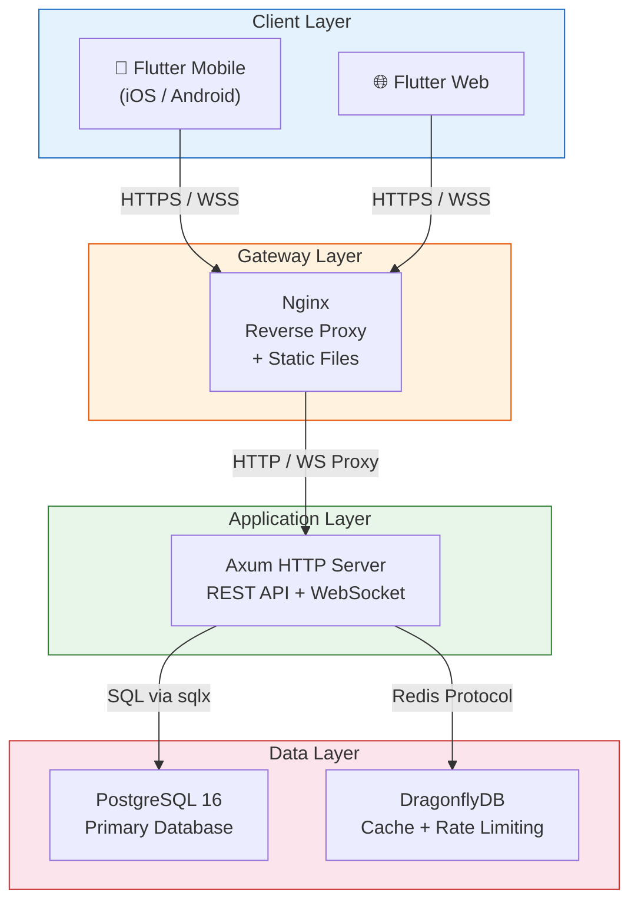

### Tóm tắt Luồng Yêu cầu (Request Flow Summary)

1. **Client** gửi yêu cầu HTTPS (REST) hoặc nâng cấp lên WSS (WebSocket)
2. **Nginx** thực hiện TLS termination, phục vụ các tài sản web tĩnh của Flutter, proxy API/WS tới backend
3. **Axum** xử lý yêu cầu qua chuỗi middleware → handler → service → repository
4. **DragonflyDB** cung cấp dữ liệu cache (bảng xếp hạng, giới hạn tốc độ, refresh tokens)
5. **PostgreSQL** cung cấp lưu trữ bền vững với các đảm bảo ACID đầy đủ

---

## 3. Kiến trúc Backend

### 3.1 Công nghệ Sử dụng

| Thành phần | Phiên bản | Mục đích |
|---|---|---|
| Rust | 1.88 | Ngôn ngữ hệ thống với các đảm bảo an toàn bộ nhớ |
| Axum | 0.8 | Framework web bất đồng bộ xây dựng trên Tokio + Tower |
| SQLx | 0.8 | Kiểm tra các truy vấn SQL tại thời điểm biên dịch |
| redis (crate) | 0.27 | Client Redis/DragonflyDB bất đồng bộ |
| jsonwebtoken | 9.x | Tạo và xác thực JWT token |
| argon2 | 0.5 | Mã hóa mật khẩu (Argon2id) |
| tower-http | 0.6 | Middleware: CORS, nén, tracing |
| tokio | 1.x | Runtime bất đồng bộ với broadcast channels |

### 3.2 Cấu trúc Module

```
backend/src/
├── main.rs                 # Khởi tạo server, kết nối dịch vụ, cấu hình router
├── state.rs                # Struct AppState với các triển khai FromRef
├── config/
│   └── mod.rs              # Cấu hình dựa trên môi trường (struct Config)
├── auth/
│   ├── jwt.rs              # Mã hóa/giải mã JWT, tạo cặp token
│   ├── password.rs         # Băm (hash) + xác thực mật khẩu Argon2id
│   └── extractor.rs        # Bộ trích xuất AuthUser từ header Authorization
├── handlers/
│   ├── mod.rs              # Xây dựng router (gộp tất cả các nhóm route)
│   ├── auth.rs             # POST register/login/refresh/logout
│   ├── user.rs             # GET/PUT /users/me
│   ├── health.rs           # GET /health
│   ├── exercise.rs         # POST generate/submit, GET history
│   ├── practice.rs         # Vòng đời phiên luyện tập
│   ├── progress.rs         # GET summary, GET topic/:topic
│   ├── leaderboard.rs      # GET leaderboard, GET leaderboard/me
│   ├── xp.rs               # Hồ sơ kỹ năng, chủ đề, mở khóa/kích hoạt
│   ├── achievement.rs      # GET achievements
│   ├── parent.rs           # Các endpoint giám sát của phụ huynh
│   └── competition.rs      # (Dành riêng cho các endpoint thi đấu REST trong tương lai)
├── services/
│   ├── adaptive_engine.rs  # Thay đổi độ khó, lựa chọn câu hỏi (thuật toán SM-2)
│   ├── session_service.rs  # Quản lý phiên luyện tập
│   ├── leaderboard_service.rs  # Tính toán xếp hạng với cache
│   ├── xp_service.rs       # Tính toán XP, thăng cấp, mở khóa thành tích
│   ├── auth_service.rs     # Điều phối xác thực
│   ├── scoring.rs          # Các công cụ tính điểm
│   └── elo.rs              # Tính toán xếp hạng ELO
├── repository/
│   ├── user_repository.rs          # CRUD người dùng
│   ├── exercise_repository.rs      # Kết quả bài tập
│   ├── progress_repository.rs      # Tiến độ + độ thông thạo chủ đề
│   ├── leaderboard_repository.rs   # Các mục bảng xếp hạng
│   ├── achievement_repository.rs   # Thành tích + user_achievements
│   └── gamification_repository.rs  # Hồ sơ kỹ năng, chủ đề, phiên/kết quả luyện tập
├── models/
│   └── mod.rs              # Các domain model, DTO yêu cầu/phản hồi
├── error.rs                # Enum ApiError → Ánh xạ mã trạng thái HTTP
├── middleware/
│   └── rate_limit.rs       # Giới hạn tốc độ dựa trên Redis
└── ws/
    └── handler.rs          # Nâng cấp WebSocket, định tuyến tin nhắn, broadcast
```

### 3.3 AppState

Struct `AppState` là container tiêm phụ thuộc (dependency injection) trung tâm, được khởi tạo một lần khi khởi động và chia sẻ cho tất cả các handler thông qua việc trích xuất trạng thái của Axum:

```rust
pub struct AppState {
    pub db: PgPool,                          // Pool kết nối PostgreSQL
    pub redis: RedisPool,                    // Pool kết nối DragonflyDB
    pub config: Arc<Config>,                 // Cấu hình bất biến
    pub ws_sender: broadcast::Sender<String>,// WebSocket broadcast (dung lượng: 1024)
    pub auth_service: Arc<AuthService>,
    pub adaptive_engine: Arc<AdaptiveEngine>,
    pub session_service: Arc<SessionService>,
    pub leaderboard_service: Arc<LeaderboardService>,
    pub xp_service: Arc<XpService>,
}
```

Mỗi trường triển khai `FromRef<AppState>`, cho phép các handler chỉ trích xuất những phụ thuộc mà chúng cần.

### 3.4 Chuỗi Middleware (Middleware Stack)

Các yêu cầu đi qua chuỗi middleware theo thứ tự:

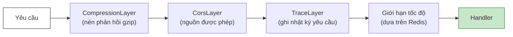

| Middleware | Cấu hình |
|---|---|
| **Compression** | Mã hóa Gzip cho tất cả phản hồi |
| **CORS** | Các nguồn được phép có thể cấu hình qua biến môi trường |
| **Tracing** | Ghi nhật ký yêu cầu/phản hồi có cấu trúc với `tracing` |
| **Rate Limiting** | Dựa trên Redis, theo từng IP: 5/phút cho các endpoint auth, có thể cấu hình cho các endpoint chung |

### 3.5 Bảng Route API

#### Xác thực (Giới hạn tốc độ: 5 yêu cầu/phút)

| Phương thức | Đường dẫn | Auth | Mô tả |
|---|---|---|---|
| `POST` | `/api/auth/register` | ✗ | Tạo tài khoản người dùng mới |
| `POST` | `/api/auth/login` | ✗ | Xác thực, trả về cặp JWT |
| `POST` | `/api/auth/refresh` | ✗ | Làm mới access token |
| `POST` | `/api/auth/logout` | ✓ | Thu hồi refresh token |

#### Hồ sơ Người dùng

| Phương thức | Đường dẫn | Auth | Mô tả |
|---|---|---|---|
| `GET` | `/api/users/me` | ✓ | Lấy hồ sơ người dùng hiện tại |
| `PUT` | `/api/users/me` | ✓ | Cập nhật hồ sơ người dùng |

#### Bài tập (Exercises)

| Phương thức | Đường dẫn | Auth | Mô tả |
|---|---|---|---|
| `POST` | `/api/exercises/generate` | ✓ | Tạo bộ bài tập thích ứng |
| `POST` | `/api/exercises/submit` | ✓ | Nộp câu trả lời bài tập |
| `GET` | `/api/exercises/history` | ✓ | Lấy lịch sử bài tập |

#### Phiên Luyện tập (Practice Sessions)

| Phương thức | Đường dẫn | Auth | Mô tả |
|---|---|---|---|
| `GET` | `/api/practice/questions` | ✓ | Lấy bộ câu hỏi luyện tập |
| `POST` | `/api/practice/submit` | ✓ | Nộp các câu trả lời luyện tập (hàng loạt) |
| `POST` | `/api/practice/start` | ✓ | Bắt đầu phiên luyện tập tính giờ |
| `POST` | `/api/practice/answer` | ✓ | Nộp câu trả lời riêng lẻ trong phiên |
| `GET` | `/api/practice/result/:id` | ✓ | Lấy kết quả phiên luyện tập |

#### Theo dõi Tiến độ

| Phương thức | Đường dẫn | Auth | Mô tả |
|---|---|---|---|
| `GET` | `/api/progress/summary` | ✓ | Lấy tóm tắt tiến độ tổng thể |
| `GET` | `/api/progress/topic/:topic` | ✓ | Lấy dữ liệu thông thạo theo từng chủ đề |

#### Bảng xếp hạng (Leaderboard)

| Phương thức | Đường dẫn | Auth | Mô tả |
|---|---|---|---|
| `GET` | `/api/leaderboard` | ✓ | Lấy bảng xếp hạng (truy vấn: `period=weekly\|global`) |
| `GET` | `/api/leaderboard/me` | ✓ | Lấy thứ hạng của người dùng hiện tại |

#### Gamification (XP / Chủ đề)

| Phương thức | Đường dẫn | Auth | Mô tả |
|---|---|---|---|
| `GET` | `/api/xp/profile` | ✓ | Lấy XP, cấp độ, hồ sơ kỹ năng |
| `GET` | `/api/xp/themes` | ✓ | Liệt kê tất cả các chủ đề có thể mở khóa |
| `POST` | `/api/xp/themes/:id/unlock` | ✓ | Mở khóa chủ đề bằng XP |
| `PUT` | `/api/xp/themes/:id/activate` | ✓ | Thiết lập chủ đề đang hoạt động |

#### Thành tích (Achievements)

| Phương thức | Đường dẫn | Auth | Mô tả |
|---|---|---|---|
| `GET` | `/api/achievements` | ✓ | Lấy tất cả thành tích với trạng thái mở khóa |

#### Giám sát của Phụ huynh

| Phương thức | Đường dẫn | Auth | Mô tả |
|---|---|---|---|
| `GET` | `/api/parent/children` | ✓ | Liệt kê các con đã liên kết |
| `GET` | `/api/parent/child/:id/progress` | ✓ | Lấy tiến độ của con |
| `PUT` | `/api/parent/child/:id/goals` | ✓ | Thiết lập mục tiêu hàng ngày cho con |

#### Hệ thống (System)

| Phương thức | Đường dẫn | Auth | Mô tả |
|---|---|---|---|
| `GET` | `/health` | ✗ | Kiểm tra trạng thái hệ thống (kết nối DB + Redis) |
| `GET` | `/ws?token=<JWT>` | ✓ | Nâng cấp WebSocket cho các sự kiện thời gian thực |

### 3.6 Lớp Dịch vụ (Service Layer)

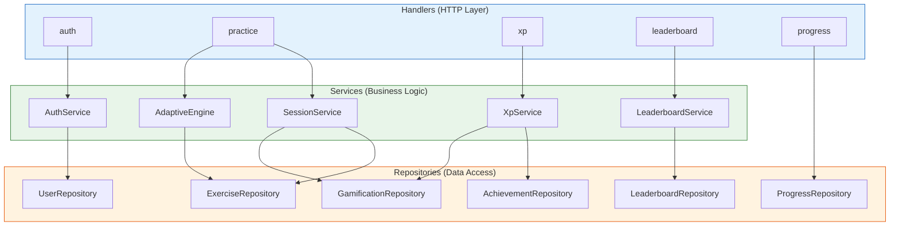

#### Mô tả Dịch vụ

| Dịch vụ | Trách nhiệm |
|---|---|
| **AuthService** | Đăng ký, đăng nhập, tạo cặp JWT, làm mới token, đăng xuất (hủy refresh token trong Redis) |
| **AdaptiveEngine** | Thuật toán lặp lại ngắt quãng SM-2, thay đổi độ khó dựa trên độ chính xác/tốc độ, lựa chọn kho câu hỏi |
| **SessionService** | Vòng đời phiên luyện tập: bắt đầu → trả lời → hoàn thành, theo dõi thời gian, tổng hợp kết quả |
| **LeaderboardService** | Tính toán xếp hạng hàng tuần/toàn cầu, xếp hạng được cache trong Redis với TTL 1 giờ, dự phòng bằng DB |
| **XpService** | Tính toán XP (cơ sở × độ khó × thưởng chuỗi), tiến trình cấp độ, đánh giá điều kiện thành tích, mở khóa chủ đề |

### 3.7 Luồng Xác thực (Authentication Flow)

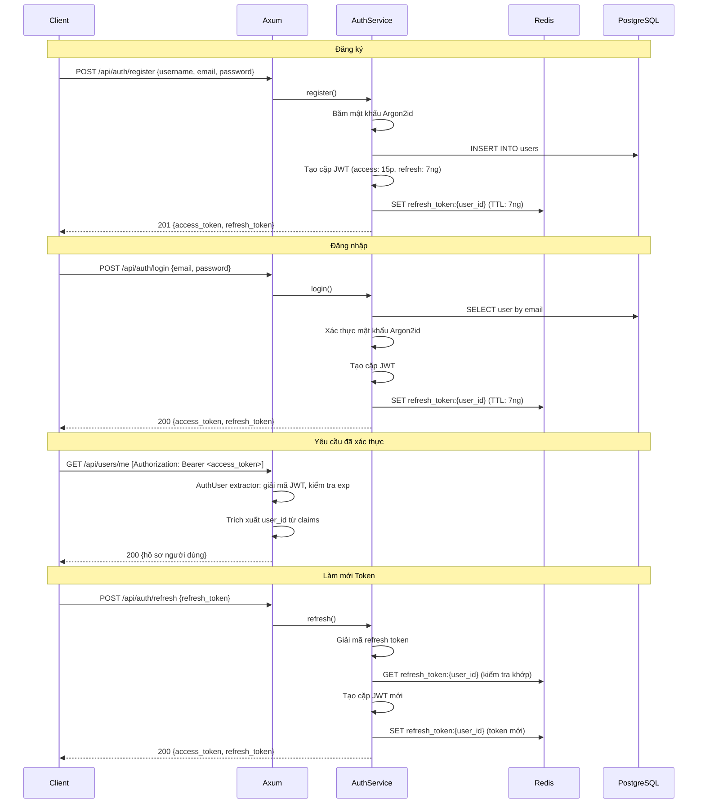

### 3.8 Xử lý Lỗi

Tất cả các lỗi đi qua enum `ApiError` triển khai `IntoResponse`:

| Biến thể | Trạng thái HTTP | Mô tả |
|---|---|---|
| `BadRequest(String)` | 400 | Đầu vào không hợp lệ / xác thực thất bại |
| `Unauthorized(String)` | 401 | Thiếu hoặc JWT không hợp lệ |
| `Forbidden(String)` | 403 | Không đủ quyền hạn |
| `NotFound(String)` | 404 | Không tìm thấy tài nguyên |
| `Conflict(String)` | 409 | Mục nhập trùng lặp (ví dụ: email đã đăng ký) |
| `TooManyRequests` | 429 | Vượt quá giới hạn tốc độ |
| `Internal(String)` | 500 | Lỗi server không mong muốn |

Tất cả các phản hồi lỗi tuân theo một định dạng JSON nhất quán:

```json
{
  "error": "Thông báo lỗi thân thiện với con người"
}
```

---

## 4. Thiết kế Cơ sở dữ liệu

### 4.1 Sơ đồ Quan hệ Thực thể (ER Diagram)

```mermaid
erDiagram
    users ||--o{ exercise_results : "completes"
    users ||--o{ user_achievements : "earns"
    users ||--o{ daily_progress : "tracks"
    users ||--o{ topic_mastery : "masters"
    users ||--o{ leaderboard_entries : "ranks"
    users ||--o{ skill_profiles : "has"
    users ||--o{ practice_sessions : "starts"
    users ||--o{ user_themes : "owns"
    users ||--o{ parent_child_links : "child"
    users ||--o{ parent_child_links : "parent"
    achievements ||--o{ user_achievements : "unlocked_by"
    practice_sessions ||--o{ practice_results : "contains"
    unlockable_themes ||--o{ user_themes : "unlocked_as"
    users ||--o{ daily_goals : "has"

    users {
        uuid id PK
        varchar username
        varchar email UK
        varchar password_hash
        varchar role "student|parent|admin"
        int grade_level
        timestamp created_at
        timestamp updated_at
    }

    exercise_results {
        uuid id PK
        uuid user_id FK
        varchar topic
        varchar difficulty
        jsonb question
        varchar user_answer
        varchar correct_answer
        boolean is_correct
        int response_time_ms
        int xp_earned
        timestamp created_at
    }

    achievements {
        uuid id PK
        varchar name UK
        varchar description
        varchar icon
        varchar category
        jsonb condition
        int xp_reward
        timestamp created_at
    }

    user_achievements {
        uuid id PK
        uuid user_id FK
        uuid achievement_id FK
        timestamp unlocked_at
    }

    daily_progress {
        uuid id PK
        uuid user_id FK
        date date
        int problems_solved
        int problems_correct
        int total_time_seconds
        int xp_earned
        int streak_count
        timestamp created_at
        timestamp updated_at
    }

    topic_mastery {
        uuid id PK
        uuid user_id FK
        varchar topic
        decimal mastery_level
        int total_attempts
        int correct_attempts
        decimal avg_response_time
        timestamp last_practiced
        timestamp created_at
        timestamp updated_at
    }

    parent_child_links {
        uuid id PK
        uuid parent_id FK
        uuid child_id FK
        timestamp created_at
    }

    daily_goals {
        uuid id PK
        uuid user_id FK
        int target_problems
        int target_minutes
        int target_accuracy
        timestamp created_at
        timestamp updated_at
    }

    leaderboard_entries {
        uuid id PK
        uuid user_id FK
        varchar period "weekly|global"
        int score
        int rank
        varchar username
        timestamp week_start
        timestamp created_at
        timestamp updated_at
    }

    question_bank {
        uuid id PK
        varchar topic
        varchar difficulty
        varchar question_template
        varchar answer_formula
        jsonb parameters
        timestamp created_at
    }

    skill_profiles {
        uuid id PK
        uuid user_id FK UK
        int total_xp
        int current_level
        int current_streak
        int best_streak
        decimal elo_rating
        varchar preferred_difficulty
        jsonb topic_weights
        timestamp created_at
        timestamp updated_at
    }

    practice_sessions {
        uuid id PK
        uuid user_id FK
        varchar status "active|completed|abandoned"
        varchar topic
        varchar difficulty
        int total_questions
        int correct_answers
        int total_time_seconds
        int xp_earned
        timestamp started_at
        timestamp completed_at
        timestamp created_at
    }

    practice_results {
        uuid id PK
        uuid session_id FK
        int question_number
        jsonb question
        varchar user_answer
        varchar correct_answer
        boolean is_correct
        int response_time_ms
        timestamp created_at
    }

    unlockable_themes {
        uuid id PK
        varchar name UK
        varchar description
        varchar preview_color
        int xp_cost
        int required_level
        boolean is_default
        timestamp created_at
    }

    user_themes {
        uuid id PK
        uuid user_id FK
        uuid theme_id FK
        boolean is_active
        timestamp unlocked_at
    }
```

### 4.2 Chi tiết Bảng theo Domain

#### Domain Người dùng (3 bảng)

| Bảng | Bản ghi | Mục đích |
|---|---|---|
| `users` | Cốt lõi | Các tài khoản người dùng với quyền truy cập theo vai trò (student/parent/admin) |
| `parent_child_links` | Quan hệ | Liên kết người dùng phụ huynh với người dùng con để giám sát |
| `daily_goals` | Cấu hình | Mục tiêu hàng ngày cho mỗi trẻ do phụ huynh thiết lập |

#### Domain Luyện tập (4 bảng)

| Bảng | Bản ghi | Mục đích |
|---|---|---|
| `question_bank` | 40 mẫu | Các mẫu câu hỏi được nạp sẵn với các công thức tham số hóa |
| `exercise_results` | Append-only | Các bản ghi nỗ lực làm bài tập cá nhân |
| `practice_sessions` | Mỗi phiên | Metadata phiên luyện tập tính giờ và kết quả tổng hợp |
| `practice_results` | Mỗi câu trả lời | Các câu trả lời cá nhân trong một phiên luyện tập |

#### Domain Tiến độ (2 bảng)

| Bảng | Bản ghi | Mục đích |
|---|---|---|
| `daily_progress` | Mỗi user/ngày | Các chỉ số tổng hợp hàng ngày (bài tập, độ chính xác, XP, chuỗi) |
| `topic_mastery` | Mỗi user/chủ đề | Thông thạo cấp độ chủ đề với dữ liệu lập lịch SM-2 |

#### Domain Gamification (5 bảng)

| Bảng | Bản ghi | Mục đích |
|---|---|---|
| `skill_profiles` | Mỗi user (1:1) | XP, cấp độ, xếp hạng ELO, theo dõi chuỗi |
| `achievements` | 14 mẫu nạp sẵn | Định nghĩa thành tích với các điều kiện JSON |
| `user_achievements` | Mỗi lần mở khóa | Theo dõi các thành tích mà mỗi người dùng đã đạt được |
| `leaderboard_entries` | Mỗi user/giai đoạn | Các vị trí bảng xếp hạng được cache (hàng tuần + toàn cầu) |
| `unlockable_themes` | 9 mẫu nạp sẵn | Định nghĩa chủ đề với chi phí XP và yêu cầu cấp độ |
| `user_themes` | Mỗi lần mở khóa | Theo dõi quyền sở hữu chủ đề và lựa chọn chủ đề hoạt động |

### 4.3 Các Kiểu dữ liệu Tùy chỉnh (Custom Types)

```sql
CREATE TYPE user_role AS ENUM ('student', 'parent', 'admin');
CREATE TYPE session_status AS ENUM ('active', 'completed', 'abandoned');
```

### 4.4 Chiến lược Đánh chỉ mục (Indexing Strategy)

Cơ sở dữ liệu sử dụng **hơn 40 chỉ mục** để tối ưu hiệu suất truy vấn:

| Mô hình | Ví dụ | Mục đích |
|---|---|---|
| **Chỉ mục khóa ngoại** | `idx_exercise_results_user_id` | Join nhanh trên tất cả các cột FK |
| **Chỉ mục hỗn hợp** | `idx_daily_progress_user_date` trên `(user_id, date)` | Truy vấn dải ngày hiệu quả cho mỗi người dùng |
| **Ràng buộc duy nhất** | `idx_user_achievements_unique` trên `(user_id, achievement_id)` | Ngăn chặn mở khóa thành tích trùng lặp |
| **Bảng xếp hạng** | `idx_leaderboard_period_score` trên `(period, score DESC)` | Truy vấn bảng xếp hạng đã sắp xếp nhanh chóng |
| **Tìm kiếm chủ đề** | `idx_topic_mastery_user_topic` trên `(user_id, topic)` | Tìm kiếm thông thạo chủ đề với độ phức tạp O(1) |
| **Kho câu hỏi** | `idx_question_bank_topic_difficulty` trên `(topic, difficulty)` | Lựa chọn câu hỏi nhanh theo tiêu chí |

### 4.5 Trình kích hoạt (Triggers)

Sáu trình kích hoạt tự động cập nhật `updated_at` đảm bảo dấu thời gian luôn mới nhất:

```sql
-- Áp dụng cho: users, daily_progress, topic_mastery, skill_profiles, daily_goals, leaderboard_entries
CREATE TRIGGER set_updated_at
    BEFORE UPDATE ON {table}
    FOR EACH ROW
    EXECUTE FUNCTION update_updated_at_column();
```

### 4.6 Chiến lược Cache (DragonflyDB)

| Mô hình Key | TTL | Mục đích |
|---|---|---|
| `rate_limit:auth:{ip}` | 60s | Giới hạn tốc độ endpoint auth (5 req/phút) |
| `rate_limit:general:{ip}` | 60s | Giới hạn tốc độ endpoint chung |
| `problems:{topic}:{difficulty}:{hash}` | 5-10 phút | Cache các bộ bài tập đã tạo |
| `refresh_token:{user_id}` | 7 ngày | Lưu trữ refresh token để xác thực |
| `leaderboard:rank:{user_id}:{period}` | 1 giờ | Cache vị trí thứ hạng của người dùng |
| `leaderboard:{period}` | 1 giờ | Dữ liệu bảng xếp hạng đầy đủ (hàng tuần/toàn cầu) |

**Chiến lược Cache**: Read-through với hết hạn TTL. Khi không có trong cache (cache miss), truy vấn PostgreSQL và nạp vào cache. Bảng xếp hạng sử dụng TTL 1 giờ với khả năng làm mới trong nền.

---

## 5. Kiến trúc Frontend

### 5.1 Công nghệ Sử dụng

| Thành phần | Phiên bản | Mục đích |
|---|---|---|
| Flutter | 3.29.3 | Framework UI đa nền tảng (mobile + web) |
| Riverpod | 2.x | Quản lý trạng thái phản ứng với tạo mã tự động |
| GoRouter | 14.x | Điều hướng khai báo với bảo vệ chuyển hướng auth |
| Dio | 5.x | Client HTTP với các interceptor |
| Hive | 4.x | Lưu trữ key-value cục bộ |
| fl_chart | 0.69.x | Biểu đồ trực quan hóa tiến độ |
| flutter_animate | 4.x | Hiệu ứng hoạt hình khai báo |
| Freezed | 2.x | Các model bất biến với kiểu union |
| Lottie | 3.x | Hoạt hình vector (splash, ăn mừng) |
| Rive | 0.13.x | Hoạt hình tương tác (mẹo học tập) |
| web_socket_channel | 3.x | Client WebSocket cho các tính năng thời gian thực |
| confetti_widget | 0.4.x | Hiệu ứng hạt ăn mừng (pháo hoa giấy) |

### 5.2 Các lớp Kiến trúc Sạch (Clean Architecture Layers)

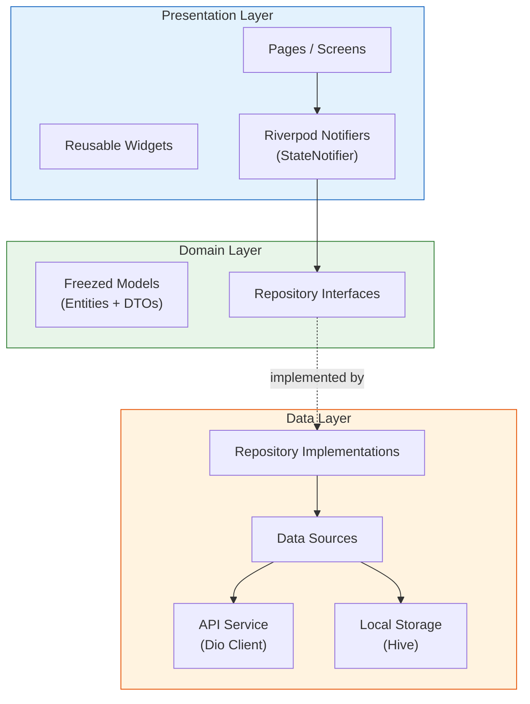

**Quy tắc Phụ thuộc**: Các lớp bên ngoài phụ thuộc vào các lớp bên trong. Lớp Domain không có phụ thuộc bên ngoài nào.

### 5.3 Cấu trúc Dự án

```
frontend/lib/
├── app.dart                        # Gốc SmartMathApp (ProviderScope + MaterialApp.router)
├── main.dart                       # Điểm nhập (Entry point)
├── core/
│   ├── constants/
│   │   └── api_constants.dart      # URL cơ sở, tất cả đường dẫn endpoint, cấu hình WS
│   ├── network/
│   │   ├── api_client.dart         # ApiClient có kiểu bao bọc Dio (get/post/put/delete)
│   │   └── dio_provider.dart       # Instance Dio với interceptor auth + làm mới token
│   ├── router/
│   │   ├── app_router.dart         # Cấu hình GoRouter với bảo vệ chuyển hướng auth
│   │   └── route_names.dart        # Hơn 20 hằng số tên route
│   ├── storage/
│   │   └── hive_service.dart       # Khởi tạo Hive + các box: user_box, settings_box, cache_box
│   ├── theme/
│   │   └── app_theme.dart          # Chủ đề Material 3 thân thiện với trẻ em (bo tròn, đầy màu sắc)
│   └── error/
│       └── error_handler.dart      # Xử lý lỗi toàn cục + thông báo thân thiện với người dùng
├── features/
│   ├── auth/                       # Đăng nhập, đăng ký, quản lý token
│   ├── home/                       # Bảng điều khiển, trung tâm điều hướng
│   ├── exercises/                  # Luồng bài tập thích ứng
│   ├── practice/                   # Luyện tập tính giờ với hiệu ứng
│   ├── progress/                   # Biểu đồ, phân tích kỹ năng, so sánh hàng tuần
│   ├── achievements/               # Lưới thành tích, thông báo huy hiệu
│   ├── leaderboard/                # Xếp hạng hàng tuần/toàn cầu
│   ├── competition/                # Các trận đấu thời gian thực qua WebSocket
│   ├── learning_tips/              # Hướng dẫn hoạt hình + trắc nghiệm nhỏ
│   ├── gamification/               # Hiển thị XP, thăng cấp, lựa chọn chủ đề
│   ├── parent/                     # Bảng điều khiển phụ huynh + thiết lập mục tiêu
│   └── settings/                   # Tùy chọn ứng dụng
└── shared/
    └── widgets/                    # Các widget hoạt hình dùng chung
```

### 5.4 Mô hình Module Tính năng (Feature Module Pattern)

Mỗi tính năng tuân theo một cấu trúc nội bộ nhất quán:

```
features/{feature_name}/
├── data/
│   ├── datasources/
│   │   └── {feature}_remote_data_source.dart
│   └── repositories/
│       └── {feature}_repository_impl.dart
├── domain/
│   ├── models/
│   │   └── {feature}_model.dart        # Các model bất biến Freezed
│   └── repositories/
│       └── {feature}_repository.dart    # Giao diện trừu tượng
├── presentation/
│   ├── notifiers/
│   │   └── {feature}_notifier.dart      # StateNotifier + provider Riverpod
│   ├── pages/
│   │   └── {feature}_page.dart          # Trang toàn màn hình
│   └── widgets/
│       └── {feature}_widget.dart        # Các widget đặc thù cho tính năng
└── providers.dart                       # Các provider Riverpod phạm vi tính năng
```

### 5.5 Điều hướng (GoRouter)

```dart
GoRouter(
  initialLocation: '/splash',
  redirect: (context, state) {
    final isLoggedIn = /* kiểm tra trạng thái auth */;
    final isAuthRoute = state.matchedLocation.startsWith('/auth');
    if (!isLoggedIn && !isAuthRoute) return '/auth/login';
    if (isLoggedIn && isAuthRoute) return '/home';
    return null;
  },
  routes: [
    GoRoute(path: '/splash', builder: (_,__) => SplashPage()),
    GoRoute(path: '/auth/login', builder: (_,__) => LoginPage()),
    GoRoute(path: '/auth/register', builder: (_,__) => RegisterPage()),
    GoRoute(path: '/auth/parent/register', builder: (_,__) => ParentRegisterPage()),
    ShellRoute(
      builder: (_,__,child) => BaseLayout(child: child),
      routes: [
        GoRoute(path: '/home', builder: (_,__) => HomePage()),
        GoRoute(path: '/practice', builder: (_,__) => PracticePage()),
        GoRoute(path: '/practice/result/:id', builder: ...),
        GoRoute(path: '/progress', builder: (_,__) => ProgressPage()),
        GoRoute(path: '/leaderboard', builder: (_,__) => LeaderboardPage()),
        GoRoute(path: '/achievements', builder: (_,__) => AchievementsPage()),
        GoRoute(path: '/competition', builder: (_,__) => CompetitionPage()),
        GoRoute(path: '/learning-tips', builder: (_,__) => LearningTipsPage()),
        GoRoute(path: '/gamification', builder: (_,__) => GamificationPage()),
        GoRoute(path: '/themes', builder: (_,__) => ThemeSelectionPage()),
        GoRoute(path: '/settings', builder: (_,__) => SettingsPage()),
        GoRoute(path: '/parent', builder: (_,__) => ParentDashboardPage()),
      ],
    ),
  ],
)
```

### 5.6 Quản lý Trạng thái (Riverpod)

**Mô hình**: `StateNotifier<AsyncValue<T>>` với các provider Riverpod.

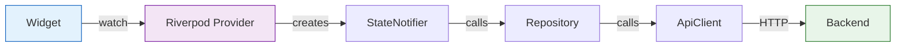

Trạng thái mang tính phản ứng — các widget tự động xây dựng lại khi các provider phát ra các giá trị mới. `AsyncValue` cung cấp các trạng thái loading/error/data có sẵn.

### 5.7 Lớp Mạng (Network Layer)

**Cấu hình Dio**:
- URL cơ sở từ môi trường/hằng số
- Interceptor Auth: đính kèm header `Authorization: Bearer <token>`
- Interceptor làm mới Token: khi nhận lỗi 401, cố gắng làm mới và thử lại yêu cầu gốc
- Interceptor Lỗi: ánh xạ các lỗi Dio thành thông báo thân thiện với người dùng
- Timeout: có thể cấu hình thời gian kết nối/nhận dữ liệu

**ApiClient** bao bọc Dio với các phương thức có kiểu:

```dart
class ApiClient {
  Future<T> get<T>(String path, {Map<String, dynamic>? queryParams, T Function(dynamic)? fromJson});
  Future<T> post<T>(String path, {dynamic data, T Function(dynamic)? fromJson});
  Future<T> put<T>(String path, {dynamic data, T Function(dynamic)? fromJson});
  Future<void> delete(String path);
}
```

### 5.8 Tích hợp WebSocket

Tính năng thi đấu sử dụng WebSocket để giao tiếp thời gian thực:

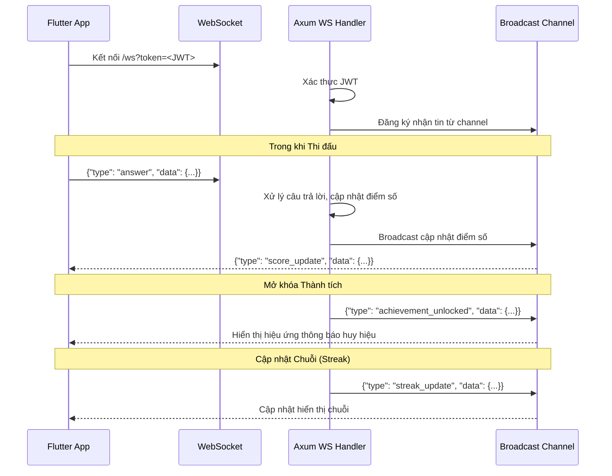

**Các Sự kiện WebSocket**:
- `achievement_unlocked` — Kích hoạt hiệu ứng thông báo huy hiệu
- `streak_update` — Cập nhật bộ đếm chuỗi thời gian thực
- `score_update` — Đồng bộ điểm số thi đấu giữa các đối thủ

---

## 6. Giao tiếp giữa các Dịch vụ

### 6.1 Vòng đời Yêu cầu Đầy đủ (Full Request Lifecycle)

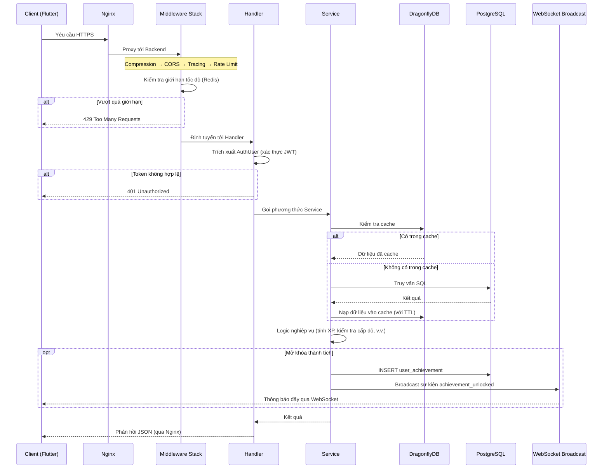

### 6.2 Luồng Phiên Luyện tập

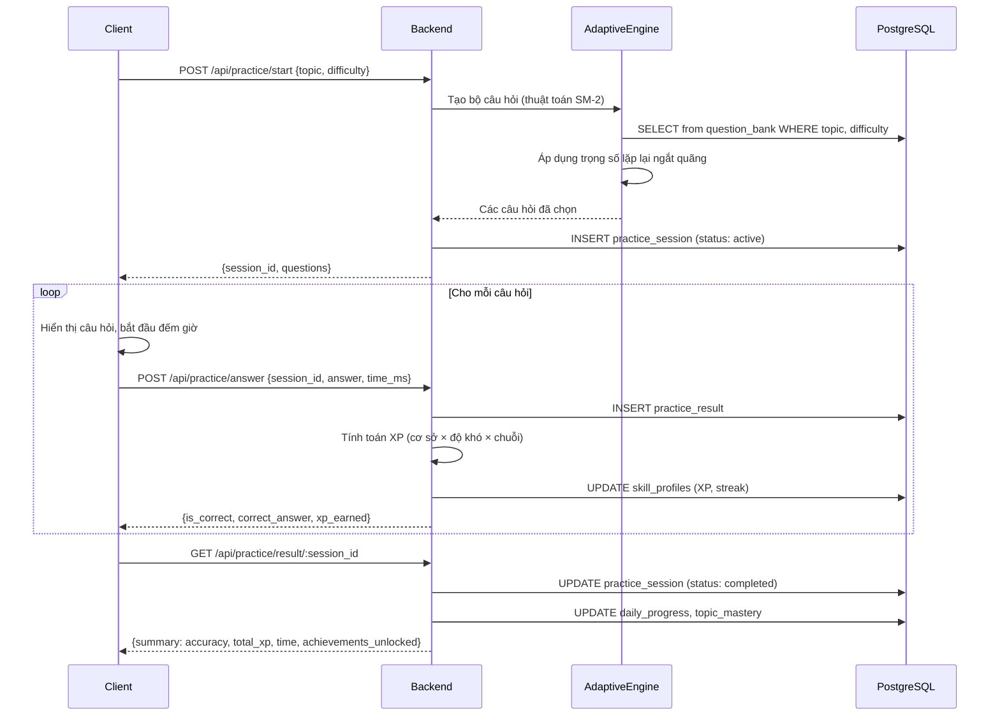

---

## 7. Kiến trúc Triển khai

### 7.1 Cấu trúc Docker Compose (Topology)

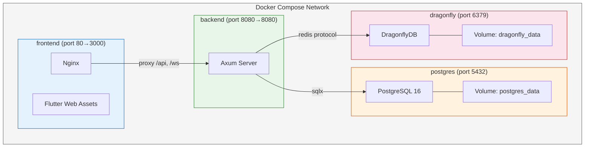

### 7.2 Cấu hình Dịch vụ

| Dịch vụ | Image | Ports | Phụ thuộc | Kiểm tra Sức khỏe |
|---|---|---|---|---|
| `postgres` | `postgres:16-alpine` | 5432 | — | `pg_isready` |
| `dragonfly` | `docker.dragonflydb.io/dragonflydb/dragonfly` | 6379 | — | `redis-cli ping` |
| `backend` | Custom (build 4 giai đoạn) | 8080 | postgres, dragonfly | `curl /health` |
| `frontend` | Custom (build 2 giai đoạn) | 3000 | backend | — |

### 7.3 Dockerfile Backend (Build 4 Giai đoạn)

```dockerfile
# Giai đoạn 1: Chef — chuẩn bị công thức phụ thuộc
FROM rust:1.88-slim AS chef
RUN cargo install cargo-chef
WORKDIR /app
COPY . .
RUN cargo chef prepare --recipe-path recipe.json

# Giai đoạn 2: Cache — chỉ build các phụ thuộc (layer được cache)
FROM rust:1.88-slim AS cacher
RUN cargo install cargo-chef
WORKDIR /app
COPY --from=chef /app/recipe.json recipe.json
RUN cargo chef cook --release --recipe-path recipe.json

# Giai đoạn 3: Build — biên dịch ứng dụng với các phụ thuộc đã cache
FROM rust:1.88-slim AS builder
WORKDIR /app
COPY --from=cacher /app/target target
COPY --from=cacher /usr/local/cargo /usr/local/cargo
COPY . .
RUN cargo build --release

# Giai đoạn 4: Runtime — image production tối giản
FROM debian:bookworm-slim AS runtime
RUN apt-get update && apt-get install -y ca-certificates && rm -rf /var/lib/apt/lists/*
COPY --from=builder /app/target/release/smart-brain-backend /usr/local/bin/
EXPOSE 8080
CMD ["smart-brain-backend"]
```

**Tối ưu hóa then chốt**: `cargo-chef` tách biệt việc biên dịch phụ thuộc khỏi việc biên dịch ứng dụng, cho phép Docker cache layer cho các phụ thuộc. Các lần build lại chỉ biên dịch lại mã nguồn ứng dụng.

### 7.4 Dockerfile Frontend (Build 2 Giai đoạn)

```dockerfile
# Giai đoạn 1: Build Flutter web
FROM ghcr.io/cirruslabs/flutter:3.29.3 AS builder
WORKDIR /app
COPY . .
RUN flutter pub get && flutter build web --release

# Giai đoạn 2: Phục vụ bằng Nginx
FROM nginx:alpine
COPY --from=builder /app/build/web /usr/share/nginx/html
COPY nginx.conf /etc/nginx/conf.d/default.conf
EXPOSE 80
```

**Cấu hình Nginx**: Điều hướng SPA (dự phòng về `index.html`), API proxy (`/api` → backend:8080), WebSocket proxy (`/ws` → backend:8080 với các header nâng cấp).

### 7.5 Đường ống CI/CD (GitHub Actions)

#### Đường ống Rust (`.github/workflows/rust.yml`)

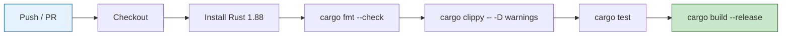

#### Đường ống Flutter (`.github/workflows/flutter.yml`)

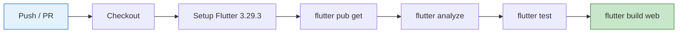

### 7.6 Cấu hình Môi trường

Tất cả cấu hình được tiêm qua các biến môi trường (ứng dụng 12 yếu tố):

| Biến | Dịch vụ | Mặc định | Mô tả |
|---|---|---|---|
| `DATABASE_URL` | backend | — | Chuỗi kết nối PostgreSQL |
| `REDIS_URL` | backend | — | Chuỗi kết nối DragonflyDB |
| `JWT_SECRET` | backend | — | Bí mật HMAC để ký JWT |
| `JWT_EXPIRATION` | backend | `900` | TTL của access token (giây) |
| `REFRESH_TOKEN_EXPIRATION` | backend | `604800` | TTL của refresh token (giây) |
| `CORS_ORIGINS` | backend | `*` | Các nguồn CORS được phép |
| `RUST_LOG` | backend | `info` | Bộ lọc cấp độ log |
| `SERVER_HOST` | backend | `0.0.0.0` | Địa chỉ bind |
| `SERVER_PORT` | backend | `8080` | Cổng bind |
| `POSTGRES_USER` | postgres | — | Người dùng cơ sở dữ liệu |
| `POSTGRES_PASSWORD` | postgres | — | Mật khẩu cơ sở dữ liệu |
| `POSTGRES_DB` | postgres | — | Tên cơ sở dữ liệu |
| `DRAGONFLY_PASSWORD` | dragonfly | — | Xác thực cache |

---

## 8. Các lưu ý về Bảo mật

### 8.1 Xác thực & Phân quyền

| Biện pháp | Triển khai |
|---|---|
| **Băm mật khẩu** | Argon2id (ngốn bộ nhớ, chống lại GPU) |
| **Chiến lược Token** | Access token ngắn hạn (15 phút) + Refresh token dài hạn (7 ngày) |
| **Lưu trữ Token** | Refresh token được lưu trong Redis với thực thi TTL |
| **Thu hồi Token** | Đăng xuất xóa refresh token khỏi Redis ngay lập tức |
| **Bảo vệ Route** | Bộ trích xuất `AuthUser` trên tất cả các endpoint được bảo vệ |
| **Truy cập theo Vai trò** | ENUM `user_role` (student/parent/admin) với kiểm tra vai trò |

### 8.2 Bảo mật Mạng

| Biện pháp | Triển khai |
|---|---|
| **TLS Termination** | Nginx xử lý HTTPS (chứng chỉ qua môi trường triển khai) |
| **CORS** | Các nguồn được phép có thể cấu hình, không sử dụng wildcard trong production |
| **Giới hạn tốc độ** | Giới hạn theo IP dựa trên Redis: 5/phút auth, có thể cấu hình cho chung |
| **Xác thực WebSocket** | Yêu cầu JWT làm tham số truy vấn khi nâng cấp WS |
| **Mạng Nội bộ** | Mạng Docker cô lập các dịch vụ; chỉ lộ diện Nginx |

### 8.3 Bảo mật Dữ liệu

| Biện pháp | Triển khai |
|---|---|
| **SQL Injection** | Truy vấn được kiểm tra tại thời điểm biên dịch qua SQLx (tham số hóa) |
| **Xác thực Đầu vào** | Giải tuần tự hóa Serde với thực thi kiểu dữ liệu |
| **Quản lý Bí mật** | Các biến môi trường, không bao giờ hardcode; `.env.example` không có giá trị thật |
| **Tiết lộ Lỗi** | Lỗi nội bộ trả về thông báo chung; chi tiết chỉ được ghi log phía server |
| **Xác thực Cache** | DragonflyDB yêu cầu xác thực bằng mật khẩu |

### 8.4 An toàn cho Trẻ em

| Biện pháp | Triển khai |
|---|---|
| **PII tối thiểu** | Chỉ lưu tên người dùng, email; không yêu cầu tên thật |
| **Liên kết Phụ huynh** | Mối quan hệ phụ huynh-con rõ ràng với các vai trò riêng biệt |
| **An toàn Nội dung** | Tất cả nội dung chỉ liên quan đến toán học, không có văn bản do người dùng tạo hiển thị cho người khác |
| **Giới hạn Phiên** | Các phiên luyện tập có giới hạn; không có vòng lặp tương tác vô tận |

---

## 9. Các lưu ý về Khả năng mở rộng

### 9.1 Các điểm mở rộng trong Kiến trúc Hiện tại

| Thành phần | Chiến lược | Chi tiết |
|---|---|---|
| **Backend** | Mở rộng theo chiều ngang | Các server Axum không trạng thái đằng sau bộ cân bằng tải; dùng chung DB + Redis |
| **PostgreSQL** | Chiều dọc + Read replicas | Pooling kết nối qua `sqlx::PgPool`; read replicas cho các truy vấn bảng xếp hạng/tiến độ |
| **DragonflyDB** | Mở rộng theo chiều dọc | Đa luồng (so với Redis đơn luồng); xử lý thông lượng cao một cách tự nhiên |
| **Frontend** | Phân phối CDN | Các tài sản web Flutter tĩnh được phục vụ qua Nginx / CDN |
| **WebSocket** | Kênh Broadcast | `tokio::sync::broadcast` với dung lượng 1024; Redis Pub/Sub cho đa instance |

### 9.2 Tối ưu hóa Hiệu suất

| Tối ưu hóa | Ở đâu | Tác động |
|---|---|---|
| **Nén Gzip** | Tất cả phản hồi | Giảm 60-80% băng thông |
| **Pooling Kết nối** | PostgreSQL, Redis | Loại bỏ chi phí thiết lập kết nối |
| **Chỉ mục Truy vấn** | Hơn 40 chỉ mục DB | Tìm kiếm dưới một phần nghìn giây |
| **Lớp Cache** | Bảng xếp hạng, giới hạn tốc độ, token | Giảm tải DB khoảng ~70% cho các đường dẫn nóng |
| **cargo-chef Docker** | Đường ống build | Build lại nhanh hơn 5-10 lần (phụ thuộc đã được cache) |
| **Dockerfile 4 giai đoạn** | Image Backend | Image runtime tối giản (~50MB) |

### 9.3 Lộ trình Mở rộng Tương lai

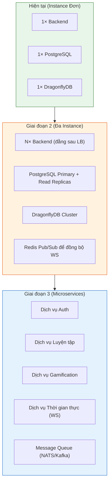

---

## 10. Hệ thống Gamification

### 10.1 Cách tính XP

```
XP = base_xp × difficulty_multiplier × streak_bonus
```

| Yếu tố | Giá trị |
|---|---|
| **base_xp** | 10 (mỗi câu trả lời đúng) |
| **difficulty_multiplier** | Dễ: 1.0, Trung bình: 1.5, Khó: 2.0, Chuyên gia: 3.0 |
| **streak_bonus** | 1.0 + (streak_count × 0.1), giới hạn tối đa 2.0 |

### 10.2 Tiến trình Cấp độ

```
XP cần thiết cho cấp độ N = 100 × N^1.5
```

| Cấp độ | XP Cần thiết | Tích lũy |
|---|---|---|
| 1 | 100 | 100 |
| 2 | 283 | 383 |
| 5 | 1,118 | 3,336 |
| 10 | 3,162 | 15,811 |
| 20 | 8,944 | 63,246 |
| 50 | 35,355 | — |

### 10.3 Xếp hạng ELO

Được sử dụng cho ghép trận thi đấu và độ khó thích ứng:

```
Xếp hạng Mới = Xếp hạng Cũ + K × (Thực tế - Kỳ vọng)
Kỳ vọng = 1 / (1 + 10^((Đối thủ - Người chơi) / 400))
Hệ số K = 32 (mặc định)
```

### 10.4 Hệ thống Thành tích

14 thành tích được nạp sẵn thuộc các danh mục:

| Danh mục | Ví dụ |
|---|---|
| **Luyện tập** | Luyện tập Đầu tiên, Có công mài sắt (100 phiên) |
| **Chuỗi (Streak)** | Đang bốc hỏa (chuỗi 7 ngày), Không thể ngăn cản (chuỗi 30 ngày) |
| **Độ chính xác** | Xạ thủ (độ chính xác 90% trên 50+ bài toán) |
| **Tốc độ** | Nhanh như chớp (trung bình dưới 3 giây) |
| **Thông thạo** | Bậc thầy Chủ đề (95% trong bất kỳ chủ đề nào) |
| **Xã hội** | Chiến thắng Thi đấu Đầu tiên |

Các điều kiện thành tích được lưu trữ dưới dạng JSON trong bảng `achievements`, được đánh giá bởi `XpService` sau mỗi lần nộp câu trả lời.

### 10.5 Các Chủ đề có thể mở khóa

9 chủ đề với các yêu cầu mở khóa tăng dần:

| Chủ đề | Chi phí XP | Cấp độ yêu cầu | Mô tả |
|---|---|---|---|
| **Cổ điển (Classic)** | 0 | 0 | Chủ đề mặc định (mở khóa sẵn) |
| **Đại dương Xanh** | 500 | 3 | Màu đại dương mát mẻ |
| **Rừng Xanh** | 500 | 3 | Màu xanh lấy cảm hứng từ thiên nhiên |
| **Cam Hoàng hôn** | 1,000 | 5 | Bảng màu hoàng hôn ấm áp |
| **Tím Thiên hà** | 1,000 | 5 | Màu tím theo chủ đề không gian |
| **Hồng Kẹo ngọt** | 2,000 | 8 | Màu kẹo ngọt ngào |
| **Bóng đêm** | 2,000 | 8 | Chủ đề chế độ tối |
| **Hoàng kim (Golden)** | 5,000 | 15 | Điểm nhấn vàng cao cấp |
| **Cầu vồng** | 10,000 | 25 | Ăn mừng với đầy đủ màu sắc |

### 10.6 Lặp lại ngắt quãng (SM-2)

Dịch vụ `AdaptiveEngine` triển khai thuật toán SM-2 đã được sửa đổi để lựa chọn câu hỏi:

1. **Chủ đề mới**: Bắt đầu ở độ khó Dễ
2. **Sau câu trả lời đúng**: Tăng trọng số độ khó, kéo dài khoảng thời gian ôn tập
3. **Sau câu trả lời sai**: Giảm độ khó, rút ngắn khoảng thời gian ôn tập
4. **Trọng số chủ đề** (lưu trong `skill_profiles.topic_weights`): Ưu tiên các phần còn yếu
5. **Suy giảm theo thời gian**: Các chủ đề không được luyện tập gần đây sẽ có ưu tiên lựa chọn cao hơn

---

*Tài liệu này phản ánh kiến trúc hệ thống tính đến tháng 3 năm 2026. Nó nên được cập nhật khi hệ thống phát triển.*

(Kết thúc tệp - tổng cộng 1344 dòng)
