# SmartMath Kids — Database Schema Documentation

> **Database**: PostgreSQL 16  
> **Cache**: DragonflyDB (Redis-compatible)  
> **ORM**: SQLx 0.8 (compile-time checked queries)  
> **Migrations**: 12 sequential SQL files

---

## Table of Contents

1. [Overview](#1-overview)
2. [Entity-Relationship Diagram](#2-entity-relationship-diagram)
3. [Custom Types](#3-custom-types)
4. [Tables by Domain](#4-tables-by-domain)
   - [User Domain](#41-user-domain)
   - [Exercise Domain](#42-exercise-domain)
   - [Progress Domain](#43-progress-domain)
   - [Parent Domain](#44-parent-domain)
   - [Leaderboard Domain](#45-leaderboard-domain)
   - [Practice Domain](#46-practice-domain)
   - [Gamification Domain](#47-gamification-domain)
5. [Indexing Strategy](#5-indexing-strategy)
6. [Triggers](#6-triggers)
7. [Seed Data](#7-seed-data)
8. [Caching Strategy](#8-caching-strategy)
9. [Migration Reference](#9-migration-reference)

---

## 1. Overview

The SmartMath Kids database consists of **16 tables**, **2 custom ENUM types**, **45+ indexes**, and **6 auto-update triggers**. The schema is organized into 7 logical domains:

| Domain | Tables | Purpose |
|---|---|---|
| **User** | 1 | User accounts and authentication |
| **Exercise** | 1 | Individual exercise attempt tracking |
| **Progress** | 2 | Daily progress and topic mastery analytics |
| **Parent** | 2 | Parent-child relationships and daily goals |
| **Leaderboard** | 1 | Periodic ranking entries |
| **Practice** | 4 | Practice sessions, results, question bank, skill profiles |
| **Gamification** | 4 | Achievements, themes, XP tracking |

All tables use:
- `UUID` primary keys (generated via `gen_random_uuid()`)
- `TIMESTAMPTZ` for all timestamps (timezone-aware)
- `ON DELETE CASCADE` for all foreign keys
- Appropriate `CHECK` constraints for data validation

---

## 2. Entity-Relationship Diagram

```mermaid
erDiagram
    users ||--o{ exercise_results : "completes"
    users ||--o{ user_achievements : "earns"
    users ||--o{ daily_progress : "tracks"
    users ||--o{ topic_mastery : "masters"
    users ||--o{ leaderboard_entries : "ranks in"
    users ||--o{ skill_profiles : "has"
    users ||--o{ practice_sessions : "starts"
    users ||--o{ practice_results : "answers in"
    users ||--o{ user_themes : "owns"
    users ||--o{ parent_child_links : "is child in"
    users ||--o{ parent_child_links : "is parent in"
    users ||--o{ daily_goals : "has goals set by"
    achievements ||--o{ user_achievements : "unlocked as"
    practice_sessions ||--o{ practice_results : "contains"
    unlockable_themes ||--o{ user_themes : "unlocked as"

    users {
        uuid id PK
        varchar email UK
        varchar username UK
        text password_hash
        varchar display_name
        text avatar_url
        integer grade_level "1-6, default 1"
        integer age "4-18, nullable"
        user_role role "default 'student'"
        boolean is_active "default true"
        bigint total_xp "default 0"
        integer current_level "default 1"
        timestamptz created_at
        timestamptz updated_at
    }

    exercise_results {
        uuid id PK
        uuid user_id FK
        varchar topic
        varchar difficulty
        text question_text
        double correct_answer
        double user_answer
        boolean is_correct
        integer points_earned
        integer time_taken_ms
        timestamptz created_at
    }

    achievements {
        uuid id PK
        varchar name UK
        text description
        varchar emoji
        integer reward_points
        varchar criteria_type
        integer criteria_value
    }

    user_achievements {
        uuid id PK
        uuid user_id FK
        uuid achievement_id FK "UNIQUE(user_id, achievement_id)"
        timestamptz unlocked_at
    }

    daily_progress {
        uuid id PK
        uuid user_id FK "UNIQUE(user_id, date)"
        date date
        integer total_exercises
        integer correct_count
        integer total_points
        bigint total_time_ms
        integer streak_count
    }

    topic_mastery {
        uuid id PK
        uuid user_id FK "UNIQUE(user_id, topic)"
        varchar topic
        integer total_answered
        integer correct_count
        double mastery_score
        timestamptz last_practiced
        timestamptz updated_at
    }

    parent_child_links {
        uuid id PK
        uuid parent_id FK "UNIQUE(parent_id, child_id)"
        uuid child_id FK
        timestamptz created_at
    }

    daily_goals {
        uuid id PK
        uuid parent_id FK "UNIQUE(parent_id, child_id)"
        uuid child_id FK
        integer daily_exercise_target "default 10"
        integer daily_time_target_minutes "default 15"
        jsonb active_topics
        timestamptz created_at
        timestamptz updated_at
    }

    leaderboard_entries {
        uuid id PK
        uuid user_id FK "UNIQUE(user_id, period)"
        varchar period
        integer total_points
        integer rank
        timestamptz updated_at
    }

    question_bank {
        uuid id PK
        varchar topic
        integer difficulty_level "1-10"
        text question_template
        integer operand_min
        integer operand_max
        text explanation_template
        integer grade_min "1-6"
        integer grade_max "1-6"
        boolean active "default true"
        timestamptz created_at
    }

    skill_profiles {
        uuid id PK
        uuid user_id FK "UNIQUE(user_id, topic)"
        varchar topic
        integer current_difficulty "1-10"
        double elo_rating "default 1000.0"
        double recent_accuracy
        jsonb last_n_results
        integer consecutive_correct
        integer consecutive_wrong
        timestamptz next_review_at
        double review_interval_days "default 1.0"
        double ease_factor "default 2.5"
        integer total_attempts
        timestamptz created_at
        timestamptz updated_at
    }

    practice_sessions {
        uuid id PK
        uuid user_id FK
        varchar topic
        session_status status "default 'active'"
        integer total_questions
        integer correct_count
        integer total_points
        bigint total_time_ms
        integer max_combo
        integer current_combo
        integer difficulty_start "1-10"
        integer difficulty_end "1-10"
        timestamptz started_at
        timestamptz completed_at
        timestamptz created_at
        timestamptz updated_at
    }

    practice_results {
        uuid id PK
        uuid session_id FK
        uuid user_id FK
        uuid question_id
        varchar topic
        integer difficulty_level "1-10"
        text question_text
        double correct_answer
        double user_answer
        boolean is_correct
        integer points_earned
        double combo_multiplier "default 1.0"
        integer combo_count
        integer time_taken_ms
        timestamptz created_at
    }

    unlockable_themes {
        uuid id PK
        varchar name UK
        text description
        varchar emoji
        integer required_level
        bigint required_xp
        boolean is_premium
        timestamptz created_at
    }

    user_themes {
        uuid id PK
        uuid user_id FK "UNIQUE(user_id, theme_id)"
        uuid theme_id FK
        timestamptz unlocked_at
        boolean is_active "default false"
    }
```



---

## 3. Custom Types

### `user_role` ENUM

```sql
CREATE TYPE user_role AS ENUM ('student', 'parent', 'admin');
```

| Value | Description |
|---|---|
| `student` | Child user — can practice, compete, earn XP |
| `parent` | Parent user — can view children's progress, set goals |
| `admin` | Administrator — full system access |

### `session_status` ENUM

```sql
CREATE TYPE session_status AS ENUM ('active', 'completed', 'abandoned');
```

| Value | Description |
|---|---|
| `active` | Practice session is in progress |
| `completed` | All questions answered, session finalized |
| `abandoned` | Session was started but not finished |

---

## 4. Tables by Domain

### 4.1 User Domain

#### `users`

Core user accounts table with authentication and profile data.

```sql
CREATE TABLE users (
    id              UUID PRIMARY KEY DEFAULT gen_random_uuid(),
    email           VARCHAR(255) NOT NULL UNIQUE,
    username        VARCHAR(100) NOT NULL UNIQUE,
    password_hash   TEXT NOT NULL,
    display_name    VARCHAR(255),
    avatar_url      TEXT,
    grade_level     INTEGER NOT NULL DEFAULT 1 CHECK (grade_level BETWEEN 1 AND 6),
    age             INTEGER CHECK (age IS NULL OR (age BETWEEN 4 AND 18)),
    role            user_role NOT NULL DEFAULT 'student',
    is_active       BOOLEAN NOT NULL DEFAULT TRUE,
    total_xp        BIGINT NOT NULL DEFAULT 0,
    current_level   INTEGER NOT NULL DEFAULT 1,
    created_at      TIMESTAMPTZ NOT NULL DEFAULT NOW(),
    updated_at      TIMESTAMPTZ NOT NULL DEFAULT NOW()
);
```

| Column | Type | Constraints | Description |
|---|---|---|---|
| `id` | UUID | PK, auto-generated | Unique user identifier |
| `email` | VARCHAR(255) | NOT NULL, UNIQUE | Login email address |
| `username` | VARCHAR(100) | NOT NULL, UNIQUE | Display username |
| `password_hash` | TEXT | NOT NULL | Argon2id password hash |
| `display_name` | VARCHAR(255) | nullable | Optional display name |
| `avatar_url` | TEXT | nullable | Profile picture URL |
| `grade_level` | INTEGER | NOT NULL, CHECK 1-6, DEFAULT 1 | School grade level |
| `age` | INTEGER | CHECK 4-18, nullable | User age |
| `role` | user_role | NOT NULL, DEFAULT 'student' | Access role |
| `is_active` | BOOLEAN | NOT NULL, DEFAULT TRUE | Account active status |
| `total_xp` | BIGINT | NOT NULL, DEFAULT 0 | Cumulative experience points |
| `current_level` | INTEGER | NOT NULL, DEFAULT 1 | Current gamification level |
| `created_at` | TIMESTAMPTZ | NOT NULL, DEFAULT NOW() | Account creation time |
| `updated_at` | TIMESTAMPTZ | NOT NULL, DEFAULT NOW() | Last update (auto-trigger) |

**Indexes:**
- `idx_users_email` on `(email)`
- `idx_users_username` on `(username)`
- `idx_users_role` on `(role)`
- `idx_users_is_active` on `(is_active)`
- `idx_users_total_xp` on `(total_xp DESC)`
- `idx_users_current_level` on `(current_level)`

---

### 4.2 Exercise Domain

#### `exercise_results`

Records individual exercise attempts with accuracy and timing data.

```sql
CREATE TABLE exercise_results (
    id              UUID PRIMARY KEY DEFAULT gen_random_uuid(),
    user_id         UUID NOT NULL REFERENCES users(id) ON DELETE CASCADE,
    topic           VARCHAR(50) NOT NULL,
    difficulty      VARCHAR(20) NOT NULL,
    question_text   TEXT NOT NULL,
    correct_answer  DOUBLE PRECISION NOT NULL,
    user_answer     DOUBLE PRECISION,
    is_correct      BOOLEAN NOT NULL DEFAULT FALSE,
    points_earned   INTEGER NOT NULL DEFAULT 0,
    time_taken_ms   INTEGER,
    created_at      TIMESTAMPTZ NOT NULL DEFAULT NOW()
);
```

| Column | Type | Constraints | Description |
|---|---|---|---|
| `id` | UUID | PK | Result identifier |
| `user_id` | UUID | FK → users, CASCADE | User who attempted |
| `topic` | VARCHAR(50) | NOT NULL | Math topic (addition, subtraction, etc.) |
| `difficulty` | VARCHAR(20) | NOT NULL | Difficulty label (easy, medium, hard) |
| `question_text` | TEXT | NOT NULL | The question displayed |
| `correct_answer` | DOUBLE PRECISION | NOT NULL | Expected answer |
| `user_answer` | DOUBLE PRECISION | nullable | What the user entered |
| `is_correct` | BOOLEAN | NOT NULL, DEFAULT FALSE | Whether answer was correct |
| `points_earned` | INTEGER | NOT NULL, DEFAULT 0 | XP earned for this attempt |
| `time_taken_ms` | INTEGER | nullable | Response time in milliseconds |
| `created_at` | TIMESTAMPTZ | NOT NULL, DEFAULT NOW() | When the attempt occurred |

**Indexes:**
- `idx_exercise_results_user_id` on `(user_id)`
- `idx_exercise_results_topic` on `(topic)`
- `idx_exercise_results_user_topic` on `(user_id, topic)`
- `idx_exercise_results_created_at` on `(created_at)`
- `idx_exercise_results_user_created` on `(user_id, created_at DESC)`

---

### 4.3 Progress Domain

#### `daily_progress`

Aggregated daily metrics per user for progress tracking dashboards.

```sql
CREATE TABLE daily_progress (
    id              UUID PRIMARY KEY DEFAULT gen_random_uuid(),
    user_id         UUID NOT NULL REFERENCES users(id) ON DELETE CASCADE,
    date            DATE NOT NULL DEFAULT CURRENT_DATE,
    total_exercises INTEGER NOT NULL DEFAULT 0,
    correct_count   INTEGER NOT NULL DEFAULT 0,
    total_points    INTEGER NOT NULL DEFAULT 0,
    total_time_ms   BIGINT NOT NULL DEFAULT 0,
    streak_count    INTEGER NOT NULL DEFAULT 0,
    UNIQUE (user_id, date)
);
```

| Column | Type | Constraints | Description |
|---|---|---|---|
| `id` | UUID | PK | Progress record ID |
| `user_id` | UUID | FK → users, CASCADE | User |
| `date` | DATE | NOT NULL, UNIQUE(user_id, date) | Calendar date |
| `total_exercises` | INTEGER | NOT NULL, DEFAULT 0 | Problems attempted today |
| `correct_count` | INTEGER | NOT NULL, DEFAULT 0 | Correct answers today |
| `total_points` | INTEGER | NOT NULL, DEFAULT 0 | XP earned today |
| `total_time_ms` | BIGINT | NOT NULL, DEFAULT 0 | Total practice time today |
| `streak_count` | INTEGER | NOT NULL, DEFAULT 0 | Consecutive correct in session |

**Indexes:**
- `idx_daily_progress_user_id` on `(user_id)`
- `idx_daily_progress_date` on `(date)`
- `idx_daily_progress_user_date` on `(user_id, date DESC)`

#### `topic_mastery`

Per-topic mastery scores for each user, used by the adaptive engine.

```sql
CREATE TABLE topic_mastery (
    id              UUID PRIMARY KEY DEFAULT gen_random_uuid(),
    user_id         UUID NOT NULL REFERENCES users(id) ON DELETE CASCADE,
    topic           VARCHAR(50) NOT NULL,
    total_answered  INTEGER NOT NULL DEFAULT 0,
    correct_count   INTEGER NOT NULL DEFAULT 0,
    mastery_score   DOUBLE PRECISION NOT NULL DEFAULT 0.0,
    last_practiced  TIMESTAMPTZ NOT NULL DEFAULT NOW(),
    updated_at      TIMESTAMPTZ NOT NULL DEFAULT NOW(),
    UNIQUE (user_id, topic)
);
```

**Indexes:**
- `idx_topic_mastery_user_id` on `(user_id)`
- `idx_topic_mastery_topic` on `(topic)`
- `idx_topic_mastery_user_topic` on `(user_id, topic)`

---

### 4.4 Parent Domain

#### `parent_child_links`

Links parent users to their children for oversight access.

```sql
CREATE TABLE parent_child_links (
    id          UUID PRIMARY KEY DEFAULT gen_random_uuid(),
    parent_id   UUID NOT NULL REFERENCES users(id) ON DELETE CASCADE,
    child_id    UUID NOT NULL REFERENCES users(id) ON DELETE CASCADE,
    created_at  TIMESTAMPTZ NOT NULL DEFAULT NOW(),
    UNIQUE (parent_id, child_id)
);
```

**Indexes:**
- `idx_parent_child_links_parent_id` on `(parent_id)`
- `idx_parent_child_links_child_id` on `(child_id)`

#### `daily_goals`

Per-child daily targets configured by parents.

```sql
CREATE TABLE daily_goals (
    id                          UUID PRIMARY KEY DEFAULT gen_random_uuid(),
    parent_id                   UUID NOT NULL REFERENCES users(id) ON DELETE CASCADE,
    child_id                    UUID NOT NULL REFERENCES users(id) ON DELETE CASCADE,
    daily_exercise_target       INTEGER NOT NULL DEFAULT 10,
    daily_time_target_minutes   INTEGER NOT NULL DEFAULT 15,
    active_topics               JSONB NOT NULL DEFAULT '["addition", "subtraction"]'::jsonb,
    created_at                  TIMESTAMPTZ NOT NULL DEFAULT NOW(),
    updated_at                  TIMESTAMPTZ NOT NULL DEFAULT NOW(),
    UNIQUE (parent_id, child_id)
);
```

**Indexes:**
- `idx_daily_goals_parent_id` on `(parent_id)`
- `idx_daily_goals_child_id` on `(child_id)`

---

### 4.5 Leaderboard Domain

#### `leaderboard_entries`

Cached ranking positions by time period.

```sql
CREATE TABLE leaderboard_entries (
    id              UUID PRIMARY KEY DEFAULT gen_random_uuid(),
    user_id         UUID NOT NULL REFERENCES users(id) ON DELETE CASCADE,
    period          VARCHAR(20) NOT NULL DEFAULT 'all_time',
    total_points    INTEGER NOT NULL DEFAULT 0,
    rank            INTEGER NOT NULL DEFAULT 0,
    updated_at      TIMESTAMPTZ NOT NULL DEFAULT NOW()
);
```

**Indexes:**
- `idx_leaderboard_entries_user_id` on `(user_id)`
- `idx_leaderboard_entries_period` on `(period)`
- `idx_leaderboard_entries_period_points` on `(period, total_points DESC)`
- `idx_leaderboard_entries_period_rank` on `(period, rank ASC)`
- `idx_leaderboard_entries_user_period` UNIQUE on `(user_id, period)`

---

### 4.6 Practice Domain

#### `question_bank`

Pre-seeded question templates with parameterized difficulty (1-10 scale).

```sql
CREATE TABLE question_bank (
    id                      UUID PRIMARY KEY DEFAULT gen_random_uuid(),
    topic                   VARCHAR(50) NOT NULL,
    difficulty_level        INTEGER NOT NULL CHECK (difficulty_level BETWEEN 1 AND 10),
    question_template       TEXT NOT NULL,
    operand_min             INTEGER NOT NULL,
    operand_max             INTEGER NOT NULL,
    explanation_template    TEXT NOT NULL,
    grade_min               INTEGER NOT NULL DEFAULT 1 CHECK (grade_min BETWEEN 1 AND 6),
    grade_max               INTEGER NOT NULL DEFAULT 6 CHECK (grade_max BETWEEN 1 AND 6),
    active                  BOOLEAN NOT NULL DEFAULT TRUE,
    created_at              TIMESTAMPTZ NOT NULL DEFAULT NOW()
);
```

**Indexes:**
- `idx_question_bank_topic` on `(topic)`
- `idx_question_bank_difficulty` on `(difficulty_level)`
- `idx_question_bank_topic_difficulty` on `(topic, difficulty_level)`
- `idx_question_bank_active` PARTIAL on `(active) WHERE active = true`

#### `skill_profiles`

Per-user, per-topic adaptive difficulty tracking with SM-2 spaced repetition data.

```sql
CREATE TABLE skill_profiles (
    id                      UUID PRIMARY KEY DEFAULT gen_random_uuid(),
    user_id                 UUID NOT NULL REFERENCES users(id) ON DELETE CASCADE,
    topic                   VARCHAR(50) NOT NULL,
    current_difficulty      INTEGER NOT NULL DEFAULT 1 CHECK (current_difficulty BETWEEN 1 AND 10),
    elo_rating              DOUBLE PRECISION NOT NULL DEFAULT 1000.0,
    recent_accuracy         DOUBLE PRECISION NOT NULL DEFAULT 0.0,
    last_n_results          JSONB NOT NULL DEFAULT '[]'::jsonb,
    consecutive_correct     INTEGER NOT NULL DEFAULT 0,
    consecutive_wrong       INTEGER NOT NULL DEFAULT 0,
    next_review_at          TIMESTAMPTZ NOT NULL DEFAULT NOW(),
    review_interval_days    DOUBLE PRECISION NOT NULL DEFAULT 1.0,
    ease_factor             DOUBLE PRECISION NOT NULL DEFAULT 2.5,
    total_attempts          INTEGER NOT NULL DEFAULT 0,
    created_at              TIMESTAMPTZ NOT NULL DEFAULT NOW(),
    updated_at              TIMESTAMPTZ NOT NULL DEFAULT NOW(),
    UNIQUE (user_id, topic)
);
```

| Column | Description |
|---|---|
| `current_difficulty` | Current difficulty level (1-10), adjusted by adaptive engine |
| `elo_rating` | ELO rating starting at 1000, used for matchmaking |
| `recent_accuracy` | Rolling accuracy percentage |
| `last_n_results` | JSON array of recent boolean results for trend analysis |
| `consecutive_correct` | Current streak of correct answers |
| `consecutive_wrong` | Current streak of wrong answers |
| `next_review_at` | SM-2 next scheduled review timestamp |
| `review_interval_days` | SM-2 review interval |
| `ease_factor` | SM-2 ease factor (default 2.5) |

**Indexes:**
- `idx_skill_profiles_user` on `(user_id)`
- `idx_skill_profiles_user_topic` on `(user_id, topic)`
- `idx_skill_profiles_review` on `(user_id, next_review_at)`

#### `practice_sessions`

Timed practice session metadata with aggregated scoring.

```sql
CREATE TABLE practice_sessions (
    id                  UUID PRIMARY KEY DEFAULT gen_random_uuid(),
    user_id             UUID NOT NULL REFERENCES users(id) ON DELETE CASCADE,
    topic               VARCHAR(50) NOT NULL,
    status              session_status NOT NULL DEFAULT 'active',
    total_questions     INTEGER NOT NULL DEFAULT 0,
    correct_count       INTEGER NOT NULL DEFAULT 0,
    total_points        INTEGER NOT NULL DEFAULT 0,
    total_time_ms       BIGINT NOT NULL DEFAULT 0,
    max_combo           INTEGER NOT NULL DEFAULT 0,
    current_combo       INTEGER NOT NULL DEFAULT 0,
    difficulty_start    INTEGER NOT NULL DEFAULT 1 CHECK (difficulty_start BETWEEN 1 AND 10),
    difficulty_end      INTEGER NOT NULL DEFAULT 1 CHECK (difficulty_end BETWEEN 1 AND 10),
    started_at          TIMESTAMPTZ NOT NULL DEFAULT NOW(),
    completed_at        TIMESTAMPTZ,
    created_at          TIMESTAMPTZ NOT NULL DEFAULT NOW(),
    updated_at          TIMESTAMPTZ NOT NULL DEFAULT NOW()
);
```

**Indexes:**
- `idx_practice_sessions_user` on `(user_id)`
- `idx_practice_sessions_user_status` on `(user_id, status)`
- `idx_practice_sessions_user_topic` on `(user_id, topic)`
- `idx_practice_sessions_started` on `(started_at DESC)`

#### `practice_results`

Individual answer records within a practice session.

```sql
CREATE TABLE practice_results (
    id                  UUID PRIMARY KEY DEFAULT gen_random_uuid(),
    session_id          UUID NOT NULL REFERENCES practice_sessions(id) ON DELETE CASCADE,
    user_id             UUID NOT NULL REFERENCES users(id) ON DELETE CASCADE,
    question_id         UUID NOT NULL,
    topic               VARCHAR(50) NOT NULL,
    difficulty_level    INTEGER NOT NULL CHECK (difficulty_level BETWEEN 1 AND 10),
    question_text       TEXT NOT NULL,
    correct_answer      DOUBLE PRECISION NOT NULL,
    user_answer         DOUBLE PRECISION NOT NULL,
    is_correct          BOOLEAN NOT NULL DEFAULT FALSE,
    points_earned       INTEGER NOT NULL DEFAULT 0,
    combo_multiplier    DOUBLE PRECISION NOT NULL DEFAULT 1.0,
    combo_count         INTEGER NOT NULL DEFAULT 0,
    time_taken_ms       INTEGER,
    created_at          TIMESTAMPTZ NOT NULL DEFAULT NOW()
);
```

**Indexes:**
- `idx_practice_results_session` on `(session_id)`
- `idx_practice_results_user` on `(user_id)`
- `idx_practice_results_session_created` on `(session_id, created_at)`
- `idx_practice_results_user_topic` on `(user_id, topic)`

---

### 4.7 Gamification Domain

#### `achievements`

Achievement definitions with unlock criteria. Pre-seeded with 15 achievements.

```sql
CREATE TABLE achievements (
    id              UUID PRIMARY KEY DEFAULT gen_random_uuid(),
    name            VARCHAR(100) NOT NULL UNIQUE,
    description     TEXT NOT NULL,
    emoji           VARCHAR(10) NOT NULL DEFAULT '🏆',
    reward_points   INTEGER NOT NULL DEFAULT 0,
    criteria_type   VARCHAR(50) NOT NULL,
    criteria_value  INTEGER NOT NULL DEFAULT 0
);
```

| `criteria_type` Values | Description |
|---|---|
| `total_answered` | Total questions answered |
| `total_correct` | Total correct answers |
| `streak` | Consecutive correct answers |
| `{topic}_mastery` | 90%+ accuracy in specific topic (min 50 questions) |
| `speed` | Total time for N questions (ms) |
| `perfect_session` | 100% accuracy in session (min N questions) |
| `day_streak` | Consecutive days practiced |
| `level` | Reaching a specific level |
| `total_points` | Cumulative points earned |

#### `user_achievements`

Tracks which achievements each user has unlocked.

```sql
CREATE TABLE user_achievements (
    id              UUID PRIMARY KEY DEFAULT gen_random_uuid(),
    user_id         UUID NOT NULL REFERENCES users(id) ON DELETE CASCADE,
    achievement_id  UUID NOT NULL REFERENCES achievements(id) ON DELETE CASCADE,
    unlocked_at     TIMESTAMPTZ NOT NULL DEFAULT NOW(),
    UNIQUE (user_id, achievement_id)
);
```

#### `unlockable_themes`

Theme definitions with level and XP requirements. Pre-seeded with 9 themes.

```sql
CREATE TABLE unlockable_themes (
    id              UUID PRIMARY KEY DEFAULT gen_random_uuid(),
    name            VARCHAR(100) NOT NULL UNIQUE,
    description     TEXT NOT NULL,
    emoji           VARCHAR(10) NOT NULL DEFAULT '🎨',
    required_level  INTEGER NOT NULL DEFAULT 1,
    required_xp     BIGINT NOT NULL DEFAULT 0,
    is_premium      BOOLEAN NOT NULL DEFAULT FALSE,
    created_at      TIMESTAMPTZ NOT NULL DEFAULT NOW()
);
```

#### `user_themes`

Tracks theme ownership and active theme per user.

```sql
CREATE TABLE user_themes (
    id          UUID PRIMARY KEY DEFAULT gen_random_uuid(),
    user_id     UUID NOT NULL REFERENCES users(id) ON DELETE CASCADE,
    theme_id    UUID NOT NULL REFERENCES unlockable_themes(id) ON DELETE CASCADE,
    unlocked_at TIMESTAMPTZ NOT NULL DEFAULT NOW(),
    is_active   BOOLEAN NOT NULL DEFAULT FALSE,
    UNIQUE (user_id, theme_id)
);
```

**Indexes:**
- `idx_user_themes_user_id` on `(user_id)`
- `idx_user_themes_active` PARTIAL on `(user_id, is_active) WHERE is_active = TRUE`

---

## 5. Indexing Strategy

### Index Categories

| Category | Count | Purpose |
|---|---|---|
| **Primary Key** | 16 | Unique row identification |
| **Unique Constraints** | 9 | Business rule enforcement |
| **Foreign Key** | 15 | Fast JOIN performance |
| **Composite** | 10 | Multi-column query optimization |
| **Sorting** | 4 | Pre-sorted results (DESC indexes) |
| **Partial** | 2 | Conditional filtering optimization |

### Key Composite Indexes

| Index | Columns | Use Case |
|---|---|---|
| `idx_daily_progress_user_date` | `(user_id, date DESC)` | "Show my last 7 days of progress" |
| `idx_exercise_results_user_created` | `(user_id, created_at DESC)` | "Show my recent exercise history" |
| `idx_leaderboard_entries_period_points` | `(period, total_points DESC)` | "Get top 20 weekly scores" |
| `idx_skill_profiles_review` | `(user_id, next_review_at)` | "Which topics are due for review?" |
| `idx_question_bank_topic_difficulty` | `(topic, difficulty_level)` | "Get addition questions at level 5" |

### Partial Indexes

```sql
-- Only index active questions (skip archived)
CREATE INDEX idx_question_bank_active ON question_bank (active) WHERE active = true;

-- Only index active themes per user (one active at a time)
CREATE INDEX idx_user_themes_active ON user_themes (user_id, is_active) WHERE is_active = TRUE;
```

---

## 6. Triggers

All six triggers use the same function to automatically update `updated_at` timestamps:

```sql
CREATE OR REPLACE FUNCTION update_updated_at_column()
RETURNS TRIGGER AS $$
BEGIN
    NEW.updated_at = NOW();
    RETURN NEW;
END;
$$ LANGUAGE plpgsql;
```

| Trigger | Table | Event |
|---|---|---|
| `trigger_users_updated_at` | `users` | BEFORE UPDATE |
| `trigger_topic_mastery_updated_at` | `topic_mastery` | BEFORE UPDATE |
| `trigger_daily_goals_updated_at` | `daily_goals` | BEFORE UPDATE |
| `trigger_leaderboard_entries_updated_at` | `leaderboard_entries` | BEFORE UPDATE |
| `trigger_skill_profiles_updated_at` | `skill_profiles` | BEFORE UPDATE |
| `trigger_practice_sessions_updated_at` | `practice_sessions` | BEFORE UPDATE |

---

## 7. Seed Data

### 7.1 Achievements (15 records)

| Name | Emoji | Points | Criteria | Value | Description |
|---|---|---|---|---|---|
| `first_step` | 🎯 | 10 | total_answered | 1 | Answer your first question |
| `ten_streak` | 🔥 | 50 | streak | 10 | Get 10 correct answers in a row |
| `hundred_correct` | 💯 | 100 | total_correct | 100 | Answer 100 questions correctly |
| `addition_master` | ➕ | 200 | addition_mastery | 90 | 90% accuracy in addition (min 50) |
| `subtraction_master` | ➖ | 200 | subtraction_mastery | 90 | 90% accuracy in subtraction (min 50) |
| `multiplication_master` | ✖️ | 200 | multiplication_mastery | 90 | 90% accuracy in multiplication (min 50) |
| `division_master` | ➗ | 200 | division_mastery | 90 | 90% accuracy in division (min 50) |
| `speed_demon` | ⚡ | 75 | speed | 30000 | 5 questions in under 30s total |
| `perfect_day` | ⭐ | 150 | perfect_session | 10 | 100% accuracy in session (min 10) |
| `week_warrior` | 🗓️ | 100 | day_streak | 7 | Practice 7 days in a row |
| `month_champion` | 👑 | 500 | day_streak | 30 | Practice 30 days in a row |
| `level_5` | 🌟 | 50 | level | 5 | Reach level 5 |
| `level_10` | 🌠 | 100 | level | 10 | Reach level 10 |
| `level_20` | 💫 | 250 | level | 20 | Reach level 20 |
| `thousand_points` | 🏅 | 100 | total_points | 1000 | Earn 1000 total points |

### 7.2 Question Bank (40 templates)

4 topics × 10 difficulty levels = 40 question templates.

| Topic | Levels | Operand Ranges | Grade Range |
|---|---|---|---|
| **Addition** | 1-10 | 1-10 → 5000-99999 | Grades 1-6 |
| **Subtraction** | 1-10 | 1-10 → 5000-99999 | Grades 1-6 |
| **Multiplication** | 1-10 | 1-3 → 100-999 | Grades 1-6 |
| **Division** | 1-10 | 1-5 → 50-999 | Grades 1-6 |

**Example Question Template:**
```
Template: "{a} + {b} = ?"
Operand Range: min=10, max=50
Explanation: "{a} + {b} = {answer}. Try adding the tens first, then the ones."
```

### 7.3 Themes (9 records)

| Theme | Emoji | Level | XP | Premium |
|---|---|---|---|---|
| `ocean_blue` | 🌊 | 1 | 0 | No |
| `forest_green` | 🌲 | 3 | 200 | No |
| `sunset_orange` | 🌅 | 5 | 500 | No |
| `galaxy_purple` | 🌌 | 8 | 1,000 | No |
| `candy_pink` | 🍬 | 10 | 1,500 | No |
| `golden_star` | ⭐ | 15 | 3,000 | No |
| `rainbow_burst` | 🌈 | 20 | 5,000 | No |
| `diamond_ice` | 💎 | 25 | 8,000 | Yes |
| `dragon_fire` | 🐉 | 30 | 12,000 | Yes |

---

## 8. Caching Strategy

### DragonflyDB Key Patterns

| Key Pattern | TTL | Data Type | Purpose |
|---|---|---|---|
| `rate_limit:auth:{ip}` | 60s | Counter | Auth endpoint rate limiting (5 req/min) |
| `rate_limit:general:{ip}` | 60s | Counter | General endpoint rate limiting |
| `problems:{topic}:{difficulty}:{hash}` | 5-10 min | JSON | Cached generated problem sets |
| `refresh_token:{user_id}` | 7 days | String | Refresh token for validation |
| `leaderboard:{period}` | 1 hour | JSON | Full leaderboard data |
| `leaderboard:rank:{user_id}:{period}` | 1 hour | JSON | Individual user rank |

### Cache Strategy

```
Read Path:
  1. Check DragonflyDB cache
  2. Cache HIT → Return cached data
  3. Cache MISS → Query PostgreSQL → Populate cache → Return

Write Path:
  1. Write to PostgreSQL (source of truth)
  2. Invalidate related cache keys
  3. Next read re-populates cache
```

### Why DragonflyDB over Redis?

| Feature | Redis | DragonflyDB |
|---|---|---|
| Threading | Single-threaded | Multi-threaded |
| Memory efficiency | Good | 25% less memory |
| Throughput | ~100K ops/s | ~1M ops/s |
| API compatibility | Native | 100% Redis compatible |
| Snapshots | BGSAVE | Built-in cron snapshots |

---

## 9. Migration Reference

| Order | File | Tables/Changes |
|---|---|---|
| 1 | `20240101000001_create_users.sql` | `user_role` type, `users` table |
| 2 | `20240101000002_create_exercises.sql` | `exercise_results` table |
| 3 | `20240101000003_create_achievements.sql` | `achievements`, `user_achievements` + seed 15 achievements |
| 4 | `20240101000004_create_progress.sql` | `daily_progress`, `topic_mastery` |
| 5 | `20240101000005_create_parent_child.sql` | `parent_child_links`, `daily_goals` |
| 6 | `20240101000006_create_leaderboard.sql` | `leaderboard_entries` |
| 7 | `20240101000007_create_question_bank.sql` | `question_bank` + seed 40 templates |
| 8 | `20240101000008_create_skill_profiles.sql` | `skill_profiles` |
| 9 | `20240101000009_create_practice_sessions.sql` | `session_status` type, `practice_sessions` |
| 10 | `20240101000010_create_practice_results.sql` | `practice_results` |
| 11 | `20240101000011_add_xp_to_users.sql` | ALTER `users` + `total_xp`, `current_level` |
| 12 | `20240101000012_create_themes.sql` | `unlockable_themes`, `user_themes` + seed 9 themes |

### Running Migrations

```bash
# Install sqlx-cli
cargo install sqlx-cli --no-default-features --features rustls,postgres

# Run all pending migrations
cd backend && sqlx migrate run

# Check migration status
sqlx migrate info

# Revert last migration
sqlx migrate revert
```

---

*This document is auto-generated from the database migration files and reflects the current schema as of March 2026.*
