# SmartMath Kids — Tài liệu Lược đồ Cơ sở Dữ liệu

> **Cơ sở dữ liệu**: PostgreSQL 16  
> **Bộ nhớ đệm (Cache)**: DragonflyDB (Tương thích với Redis)  
> **ORM**: SQLx 0.8 (Truy vấn được kiểm tra tại thời điểm biên dịch)  
> **Migrations**: 12 tệp SQL tuần tự

---

## Mục lục

1. [Tổng quan](#1-tổng-quan)
2. [Sơ đồ Quan hệ Thực thể (ERD)](#2-sơ-đồ-quan-hệ-thực-thể)
3. [Các kiểu dữ liệu tùy chỉnh](#3-các-kiểu-dữ-liệu-tùy-chỉnh)
4. [Các bảng theo phân vùng (Domain)](#4-các-bảng-theo-phân-vùng)
   - [Phân vùng Người dùng](#41-phân-vùng-người-dùng)
   - [Phân vùng Bài tập](#42-phân-vùng-bài-tập)
   - [Phân vùng Tiến độ](#43-phân-vùng-tiến-độ)
   - [Phân vùng Phụ huynh](#44-phân-vùng-phụ-huynh)
   - [Phân vùng Bảng xếp hạng](#45-phân-vùng-bảng-xếp-hạng)
   - [Phân vùng Luyện tập](#46-phân-vùng-luyện-tập)
   - [Phân vùng Gamification](#47-phân-vùng-gamification)
5. [Chiến lược Đánh chỉ mục (Indexing)](#5-chiến-lược-đánh-chỉ-mục)
6. [Triggers](#6-triggers)
7. [Dữ liệu mẫu (Seed Data)](#7-dữ-liệu-mẫu)
8. [Chiến lược Caching](#8-chiến-lược-caching)
9. [Tham chiếu Migration](#9-tham-chiếu-migration)

---

## 1. Tổng quan

Cơ sở dữ liệu SmartMath Kids bao gồm **16 bảng**, **2 kiểu ENUM tùy chỉnh**, hơn **45 chỉ mục (indexes)**, và **6 triggers tự động cập nhật**. Lược đồ được tổ chức thành 7 phân vùng logic:

| Phân vùng | Số bảng | Mục đích |
|---|---|---|
| **Người dùng (User)** | 1 | Tài khoản người dùng và xác thực |
| **Bài tập (Exercise)** | 1 | Theo dõi các lượt làm bài tập cá nhân |
| **Tiến độ (Progress)** | 2 | Phân tích tiến độ hàng ngày và mức độ thông thạo chủ đề |
| **Phụ huynh (Parent)** | 2 | Quan hệ cha mẹ - con cái và thiết lập mục tiêu hàng ngày |
| **Bảng xếp hạng (Leaderboard)** | 1 | Các mục xếp hạng định kỳ |
| **Luyện tập (Practice)** | 4 | Các phiên luyện tập, kết quả, ngân hàng câu hỏi, hồ sơ kỹ năng |
| **Gamification** | 4 | Thành tích, giao diện, theo dõi XP |

Tất cả các bảng sử dụng:
- Khóa chính `UUID` (được tạo qua `gen_random_uuid()`)
- `TIMESTAMPTZ` cho tất cả các mốc thời gian (nhận biết múi giờ)
- `ON DELETE CASCADE` cho tất cả các khóa ngoại
- Các ràng buộc `CHECK` phù hợp để xác thực dữ liệu

---

## 2. Sơ đồ Quan hệ Thực thể

```mermaid
erDiagram
    users ||--o{ exercise_results : "completes"
    users ||--o{ user_achievements : "earns"
    users ||--o{ daily_progress : "tracks"
    users ||--o{ topic_mastery : "masters"
    users ||--o{ leaderboard_entries : "ranks in"
    users ||--o{ skill_profiles : "has"
    users ||--o{ practice_sessions : "starts"
    users ||--o{ practice_results : "answers in"
    users ||--o{ user_themes : "owns"
    users ||--o{ parent_child_links : "is child in"
    users ||--o{ parent_child_links : "is parent in"
    users ||--o{ daily_goals : "has goals set by"
    achievements ||--o{ user_achievements : "unlocked as"
    practice_sessions ||--o{ practice_results : "contains"
    unlockable_themes ||--o{ user_themes : "unlocked as"

    users {
        uuid id PK
        varchar email UK
        varchar username UK
        text password_hash
        varchar display_name
        text avatar_url
        integer grade_level "1-6, default 1"
        integer age "4-18, nullable"
        user_role role "default 'student'"
        boolean is_active "default true"
        bigint total_xp "default 0"
        integer current_level "default 1"
        timestamptz created_at
        timestamptz updated_at
    }

    exercise_results {
        uuid id PK
        uuid user_id FK
        varchar topic
        varchar difficulty
        text question_text
        double correct_answer
        double user_answer
        boolean is_correct
        integer points_earned
        integer time_taken_ms
        timestamptz created_at
    }

    achievements {
        uuid id PK
        varchar name UK
        text description
        varchar emoji
        integer reward_points
        varchar criteria_type
        integer criteria_value
    }

    user_achievements {
        uuid id PK
        uuid user_id FK
        uuid achievement_id FK "UNIQUE(user_id, achievement_id)"
        timestamptz unlocked_at
    }

    daily_progress {
        uuid id PK
        uuid user_id FK "UNIQUE(user_id, date)"
        date date
        integer total_exercises
        integer correct_count
        integer total_points
        bigint total_time_ms
        integer streak_count
    }

    topic_mastery {
        uuid id PK
        uuid user_id FK "UNIQUE(user_id, topic)"
        varchar topic
        integer total_answered
        integer correct_count
        double mastery_score
        timestamptz last_practiced
        timestamptz updated_at
    }

    parent_child_links {
        uuid id PK
        uuid parent_id FK "UNIQUE(parent_id, child_id)"
        uuid child_id FK
        timestamptz created_at
    }

    daily_goals {
        uuid id PK
        uuid parent_id FK "UNIQUE(parent_id, child_id)"
        uuid child_id FK
        integer daily_exercise_target "default 10"
        integer daily_time_target_minutes "default 15"
        jsonb active_topics
        timestamptz created_at
        timestamptz updated_at
    }

    leaderboard_entries {
        uuid id PK
        uuid user_id FK "UNIQUE(user_id, period)"
        varchar period
        integer total_points
        integer rank
        timestamptz updated_at
    }

    question_bank {
        uuid id PK
        varchar topic
        integer difficulty_level "1-10"
        text question_template
        integer operand_min
        integer operand_max
        text explanation_template
        integer grade_min "1-6"
        integer grade_max "1-6"
        boolean active "default true"
        timestamptz created_at
    }

    skill_profiles {
        uuid id PK
        uuid user_id FK "UNIQUE(user_id, topic)"
        varchar topic
        integer current_difficulty "1-10"
        double elo_rating "default 1000.0"
        double recent_accuracy
        jsonb last_n_results
        integer consecutive_correct
        integer consecutive_wrong
        timestamptz next_review_at
        double review_interval_days "default 1.0"
        double ease_factor "default 2.5"
        integer total_attempts
        timestamptz created_at
        timestamptz updated_at
    }

    practice_sessions {
        uuid id PK
        uuid user_id FK
        varchar topic
        session_status status "default 'active'"
        integer total_questions
        integer correct_count
        integer total_points
        bigint total_time_ms
        integer max_combo
        integer current_combo
        integer difficulty_start "1-10"
        integer difficulty_end "1-10"
        timestamptz started_at
        timestamptz completed_at
        timestamptz created_at
        timestamptz updated_at
    }

    practice_results {
        uuid id PK
        uuid session_id FK
        uuid user_id FK
        uuid question_id
        varchar topic
        integer difficulty_level "1-10"
        text question_text
        double correct_answer
        double user_answer
        boolean is_correct
        integer points_earned
        double combo_multiplier "default 1.0"
        integer combo_count
        integer time_taken_ms
        timestamptz created_at
    }

    unlockable_themes {
        uuid id PK
        varchar name UK
        text description
        varchar emoji
        integer required_level
        bigint required_xp
        boolean is_premium
        timestamptz created_at
    }

    user_themes {
        uuid id PK
        uuid user_id FK "UNIQUE(user_id, theme_id)"
        uuid theme_id FK
        timestamptz unlocked_at
        boolean is_active "default false"
    }
```



---

## 3. Các kiểu dữ liệu tùy chỉnh

### `user_role` ENUM

```sql
CREATE TYPE user_role AS ENUM ('student', 'parent', 'admin');
```

| Giá trị | Mô tả |
|---|---|
| `student` | Người dùng là học sinh — có thể luyện tập, thi đấu, tích lũy XP |
| `parent` | Người dùng là phụ huynh — có thể xem tiến độ của con, đặt mục tiêu |
| `admin` | Quản trị viên — có toàn quyền truy cập hệ thống |

### `session_status` ENUM

```sql
CREATE TYPE session_status AS ENUM ('active', 'completed', 'abandoned');
```

| Giá trị | Mô tả |
|---|---|
| `active` | Phiên luyện tập đang diễn ra |
| `completed` | Đã trả lời tất cả các câu hỏi, phiên luyện tập đã hoàn tất |
| `abandoned` | Phiên luyện tập đã bắt đầu nhưng chưa kết thúc |

---

## 4. Các bảng theo phân vùng

### 4.1 Phân vùng Người dùng

#### `users`

Bảng tài khoản người dùng cốt lõi với dữ liệu xác thực và hồ sơ.

```sql
CREATE TABLE users (
    id              UUID PRIMARY KEY DEFAULT gen_random_uuid(),
    email           VARCHAR(255) NOT NULL UNIQUE,
    username        VARCHAR(100) NOT NULL UNIQUE,
    password_hash   TEXT NOT NULL,
    display_name    VARCHAR(255),
    avatar_url      TEXT,
    grade_level     INTEGER NOT NULL DEFAULT 1 CHECK (grade_level BETWEEN 1 AND 6),
    age             INTEGER CHECK (age IS NULL OR (age BETWEEN 4 AND 18)),
    role            user_role NOT NULL DEFAULT 'student',
    is_active       BOOLEAN NOT NULL DEFAULT TRUE,
    total_xp        BIGINT NOT NULL DEFAULT 0,
    current_level   INTEGER NOT NULL DEFAULT 1,
    created_at      TIMESTAMPTZ NOT NULL DEFAULT NOW(),
    updated_at      TIMESTAMPTZ NOT NULL DEFAULT NOW()
);
```

| Cột | Kiểu | Ràng buộc | Mô tả |
|---|---|---|---|
| `id` | UUID | PK, tự động tạo | Mã định danh duy nhất của người dùng |
| `email` | VARCHAR(255) | NOT NULL, UNIQUE | Địa chỉ email đăng nhập |
| `username` | VARCHAR(100) | NOT NULL, UNIQUE | Tên người dùng hiển thị |
| `password_hash` | TEXT | NOT NULL | Mã băm mật khẩu Argon2id |
| `display_name` | VARCHAR(255) | nullable | Tên hiển thị tùy chọn |
| `avatar_url` | TEXT | nullable | URL ảnh đại diện |
| `grade_level` | INTEGER | NOT NULL, CHECK 1-6, DEFAULT 1 | Khối lớp |
| `age` | INTEGER | CHECK 4-18, nullable | Tuổi người dùng |
| `role` | user_role | NOT NULL, DEFAULT 'student' | Quyền truy cập |
| `is_active` | BOOLEAN | NOT NULL, DEFAULT TRUE | Trạng thái hoạt động của tài khoản |
| `total_xp` | BIGINT | NOT NULL, DEFAULT 0 | Tổng điểm kinh nghiệm tích lũy |
| `current_level` | INTEGER | NOT NULL, DEFAULT 1 | Cấp độ hiện tại |
| `created_at` | TIMESTAMPTZ | NOT NULL, DEFAULT NOW() | Thời gian tạo tài khoản |
| `updated_at` | TIMESTAMPTZ | NOT NULL, DEFAULT NOW() | Lần cập nhật cuối (trigger tự động) |

**Chỉ mục (Indexes):**
- `idx_users_email` trên `(email)`
- `idx_users_username` trên `(username)`
- `idx_users_role` trên `(role)`
- `idx_users_is_active` trên `(is_active)`
- `idx_users_total_xp` trên `(total_xp DESC)`
- `idx_users_current_level` trên `(current_level)`

---

### 4.2 Phân vùng Bài tập

#### `exercise_results`

Ghi lại các lượt làm bài tập cá nhân với dữ liệu về độ chính xác và thời gian.

```sql
CREATE TABLE exercise_results (
    id              UUID PRIMARY KEY DEFAULT gen_random_uuid(),
    user_id         UUID NOT NULL REFERENCES users(id) ON DELETE CASCADE,
    topic           VARCHAR(50) NOT NULL,
    difficulty      VARCHAR(20) NOT NULL,
    question_text   TEXT NOT NULL,
    correct_answer  DOUBLE PRECISION NOT NULL,
    user_answer     DOUBLE PRECISION,
    is_correct      BOOLEAN NOT NULL DEFAULT FALSE,
    points_earned   INTEGER NOT NULL DEFAULT 0,
    time_taken_ms   INTEGER,
    created_at      TIMESTAMPTZ NOT NULL DEFAULT NOW()
);
```

| Cột | Kiểu | Ràng buộc | Mô tả |
|---|---|---|---|
| `id` | UUID | PK | Mã định danh kết quả |
| `user_id` | UUID | FK → users, CASCADE | Người dùng thực hiện bài tập |
| `topic` | VARCHAR(50) | NOT NULL | Chủ đề toán học (cộng, trừ, v.v.) |
| `difficulty` | VARCHAR(20) | NOT NULL | Nhãn độ khó (dễ, trung bình, khó) |
| `question_text` | TEXT | NOT NULL | Nội dung câu hỏi hiển thị |
| `correct_answer` | DOUBLE PRECISION | NOT NULL | Đáp án đúng |
| `user_answer` | DOUBLE PRECISION | nullable | Đáp án người dùng đã nhập |
| `is_correct` | BOOLEAN | NOT NULL, DEFAULT FALSE | Trả lời đúng hay sai |
| `points_earned` | INTEGER | NOT NULL, DEFAULT 0 | XP nhận được cho lượt làm này |
| `time_taken_ms` | INTEGER | nullable | Thời gian trả lời tính bằng mili giây |
| `created_at` | TIMESTAMPTZ | NOT NULL, DEFAULT NOW() | Thời điểm thực hiện |

**Chỉ mục (Indexes):**
- `idx_exercise_results_user_id` trên `(user_id)`
- `idx_exercise_results_topic` trên `(topic)`
- `idx_exercise_results_user_topic` trên `(user_id, topic)`
- `idx_exercise_results_created_at` trên `(created_at)`
- `idx_exercise_results_user_created` trên `(user_id, created_at DESC)`

---

### 4.3 Phân vùng Tiến độ

#### `daily_progress`

Các chỉ số tổng hợp hàng ngày của mỗi người dùng cho các bảng điều khiển theo dõi tiến độ.

```sql
CREATE TABLE daily_progress (
    id              UUID PRIMARY KEY DEFAULT gen_random_uuid(),
    user_id         UUID NOT NULL REFERENCES users(id) ON DELETE CASCADE,
    date            DATE NOT NULL DEFAULT CURRENT_DATE,
    total_exercises INTEGER NOT NULL DEFAULT 0,
    correct_count   INTEGER NOT NULL DEFAULT 0,
    total_points    INTEGER NOT NULL DEFAULT 0,
    total_time_ms   BIGINT NOT NULL DEFAULT 0,
    streak_count    INTEGER NOT NULL DEFAULT 0,
    UNIQUE (user_id, date)
);
```

| Cột | Kiểu | Ràng buộc | Mô tả |
|---|---|---|---|
| `id` | UUID | PK | Mã bản ghi tiến độ |
| `user_id` | UUID | FK → users, CASCADE | Người dùng |
| `date` | DATE | NOT NULL, UNIQUE(user_id, date) | Ngày trong lịch |
| `total_exercises` | INTEGER | NOT NULL, DEFAULT 0 | Số bài tập đã thử hôm nay |
| `correct_count` | INTEGER | NOT NULL, DEFAULT 0 | Số câu trả lời đúng hôm nay |
| `total_points` | INTEGER | NOT NULL, DEFAULT 0 | XP nhận được hôm nay |
| `total_time_ms` | BIGINT | NOT NULL, DEFAULT 0 | Tổng thời gian luyện tập hôm nay |
| `streak_count` | INTEGER | NOT NULL, DEFAULT 0 | Chuỗi trả lời đúng liên tiếp trong phiên |

**Chỉ mục (Indexes):**
- `idx_daily_progress_user_id` trên `(user_id)`
- `idx_daily_progress_date` trên `(date)`
- `idx_daily_progress_user_date` trên `(user_id, date DESC)`

#### `topic_mastery`

Điểm số mức độ thông thạo theo từng chủ đề của mỗi người dùng, được sử dụng bởi bộ máy học tập thích ứng.

```sql
CREATE TABLE topic_mastery (
    id              UUID PRIMARY KEY DEFAULT gen_random_uuid(),
    user_id         UUID NOT NULL REFERENCES users(id) ON DELETE CASCADE,
    topic           VARCHAR(50) NOT NULL,
    total_answered  INTEGER NOT NULL DEFAULT 0,
    correct_count   INTEGER NOT NULL DEFAULT 0,
    mastery_score   DOUBLE PRECISION NOT NULL DEFAULT 0.0,
    last_practiced  TIMESTAMPTZ NOT NULL DEFAULT NOW(),
    updated_at      TIMESTAMPTZ NOT NULL DEFAULT NOW(),
    UNIQUE (user_id, topic)
);
```

**Chỉ mục (Indexes):**
- `idx_topic_mastery_user_id` trên `(user_id)`
- `idx_topic_mastery_topic` trên `(topic)`
- `idx_topic_mastery_user_topic` trên `(user_id, topic)`

---

### 4.4 Phân vùng Phụ huynh

#### `parent_child_links`

Liên kết người dùng phụ huynh với con cái của họ để giám sát.

```sql
CREATE TABLE parent_child_links (
    id          UUID PRIMARY KEY DEFAULT gen_random_uuid(),
    parent_id   UUID NOT NULL REFERENCES users(id) ON DELETE CASCADE,
    child_id    UUID NOT NULL REFERENCES users(id) ON DELETE CASCADE,
    created_at  TIMESTAMPTZ NOT NULL DEFAULT NOW(),
    UNIQUE (parent_id, child_id)
);
```

**Chỉ mục (Indexes):**
- `idx_parent_child_links_parent_id` trên `(parent_id)`
- `idx_parent_child_links_child_id` trên `(child_id)`

#### `daily_goals`

Mục tiêu hàng ngày cho mỗi trẻ do phụ huynh thiết lập.

```sql
CREATE TABLE daily_goals (
    id                          UUID PRIMARY KEY DEFAULT gen_random_uuid(),
    parent_id                   UUID NOT NULL REFERENCES users(id) ON DELETE CASCADE,
    child_id                    UUID NOT NULL REFERENCES users(id) ON DELETE CASCADE,
    daily_exercise_target       INTEGER NOT NULL DEFAULT 10,
    daily_time_target_minutes   INTEGER NOT NULL DEFAULT 15,
    active_topics               JSONB NOT NULL DEFAULT '["addition", "subtraction"]'::jsonb,
    created_at                  TIMESTAMPTZ NOT NULL DEFAULT NOW(),
    updated_at                  TIMESTAMPTZ NOT NULL DEFAULT NOW(),
    UNIQUE (parent_id, child_id)
);
```

**Chỉ mục (Indexes):**
- `idx_daily_goals_parent_id` trên `(parent_id)`
- `idx_daily_goals_child_id` trên `(child_id)`

---

### 4.5 Phân vùng Bảng xếp hạng

#### `leaderboard_entries`

Lưu trữ tạm thời vị trí xếp hạng theo các khoảng thời gian.

```sql
CREATE TABLE leaderboard_entries (
    id              UUID PRIMARY KEY DEFAULT gen_random_uuid(),
    user_id         UUID NOT NULL REFERENCES users(id) ON DELETE CASCADE,
    period          VARCHAR(20) NOT NULL DEFAULT 'all_time',
    total_points    INTEGER NOT NULL DEFAULT 0,
    rank            INTEGER NOT NULL DEFAULT 0,
    updated_at      TIMESTAMPTZ NOT NULL DEFAULT NOW()
);
```

**Chỉ mục (Indexes):**
- `idx_leaderboard_entries_user_id` trên `(user_id)`
- `idx_leaderboard_entries_period` trên `(period)`
- `idx_leaderboard_entries_period_points` trên `(period, total_points DESC)`
- `idx_leaderboard_entries_period_rank` trên `(period, rank ASC)`
- `idx_leaderboard_entries_user_period` UNIQUE trên `(user_id, period)`

---

### 4.6 Phân vùng Luyện tập

#### `question_bank`

Các mẫu câu hỏi được nạp sẵn với độ khó có tham số (thang điểm 1-10).

```sql
CREATE TABLE question_bank (
    id                      UUID PRIMARY KEY DEFAULT gen_random_uuid(),
    topic                   VARCHAR(50) NOT NULL,
    difficulty_level        INTEGER NOT NULL CHECK (difficulty_level BETWEEN 1 AND 10),
    question_template       TEXT NOT NULL,
    operand_min             INTEGER NOT NULL,
    operand_max             INTEGER NOT NULL,
    explanation_template    TEXT NOT NULL,
    grade_min               INTEGER NOT NULL DEFAULT 1 CHECK (grade_min BETWEEN 1 AND 6),
    grade_max               INTEGER NOT NULL DEFAULT 6 CHECK (grade_max BETWEEN 1 AND 6),
    active                  BOOLEAN NOT NULL DEFAULT TRUE,
    created_at              TIMESTAMPTZ NOT NULL DEFAULT NOW()
);
```

**Chỉ mục (Indexes):**
- `idx_question_bank_topic` trên `(topic)`
- `idx_question_bank_difficulty` trên `(difficulty_level)`
- `idx_question_bank_topic_difficulty` trên `(topic, difficulty_level)`
- `idx_question_bank_active` PARTIAL trên `(active) WHERE active = true`

#### `skill_profiles`

Theo dõi độ khó thích ứng theo từng người dùng, từng chủ đề với dữ liệu lặp lại ngắt quãng SM-2.

```sql
CREATE TABLE skill_profiles (
    id                      UUID PRIMARY KEY DEFAULT gen_random_uuid(),
    user_id                 UUID NOT NULL REFERENCES users(id) ON DELETE CASCADE,
    topic                   VARCHAR(50) NOT NULL,
    current_difficulty      INTEGER NOT NULL DEFAULT 1 CHECK (current_difficulty BETWEEN 1 AND 10),
    elo_rating              DOUBLE PRECISION NOT NULL DEFAULT 1000.0,
    recent_accuracy         DOUBLE PRECISION NOT NULL DEFAULT 0.0,
    last_n_results          JSONB NOT NULL DEFAULT '[]'::jsonb,
    consecutive_correct     INTEGER NOT NULL DEFAULT 0,
    consecutive_wrong       INTEGER NOT NULL DEFAULT 0,
    next_review_at          TIMESTAMPTZ NOT NULL DEFAULT NOW(),
    review_interval_days    DOUBLE PRECISION NOT NULL DEFAULT 1.0,
    ease_factor             DOUBLE PRECISION NOT NULL DEFAULT 2.5,
    total_attempts          INTEGER NOT NULL DEFAULT 0,
    created_at              TIMESTAMPTZ NOT NULL DEFAULT NOW(),
    updated_at              TIMESTAMPTZ NOT NULL DEFAULT NOW(),
    UNIQUE (user_id, topic)
);
```

| Cột | Mô tả |
|---|---|
| `current_difficulty` | Cấp độ khó hiện tại (1-10), được điều chỉnh bởi bộ máy thích ứng |
| `elo_rating` | Chỉ số ELO bắt đầu từ 1000, dùng cho việc ghép cặp thi đấu |
| `recent_accuracy` | Tỷ lệ phần trăm chính xác lũy tiến |
| `last_n_results` | Mảng JSON các kết quả đúng/sai gần đây để phân tích xu hướng |
| `consecutive_correct` | Chuỗi câu trả lời đúng hiện tại |
| `consecutive_wrong` | Chuỗi câu trả lời sai hiện tại |
| `next_review_at` | Mốc thời gian ôn tập tiếp theo theo lịch SM-2 |
| `review_interval_days` | Khoảng thời gian ôn tập theo SM-2 |
| `ease_factor` | Hệ số dễ theo SM-2 (mặc định 2.5) |

**Chỉ mục (Indexes):**
- `idx_skill_profiles_user` trên `(user_id)`
- `idx_skill_profiles_user_topic` trên `(user_id, topic)`
- `idx_skill_profiles_review` trên `(user_id, next_review_at)`

#### `practice_sessions`

Siêu dữ liệu phiên luyện tập tính giờ với điểm số tổng hợp.

```sql
CREATE TABLE practice_sessions (
    id                  UUID PRIMARY KEY DEFAULT gen_random_uuid(),
    user_id             UUID NOT NULL REFERENCES users(id) ON DELETE CASCADE,
    topic               VARCHAR(50) NOT NULL,
    status              session_status NOT NULL DEFAULT 'active',
    total_questions     INTEGER NOT NULL DEFAULT 0,
    correct_count       INTEGER NOT NULL DEFAULT 0,
    total_points        INTEGER NOT NULL DEFAULT 0,
    total_time_ms       BIGINT NOT NULL DEFAULT 0,
    max_combo           INTEGER NOT NULL DEFAULT 0,
    current_combo       INTEGER NOT NULL DEFAULT 0,
    difficulty_start    INTEGER NOT NULL DEFAULT 1 CHECK (difficulty_start BETWEEN 1 AND 10),
    difficulty_end      INTEGER NOT NULL DEFAULT 1 CHECK (difficulty_end BETWEEN 1 AND 10),
    started_at          TIMESTAMPTZ NOT NULL DEFAULT NOW(),
    completed_at        TIMESTAMPTZ,
    created_at          TIMESTAMPTZ NOT NULL DEFAULT NOW(),
    updated_at          TIMESTAMPTZ NOT NULL DEFAULT NOW()
);
```

**Chỉ mục (Indexes):**
- `idx_practice_sessions_user` trên `(user_id)`
- `idx_practice_sessions_user_status` trên `(user_id, status)`
- `idx_practice_sessions_user_topic` trên `(user_id, topic)`
- `idx_practice_sessions_started` trên `(started_at DESC)`

#### `practice_results`

Bản ghi các câu trả lời cá nhân trong một phiên luyện tập.

```sql
CREATE TABLE practice_results (
    id                  UUID PRIMARY KEY DEFAULT gen_random_uuid(),
    session_id          UUID NOT NULL REFERENCES practice_sessions(id) ON DELETE CASCADE,
    user_id             UUID NOT NULL REFERENCES users(id) ON DELETE CASCADE,
    question_id         UUID NOT NULL,
    topic               VARCHAR(50) NOT NULL,
    difficulty_level    INTEGER NOT NULL CHECK (difficulty_level BETWEEN 1 AND 10),
    question_text       TEXT NOT NULL,
    correct_answer      DOUBLE PRECISION NOT NULL,
    user_answer         DOUBLE PRECISION NOT NULL,
    is_correct          BOOLEAN NOT NULL DEFAULT FALSE,
    points_earned       INTEGER NOT NULL DEFAULT 0,
    combo_multiplier    DOUBLE PRECISION NOT NULL DEFAULT 1.0,
    combo_count         INTEGER NOT NULL DEFAULT 0,
    time_taken_ms       INTEGER,
    created_at          TIMESTAMPTZ NOT NULL DEFAULT NOW()
);
```

**Chỉ mục (Indexes):**
- `idx_practice_results_session` trên `(session_id)`
- `idx_practice_results_user` trên `(user_id)`
- `idx_practice_results_session_created` trên `(session_id, created_at)`
- `idx_practice_results_user_topic` trên `(user_id, topic)`

---

### 4.7 Phân vùng Gamification

#### `achievements`

Định nghĩa các thành tích với tiêu chí mở khóa. Được nạp sẵn 15 thành tích.

```sql
CREATE TABLE achievements (
    id              UUID PRIMARY KEY DEFAULT gen_random_uuid(),
    name            VARCHAR(100) NOT NULL UNIQUE,
    description     TEXT NOT NULL,
    emoji           VARCHAR(10) NOT NULL DEFAULT '🏆',
    reward_points   INTEGER NOT NULL DEFAULT 0,
    criteria_type   VARCHAR(50) NOT NULL,
    criteria_value  INTEGER NOT NULL DEFAULT 0
);
```

| Các giá trị `criteria_type` | Mô tả |
|---|---|
| `total_answered` | Tổng số câu hỏi đã trả lời |
| `total_correct` | Tổng số câu trả lời đúng |
| `streak` | Số câu trả lời đúng liên tiếp |
| `{topic}_mastery` | Độ chính xác 90%+ trong chủ đề cụ thể (tối thiểu 50 câu) |
| `speed` | Tổng thời gian cho N câu hỏi (ms) |
| `perfect_session` | Độ chính xác 100% trong phiên (tối thiểu N câu) |
| `day_streak` | Số ngày luyện tập liên tiếp |
| `level` | Đạt tới một cấp độ cụ thể |
| `total_points` | Tổng số điểm tích lũy được |

#### `user_achievements`

Theo dõi thành tích nào mỗi người dùng đã mở khóa.

```sql
CREATE TABLE user_achievements (
    id              UUID PRIMARY KEY DEFAULT gen_random_uuid(),
    user_id         UUID NOT NULL REFERENCES users(id) ON DELETE CASCADE,
    achievement_id  UUID NOT NULL REFERENCES achievements(id) ON DELETE CASCADE,
    unlocked_at     TIMESTAMPTZ NOT NULL DEFAULT NOW(),
    UNIQUE (user_id, achievement_id)
);
```

#### `unlockable_themes`

Định nghĩa các giao diện với yêu cầu về cấp độ và XP. Được nạp sẵn 9 giao diện.

```sql
CREATE TABLE unlockable_themes (
    id              UUID PRIMARY KEY DEFAULT gen_random_uuid(),
    name            VARCHAR(100) NOT NULL UNIQUE,
    description     TEXT NOT NULL,
    emoji           VARCHAR(10) NOT NULL DEFAULT '🎨',
    required_level  INTEGER NOT NULL DEFAULT 1,
    required_xp     BIGINT NOT NULL DEFAULT 0,
    is_premium      BOOLEAN NOT NULL DEFAULT FALSE,
    created_at      TIMESTAMPTZ NOT NULL DEFAULT NOW()
);
```

#### `user_themes`

Theo dõi quyền sở hữu giao diện và giao diện đang hoạt động của mỗi người dùng.

```sql
CREATE TABLE user_themes (
    id          UUID PRIMARY KEY DEFAULT gen_random_uuid(),
    user_id     UUID NOT NULL REFERENCES users(id) ON DELETE CASCADE,
    theme_id    UUID NOT NULL REFERENCES unlockable_themes(id) ON DELETE CASCADE,
    unlocked_at TIMESTAMPTZ NOT NULL DEFAULT NOW(),
    is_active   BOOLEAN NOT NULL DEFAULT FALSE,
    UNIQUE (user_id, theme_id)
);
```

**Chỉ mục (Indexes):**
- `idx_user_themes_user_id` trên `(user_id)`
- `idx_user_themes_active` PARTIAL trên `(user_id, is_active) WHERE is_active = TRUE`

---

## 5. Chiến lược Đánh chỉ mục

### Các loại chỉ mục

| Loại | Số lượng | Mục đích |
|---|---|---|
| **Khóa chính** | 16 | Định danh duy nhất cho từng hàng |
| **Ràng buộc Duy nhất** | 9 | Thực thi quy tắc nghiệp vụ |
| **Khóa ngoại** | 15 | Hiệu năng JOIN nhanh chóng |
| **Phức hợp (Composite)** | 10 | Tối ưu hóa truy vấn đa cột |
| **Sắp xếp** | 4 | Kết quả được sắp xếp sẵn (chỉ mục DESC) |
| **Một phần (Partial)** | 2 | Tối ưu hóa lọc theo điều kiện |

### Các chỉ mục phức hợp quan trọng

| Chỉ mục | Các cột | Trường hợp sử dụng |
|---|---|---|
| `idx_daily_progress_user_date` | `(user_id, date DESC)` | "Hiển thị tiến độ 7 ngày qua của tôi" |
| `idx_exercise_results_user_created` | `(user_id, created_at DESC)` | "Hiển thị lịch sử làm bài tập gần đây của tôi" |
| `idx_leaderboard_entries_period_points` | `(period, total_points DESC)` | "Lấy top 20 điểm số hàng tuần" |
| `idx_skill_profiles_review` | `(user_id, next_review_at)` | "Chủ đề nào đến hạn cần ôn tập?" |
| `idx_question_bank_topic_difficulty` | `(topic, difficulty_level)` | "Lấy câu hỏi phép cộng ở cấp độ 5" |

### Chỉ mục một phần

```sql
-- Chỉ đánh chỉ mục các câu hỏi đang hoạt động (bỏ qua các câu đã lưu trữ)
CREATE INDEX idx_question_bank_active ON question_bank (active) WHERE active = true;

-- Chỉ đánh chỉ mục giao diện đang hoạt động cho mỗi người dùng (mỗi lúc chỉ có một cái)
CREATE INDEX idx_user_themes_active ON user_themes (user_id, is_active) WHERE is_active = TRUE;
```

---

## 6. Triggers

Tất cả sáu triggers đều sử dụng cùng một hàm để tự động cập nhật dấu thời gian `updated_at`:

```sql
CREATE OR REPLACE FUNCTION update_updated_at_column()
RETURNS TRIGGER AS $$
BEGIN
    NEW.updated_at = NOW();
    RETURN NEW;
END;
$$ LANGUAGE plpgsql;
```

| Trigger | Bảng | Sự kiện |
|---|---|---|
| `trigger_users_updated_at` | `users` | BEFORE UPDATE |
| `trigger_topic_mastery_updated_at` | `topic_mastery` | BEFORE UPDATE |
| `trigger_daily_goals_updated_at` | `daily_goals` | BEFORE UPDATE |
| `trigger_leaderboard_entries_updated_at` | `leaderboard_entries` | BEFORE UPDATE |
| `trigger_skill_profiles_updated_at` | `skill_profiles` | BEFORE UPDATE |
| `trigger_practice_sessions_updated_at` | `practice_sessions` | BEFORE UPDATE |

---

## 7. Dữ liệu mẫu

### 7.1 Thành tích (15 bản ghi)

| Tên | Emoji | Điểm | Tiêu chí | Giá trị | Mô tả |
|---|---|---|---|---|---|
| `first_step` | 🎯 | 10 | total_answered | 1 | Trả lời câu hỏi đầu tiên của bạn |
| `ten_streak` | 🔥 | 50 | streak | 10 | Đạt được 10 câu trả lời đúng liên tiếp |
| `hundred_correct` | 💯 | 100 | total_correct | 100 | Trả lời đúng 100 câu hỏi |
| `addition_master` | ➕ | 200 | addition_mastery | 90 | Độ chính xác 90% trong phép cộng (tối thiểu 50 câu) |
| `subtraction_master` | ➖ | 200 | subtraction_mastery | 90 | Độ chính xác 90% trong phép trừ (tối thiểu 50 câu) |
| `multiplication_master` | ✖️ | 200 | multiplication_mastery | 90 | Độ chính xác 90% trong phép nhân (tối thiểu 50 câu) |
| `division_master` | ➗ | 200 | division_mastery | 90 | Độ chính xác 90% trong phép chia (tối thiểu 50 câu) |
| `speed_demon` | ⚡ | 75 | speed | 30000 | 5 câu hỏi trong vòng dưới 30 giây tổng cộng |
| `perfect_day` | ⭐ | 150 | perfect_session | 10 | Độ chính xác 100% trong phiên (tối thiểu 10 câu) |
| `week_warrior` | 🗓️ | 100 | day_streak | 7 | Luyện tập 7 ngày liên tiếp |
| `month_champion` | 👑 | 500 | day_streak | 30 | Luyện tập 30 ngày liên tiếp |
| `level_5` | 🌟 | 50 | level | 5 | Đạt cấp độ 5 |
| `level_10` | 🌠 | 100 | level | 10 | Đạt cấp độ 10 |
| `level_20` | 💫 | 250 | level | 20 | Đạt cấp độ 20 |
| `thousand_points` | 🏅 | 100 | total_points | 1000 | Tích lũy tổng cộng 1000 điểm |

### 7.2 Ngân hàng câu hỏi (40 mẫu)

4 chủ đề × 10 cấp độ khó = 40 mẫu câu hỏi.

| Chủ đề | Các cấp độ | Phạm vi toán hạng | Phạm vi lớp học |
|---|---|---|---|
| **Addition** | 1-10 | 1-10 → 5000-99999 | Lớp 1-6 |
| **Subtraction** | 1-10 | 1-10 → 5000-99999 | Lớp 1-6 |
| **Multiplication** | 1-10 | 1-3 → 100-999 | Lớp 1-6 |
| **Division** | 1-10 | 1-5 → 50-999 | Lớp 1-6 |

**Ví dụ mẫu câu hỏi:**
```
Template: "{a} + {b} = ?"
Operand Range: min=10, max=50
Explanation: "{a} + {b} = {answer}. Hãy thử cộng hàng chục trước, sau đó đến hàng đơn vị."
```

### 7.3 Giao diện (9 bản ghi)

| Giao diện | Emoji | Cấp độ | XP | Cao cấp |
|---|---|---|---|---|
| `ocean_blue` | 🌊 | 1 | 0 | Không |
| `forest_green` | 🌲 | 3 | 200 | Không |
| `sunset_orange` | 🌅 | 5 | 500 | Không |
| `galaxy_purple` | 🌌 | 8 | 1,000 | Không |
| `candy_pink` | 🍬 | 10 | 1,500 | Không |
| `golden_star` | ⭐ | 15 | 3,000 | Không |
| `rainbow_burst` | 🌈 | 20 | 5,000 | Không |
| `diamond_ice` | 💎 | 25 | 8,000 | Có |
| `dragon_fire` | 🐉 | 30 | 12,000 | Có |

---

## 8. Chiến lược Caching

### Các mẫu khóa DragonflyDB

| Mẫu khóa | TTL | Kiểu dữ liệu | Mục đích |
|---|---|---|---|
| `rate_limit:auth:{ip}` | 60s | Counter | Giới hạn tốc độ endpoint xác thực (5 yêu cầu/phút) |
| `rate_limit:general:{ip}` | 60s | Counter | Giới hạn tốc độ endpoint chung |
| `problems:{topic}:{difficulty}:{hash}` | 5-10 phút | JSON | Lưu bộ nhớ đệm các bộ câu hỏi được tạo |
| `refresh_token:{user_id}` | 7 ngày | String | Token làm mới để xác thực |
| `leaderboard:{period}` | 1 giờ | JSON | Dữ liệu bảng xếp hạng đầy đủ |
| `leaderboard:rank:{user_id}:{period}` | 1 giờ | JSON | Xếp hạng của từng người dùng cụ thể |

### Chiến lược Cache

```
Luồng đọc (Read Path):
  1. Kiểm tra cache DragonflyDB
  2. Cache HIT → Trả về dữ liệu trong cache
  3. Cache MISS → Truy vấn PostgreSQL → Nạp vào cache → Trả về kết quả

Luồng ghi (Write Path):
  1. Ghi vào PostgreSQL (nguồn chân lý)
  2. Làm mất hiệu lực (invalidate) các khóa cache liên quan
  3. Lần đọc tiếp theo sẽ nạp lại cache
```

### Tại sao chọn DragonflyDB thay vì Redis?

| Tính năng | Redis | DragonflyDB |
|---|---|---|
| Đa luồng (Threading) | Đơn luồng | Đa luồng |
| Hiệu quả bộ nhớ | Tốt | Sử dụng ít hơn 25% bộ nhớ |
| Thông lượng (Throughput) | ~100K ops/s | ~1M ops/s |
| Khả năng tương thích API | Gốc | Tương thích 100% với Redis |
| Snapshots | BGSAVE | Tích hợp cron snapshots |

---

## 9. Tham chiếu Migration

| Thứ tự | Tệp | Các bảng/Thay đổi |
|---|---|---|
| 1 | `20240101000001_create_users.sql` | Kiểu `user_role`, bảng `users` |
| 2 | `20240101000002_create_exercises.sql` | Bảng `exercise_results` |
| 3 | `20240101000003_create_achievements.sql` | `achievements`, `user_achievements` + dữ liệu mẫu 15 thành tích |
| 4 | `20240101000004_create_progress.sql` | `daily_progress`, `topic_mastery` |
| 5 | `20240101000005_create_parent_child.sql` | `parent_child_links`, `daily_goals` |
| 6 | `20240101000006_create_leaderboard.sql` | `leaderboard_entries` |
| 7 | `20240101000007_create_question_bank.sql` | `question_bank` + dữ liệu mẫu 40 mẫu câu hỏi |
| 8 | `20240101000008_create_skill_profiles.sql` | `skill_profiles` |
| 9 | `20240101000009_create_practice_sessions.sql` | Kiểu `session_status`, bảng `practice_sessions` |
| 10 | `20240101000010_create_practice_results.sql` | Bảng `practice_results` |
| 11 | `20240101000011_add_xp_to_users.sql` | ALTER `users` + `total_xp`, `current_level` |
| 12 | `20240101000012_create_themes.sql` | `unlockable_themes`, `user_themes` + dữ liệu mẫu 9 giao diện |

### Chạy Migrations

```bash
# Cài đặt sqlx-cli
cargo install sqlx-cli --no-default-features --features rustls,postgres

# Chạy tất cả các migrations đang chờ
cd backend && sqlx migrate run

# Kiểm tra trạng thái migration
sqlx migrate info

# Hoàn tác migration cuối cùng
sqlx migrate revert
```

---

*Tài liệu này được tạo tự động từ các tệp database migration và phản ánh lược đồ hiện tại tính đến tháng 3 năm 2026.*
