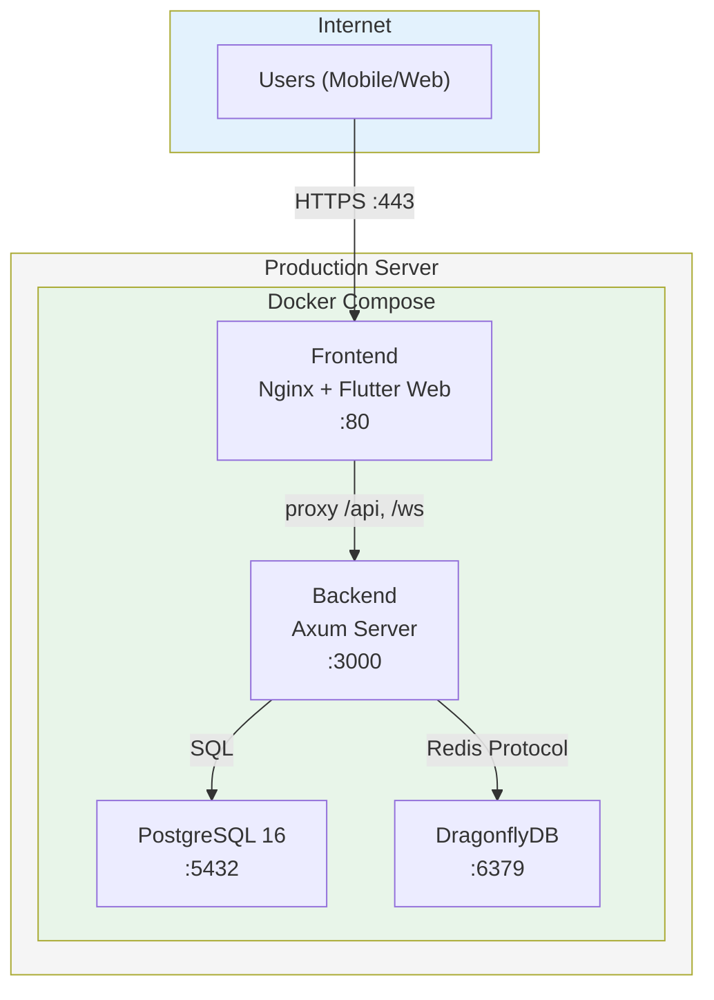
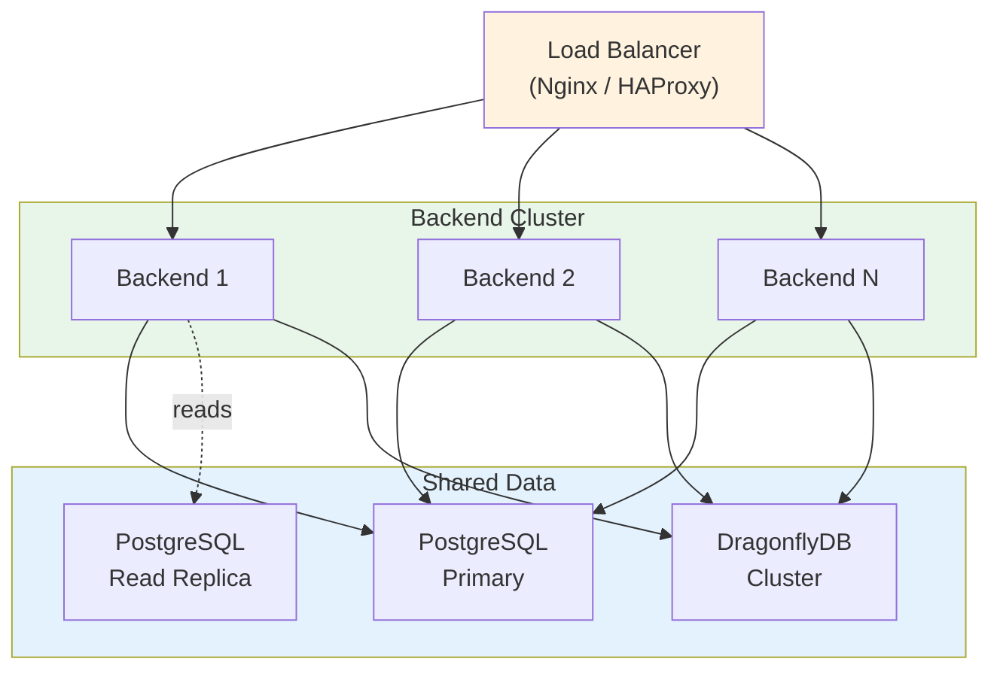

# SmartMath Kids — Production Deployment Guide

This guide covers deploying SmartMath Kids to a production environment using Docker.

---

## Table of Contents

1. [Deployment Architecture](#1-deployment-architecture)
2. [Prerequisites](#2-prerequisites)
3. [Docker Build](#3-docker-build)
4. [Environment Variables](#4-environment-variables)
5. [Database Setup](#5-database-setup)
6. [Running in Production](#6-running-in-production)
7. [Health Checks & Monitoring](#7-health-checks--monitoring)
8. [SSL/TLS Configuration](#8-ssltls-configuration)
9. [Backup & Recovery](#9-backup--recovery)
10. [Scaling Strategy](#10-scaling-strategy)
11. [Performance Tuning](#11-performance-tuning)
12. [Security Checklist](#12-security-checklist)

---

## 1. Deployment Architecture



### Service Topology

| Service | Image | Exposed Port | Internal Port | Persistent Storage |
|---|---|---|---|---|
| **Frontend** | Custom (Flutter web + Nginx) | 80/443 | 80 | None (static files) |
| **Backend** | Custom (Rust binary) | — | 3000 | None (stateless) |
| **PostgreSQL** | `postgres:16-alpine` | — | 5432 | `postgres-data` volume |
| **DragonflyDB** | `dragonflydb/dragonfly:latest` | — | 6379 | `dragonfly-data` volume |

> **Note**: In production, only the frontend Nginx port is exposed publicly. All other services communicate over the Docker internal network.

---

## 2. Prerequisites

| Requirement | Minimum | Recommended |
|---|---|---|
| **CPU** | 2 cores | 4+ cores |
| **RAM** | 4 GB | 8+ GB |
| **Disk** | 20 GB SSD | 50+ GB SSD |
| **Docker** | 24+ | Latest stable |
| **Docker Compose** | v2+ | Latest stable |
| **OS** | Ubuntu 22.04 / Debian 12 | Ubuntu 24.04 |

---

## 3. Docker Build

### 3.1 Backend Dockerfile (4-Stage Build)

The backend uses a multi-stage build with `cargo-chef` for optimal Docker layer caching:

```
Stage 1: Chef     → Install cargo-chef tool
Stage 2: Planner  → Analyze dependencies, create recipe.json
Stage 3: Builder  → Build dependencies (cached), then build application
Stage 4: Runtime  → Minimal Debian slim image with compiled binary
```

```bash
# Build backend image
docker build -t smartmath-backend:latest ./backend

# Check image size (expect ~50-80MB)
docker images smartmath-backend
```

**Key optimizations:**
- Dependencies are cached in a separate layer — rebuilds only recompile application code
- `cargo-chef` ensures dependency caching works correctly with Cargo's build system
- Runtime image uses `debian:bookworm-slim` (~80MB vs ~1.5GB for build image)
- Binary is compiled with `opt-level = 3`, LTO, single codegen unit, and symbol stripping
- Non-root user (`appuser:appgroup`) for security

### 3.2 Frontend Dockerfile (2-Stage Build)

```
Stage 1: Builder  → Flutter SDK, pub get, code generation, web build
Stage 2: Runtime  → Nginx Alpine serving static files
```

```bash
# Build frontend image
docker build -t smartmath-frontend:latest ./frontend

# Check image size (expect ~30-50MB)
docker images smartmath-frontend
```

**Key features:**
- CanvasKit renderer for maximum cross-browser compatibility
- Nginx handles SPA routing, API/WS proxy, gzip compression, security headers
- Static assets are content-hashed with 1-year cache headers

### 3.3 Build All Services

```bash
# Build all images
docker compose build

# Build without cache (clean rebuild)
docker compose build --no-cache

# Build specific service
docker compose build backend
```

---

## 4. Environment Variables

### 4.1 Required Production Variables

Create a `.env` file on your production server:

```bash
# ============================================
# PRODUCTION ENVIRONMENT CONFIGURATION
# ============================================

# PostgreSQL
POSTGRES_USER=smartmath_prod
POSTGRES_PASSWORD=<STRONG_RANDOM_PASSWORD_32_CHARS>
POSTGRES_DB=smartmath_prod
POSTGRES_PORT=5432

# DragonflyDB
REDIS_PASSWORD=<STRONG_RANDOM_PASSWORD_32_CHARS>
REDIS_PORT=6379

# Backend
BACKEND_PORT=3000
JWT_SECRET=<STRONG_RANDOM_SECRET_MINIMUM_64_CHARS>
JWT_ACCESS_TOKEN_EXPIRES_IN=15m
JWT_REFRESH_TOKEN_EXPIRES_IN=7d
RUST_LOG=info,smartmath_backend=info
ENVIRONMENT=production

# Frontend
FRONTEND_PORT=80
API_BASE_URL=https://your-domain.com/api/v1
WS_URL=wss://your-domain.com/ws
```

### 4.2 Generating Secure Secrets

```bash
# Generate JWT secret (64 chars)
openssl rand -base64 48

# Generate database password (32 chars)
openssl rand -base64 24

# Generate Redis password (32 chars)
openssl rand -base64 24
```

### 4.3 Variable Reference

| Variable | Required | Sensitive | Default | Description |
|---|---|---|---|---|
| `POSTGRES_USER` | Yes | No | — | Database username |
| `POSTGRES_PASSWORD` | Yes | **Yes** | — | Database password |
| `POSTGRES_DB` | Yes | No | — | Database name |
| `REDIS_PASSWORD` | Yes | **Yes** | — | Cache authentication |
| `JWT_SECRET` | Yes | **Yes** | — | JWT signing key (min 32 chars) |
| `JWT_ACCESS_TOKEN_EXPIRES_IN` | No | No | `15m` | Access token lifetime |
| `JWT_REFRESH_TOKEN_EXPIRES_IN` | No | No | `7d` | Refresh token lifetime |
| `RUST_LOG` | No | No | `info` | Log level filter |
| `ENVIRONMENT` | No | No | `development` | Runtime environment |

> **Critical**: Never use default passwords in production. Never commit `.env` files to version control.

---

## 5. Database Setup

### 5.1 Initial Setup

Migrations run automatically when the backend starts. However, for manual control:

```bash
# Start only PostgreSQL
docker compose up -d postgres

# Wait for healthy status
docker compose exec postgres pg_isready -U smartmath_prod

# Run migrations manually (if needed)
docker compose exec backend sqlx migrate run
```

### 5.2 Database Connection

```bash
# Connect to production database
docker compose exec postgres psql -U smartmath_prod -d smartmath_prod

# Check migration status
\dt  -- list all tables (expect 16 tables)

# Verify seed data
SELECT COUNT(*) FROM achievements;     -- expect 15
SELECT COUNT(*) FROM question_bank;    -- expect 40
SELECT COUNT(*) FROM unlockable_themes; -- expect 9
```

---

## 6. Running in Production

### 6.1 Start Services

```bash
# Start all services in detached mode
docker compose up -d

# Verify all services are healthy
docker compose ps

# Expected output:
# NAME                  STATUS          PORTS
# smartmath-postgres    Up (healthy)    5432/tcp
# smartmath-dragonfly   Up (healthy)    6379/tcp
# smartmath-backend     Up (healthy)    3000/tcp
# smartmath-frontend    Up              0.0.0.0:80->80/tcp
```

### 6.2 Startup Order

Docker Compose handles startup dependencies automatically:

```
1. PostgreSQL → starts first, health check: pg_isready
2. DragonflyDB → starts first, health check: redis-cli ping
3. Backend → waits for postgres + dragonfly healthy
4. Frontend → waits for backend
```

### 6.3 Restart Policies

All services use `restart: unless-stopped`, meaning they will:
- Restart automatically after crashes
- Restart after Docker daemon restarts
- NOT restart if manually stopped with `docker compose stop`

### 6.4 Log Management

All services use JSON file logging with rotation:

```yaml
logging:
  driver: "json-file"
  options:
    max-size: "10m"    # Max 10MB per log file
    max-file: "3"      # Keep 3 rotated files
```

```bash
# View real-time logs
docker compose logs -f

# View specific service logs
docker compose logs -f backend

# View last 100 lines
docker compose logs --tail 100 backend
```

### 6.5 Zero-Downtime Updates

```bash
# Pull latest code
git pull origin main

# Rebuild and restart services one at a time
docker compose build backend
docker compose up -d --no-deps backend

docker compose build frontend
docker compose up -d --no-deps frontend

# Verify health after update
curl -f http://localhost:3000/api/v1/health
```

---

## 7. Health Checks & Monitoring

### 7.1 Built-in Health Checks

| Service | Check | Interval | Timeout | Retries |
|---|---|---|---|---|
| **PostgreSQL** | `pg_isready` | 10s | 5s | 5 |
| **DragonflyDB** | `redis-cli ping` | 10s | 5s | 3 |
| **Backend** | `curl /api/v1/health` | 30s | 5s | 3 |
| **Frontend** | `wget http://localhost/` | 30s | 5s | 3 |

### 7.2 Health Endpoint

```bash
# Check backend health
curl -s http://localhost:3000/api/v1/health | jq

# Expected response:
{
  "status": "healthy",
  "version": "0.1.0",
  "db_connected": true,
  "redis_connected": true
}
```

### 7.3 Monitoring Commands

```bash
# Container resource usage
docker stats

# Disk usage
docker system df

# PostgreSQL connections
docker compose exec postgres psql -U smartmath_prod -c "SELECT count(*) FROM pg_stat_activity;"

# DragonflyDB stats
docker compose exec dragonfly redis-cli -a $REDIS_PASSWORD INFO stats
```

---

## 8. SSL/TLS Configuration

For production, add an Nginx reverse proxy or use a cloud load balancer for TLS termination.

### Option A: External Reverse Proxy (Recommended)

Add an `nginx-proxy` service or use your cloud provider's load balancer:

```nginx
# /etc/nginx/sites-available/smartmath
server {
    listen 443 ssl http2;
    server_name your-domain.com;

    ssl_certificate /etc/letsencrypt/live/your-domain.com/fullchain.pem;
    ssl_certificate_key /etc/letsencrypt/live/your-domain.com/privkey.pem;

    # Frontend
    location / {
        proxy_pass http://localhost:80;
        proxy_set_header Host $host;
        proxy_set_header X-Real-IP $remote_addr;
        proxy_set_header X-Forwarded-Proto $scheme;
    }

    # WebSocket
    location /ws {
        proxy_pass http://localhost:3000;
        proxy_http_version 1.1;
        proxy_set_header Upgrade $http_upgrade;
        proxy_set_header Connection "upgrade";
        proxy_read_timeout 86400s;
    }
}
```

### Option B: Let's Encrypt with Certbot

```bash
# Install certbot
sudo apt install certbot python3-certbot-nginx

# Obtain certificate
sudo certbot --nginx -d your-domain.com

# Auto-renewal (already configured by certbot)
sudo certbot renew --dry-run
```

---

## 9. Backup & Recovery

### 9.1 Database Backup

```bash
# Manual backup
docker compose exec postgres pg_dump -U smartmath_prod -d smartmath_prod > backup_$(date +%Y%m%d_%H%M%S).sql

# Compressed backup
docker compose exec postgres pg_dump -U smartmath_prod -d smartmath_prod | gzip > backup_$(date +%Y%m%d).sql.gz

# Automated daily backup (add to crontab)
# crontab -e
0 2 * * * docker compose -f /path/to/docker-compose.yml exec -T postgres pg_dump -U smartmath_prod -d smartmath_prod | gzip > /backups/smartmath_$(date +\%Y\%m\%d).sql.gz
```

### 9.2 Restore from Backup

```bash
# Stop backend to prevent writes
docker compose stop backend

# Restore
gunzip < backup_20260302.sql.gz | docker compose exec -T postgres psql -U smartmath_prod -d smartmath_prod

# Restart backend
docker compose start backend
```

### 9.3 DragonflyDB Snapshots

DragonflyDB is configured with automatic snapshots every 30 minutes:

```yaml
command: >
  --snapshot_cron "*/30 * * * *"
  --dbfilename dump
  --dir /data
```

Data is stored in the `dragonfly-data` Docker volume.

---

## 10. Scaling Strategy

### 10.1 Current Architecture (Single Server)

Suitable for up to **~1,000 concurrent users**:

| Component | Configuration |
|---|---|
| Backend | Single Axum instance (async, multi-threaded) |
| PostgreSQL | Single instance, connection pooling via sqlx |
| DragonflyDB | Single instance, multi-threaded |
| Frontend | Static files served by Nginx |

### 10.2 Phase 2: Horizontal Scaling

For **1,000 - 10,000 concurrent users**:



**Changes required:**
1. **Load Balancer**: Add Nginx/HAProxy in front of multiple backend instances
2. **PostgreSQL Read Replicas**: Offload read queries (leaderboard, progress)
3. **Redis Pub/Sub**: For WebSocket message synchronization across instances
4. **Sticky Sessions**: For WebSocket connections (or use Redis Pub/Sub)
5. **Shared Storage**: CDN for frontend static assets

### 10.3 Phase 3: Microservices

For **10,000+ concurrent users**:

| Service | Responsibility |
|---|---|
| **Auth Service** | Registration, login, token management |
| **Practice Service** | Questions, sessions, adaptive engine |
| **Gamification Service** | XP, achievements, themes, leaderboard |
| **Real-time Service** | WebSocket connections, competitions |
| **Message Queue** | NATS/Kafka for async event processing |

### 10.4 Quick Scaling Wins (No Architecture Change)

| Optimization | Impact | Effort |
|---|---|---|
| **CDN for frontend** | 50%+ latency reduction | Low |
| **PostgreSQL connection pooling** | Better DB utilization | Already done (sqlx) |
| **DragonflyDB maxmemory** | Increase to match available RAM | Config change |
| **Increase backend threads** | Better CPU utilization | Tokio handles this |
| **Gzip compression** | 60-80% bandwidth reduction | Already enabled |

---

## 11. Performance Tuning

### 11.1 PostgreSQL

```bash
# Connect and check configuration
docker compose exec postgres psql -U smartmath_prod -c "SHOW shared_buffers;"
docker compose exec postgres psql -U smartmath_prod -c "SHOW work_mem;"
```

Recommended production settings (add to `postgresql.conf` or Docker environment):

```yaml
# docker-compose.yml (postgres service)
environment:
  POSTGRES_SHARED_BUFFERS: "256MB"        # 25% of available RAM
  POSTGRES_EFFECTIVE_CACHE_SIZE: "1GB"    # 50-75% of available RAM
  POSTGRES_WORK_MEM: "16MB"              # Per-query memory
  POSTGRES_MAINTENANCE_WORK_MEM: "128MB"  # For VACUUM, INDEX
command: >
  postgres
  -c shared_buffers=256MB
  -c effective_cache_size=1GB
  -c work_mem=16MB
  -c maintenance_work_mem=128MB
  -c max_connections=100
```

### 11.2 DragonflyDB

Current configuration:
- `--maxmemory 2gb` — Adjust based on available RAM
- `--cache_mode true` — Enables automatic eviction when memory limit is reached
- `--snapshot_cron "*/30 * * * *"` — Snapshot every 30 minutes

### 11.3 Backend

The Rust backend is compiled with maximum optimizations:

```toml
[profile.release]
opt-level = 3      # Maximum optimization
lto = true          # Link-Time Optimization
codegen-units = 1   # Single codegen unit (slower build, faster binary)
strip = true        # Strip debug symbols
```

---

## 12. Security Checklist

### Pre-Deployment

- [ ] **JWT_SECRET**: Minimum 64 characters, randomly generated
- [ ] **POSTGRES_PASSWORD**: Strong, randomly generated
- [ ] **REDIS_PASSWORD**: Strong, randomly generated
- [ ] **ENVIRONMENT**: Set to `production`
- [ ] **RUST_LOG**: Set to `info` (not `debug`)
- [ ] **CORS origins**: Restricted to your domain (not `*`)
- [ ] `.env` file permissions: `chmod 600 .env`
- [ ] `.env` NOT in version control

### Network

- [ ] Only port 80/443 exposed to internet
- [ ] PostgreSQL and DragonflyDB NOT exposed externally
- [ ] Docker internal network isolates services
- [ ] TLS/SSL configured for HTTPS
- [ ] WebSocket connections use WSS

### Application

- [ ] Rate limiting enabled (5 req/min on auth endpoints)
- [ ] Argon2id password hashing (memory-hard)
- [ ] JWT access tokens expire in 15 minutes
- [ ] Refresh tokens stored in Redis with TTL
- [ ] Compile-time SQL checking prevents injection (sqlx)
- [ ] Non-root user in Docker containers
- [ ] Security headers set by Nginx (X-Frame-Options, X-Content-Type-Options, etc.)

### Ongoing

- [ ] Regular dependency updates (`cargo update`, `flutter pub upgrade`)
- [ ] Monitor Docker image vulnerabilities (`docker scout cves`)
- [ ] Database backups verified and tested
- [ ] Log rotation configured (max 10MB × 3 files per service)
- [ ] Health check endpoints monitored

---

*Last updated: March 2026*
