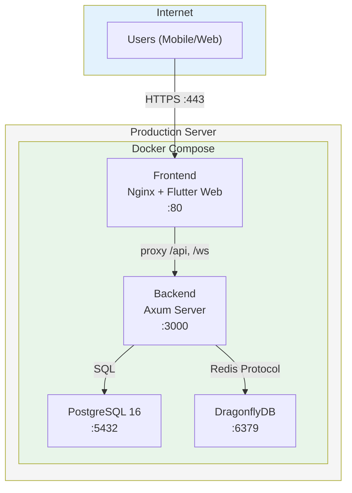
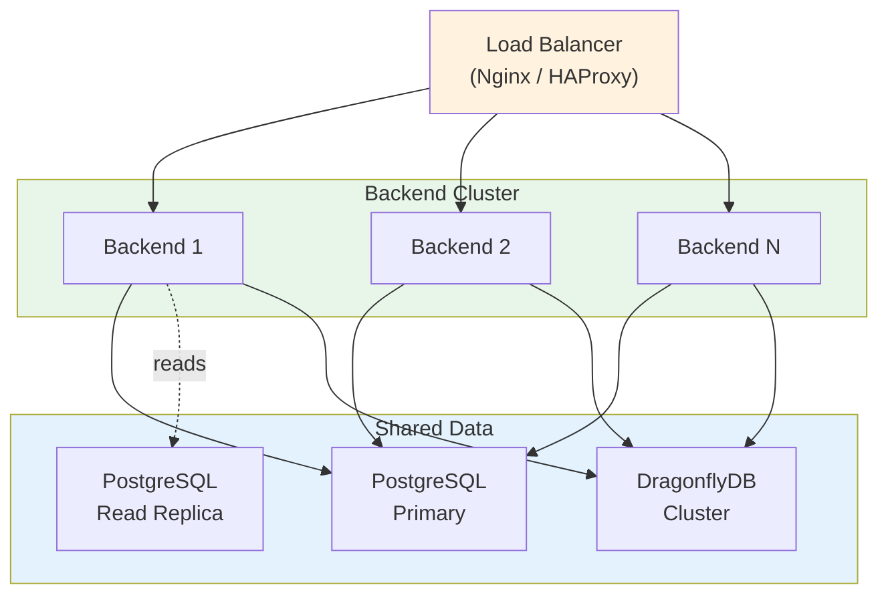

# SmartMath Kids — Hướng dẫn Triển khai Production

Hướng dẫn này bao gồm việc triển khai SmartMath Kids vào môi trường production bằng Docker.

---

## Mục lục

1. [Kiến trúc Triển khai](#1-deployment-architecture)
2. [Điều kiện tiên quyết](#2-prerequisites)
3. [Build Docker](#3-docker-build)
4. [Biến Môi trường](#4-environment-variables)
5. [Thiết lập Cơ sở dữ liệu](#5-database-setup)
6. [Chạy trong môi trường Production](#6-running-in-production)
7. [Kiểm tra Sức khỏe & Giám sát](#7-health-checks--monitoring)
8. [Cấu hình SSL/TLS](#8-ssltls-configuration)
9. [Sao lưu & Phục hồi](#9-backup--recovery)
10. [Chiến lược Mở rộng](#10-scaling-strategy)
11. [Tối ưu hiệu suất](#11-performance-tuning)
12. [Danh sách Kiểm tra Bảo mật](#12-security-checklist)

---

## 1. Kiến trúc Triển khai



### Sơ đồ Dịch vụ

| Dịch vụ | Image | Cổng công khai | Cổng nội bộ | Lưu trữ bền vững |
|---|---|---|---|---|
| **Frontend** | Custom (Flutter web + Nginx) | 80/443 | 80 | Không (static files) |
| **Backend** | Custom (Rust binary) | — | 3000 | Không (stateless) |
| **PostgreSQL** | `postgres:16-alpine` | — | 5432 | `postgres-data` volume |
| **DragonflyDB** | `dragonflydb/dragonfly:latest` | — | 6379 | `dragonfly-data` volume |

> **Lưu ý**: Trong môi trường production, chỉ có cổng Nginx của frontend được mở công khai. Tất cả các dịch vụ khác giao tiếp qua mạng nội bộ của Docker.

---

## 2. Điều kiện tiên quyết

| Yêu cầu | Tối thiểu | Khuyến nghị |
|---|---|---|
| **CPU** | 2 cores | 4+ cores |
| **RAM** | 4 GB | 8+ GB |
| **Ổ cứng** | 20 GB SSD | 50+ GB SSD |
| **Docker** | 24+ | Bản ổn định mới nhất |
| **Docker Compose** | v2+ | Bản ổn định mới nhất |
| **Hệ điều hành** | Ubuntu 22.04 / Debian 12 | Ubuntu 24.04 |

---

## 3. Build Docker

### 3.1 Backend Dockerfile (Build 4 giai đoạn)

Backend sử dụng multi-stage build với `cargo-chef` để tối ưu hóa việc lưu bộ nhớ đệm (caching) các lớp Docker:

```
Stage 1: Chef     → Cài đặt công cụ cargo-chef
Stage 2: Planner  → Phân tích phụ thuộc, tạo recipe.json
Stage 3: Builder  → Build các phụ thuộc (được cache), sau đó build ứng dụng
Stage 4: Runtime  → Image Debian slim tối giản với file thực thi đã biên dịch
```

```bash
# Build backend image
docker build -t smartmath-backend:latest ./backend

# Kiểm tra dung lượng image (dự kiến ~50-80MB)
docker images smartmath-backend
```

**Các tối ưu hóa chính:**
- Các phụ thuộc (dependencies) được lưu trong một lớp riêng biệt — việc build lại chỉ biên dịch lại mã nguồn ứng dụng
- `cargo-chef` đảm bảo việc lưu cache phụ thuộc hoạt động chính xác với hệ thống build của Cargo
- Runtime image sử dụng `debian:bookworm-slim` (~80MB so với ~1.5GB của build image)
- Binary được biên dịch với `opt-level = 3`, LTO, single codegen unit, và loại bỏ ký hiệu (symbol stripping)
- Sử dụng người dùng không có quyền root (`appuser:appgroup`) để bảo mật

### 3.2 Frontend Dockerfile (Build 2 giai đoạn)

```
Stage 1: Builder  → Flutter SDK, pub get, tạo mã (code generation), build web
Stage 2: Runtime  → Nginx Alpine phục vụ các file tĩnh
```

```bash
# Build frontend image
docker build -t smartmath-frontend:latest ./frontend

# Kiểm tra dung lượng image (dự kiến ~30-50MB)
docker images smartmath-frontend
```

**Các tính năng chính:**
- Renderer CanvasKit để tương thích tối đa trên các trình duyệt
- Nginx xử lý định tuyến SPA, API/WS proxy, nén gzip, các tiêu đề bảo mật (security headers)
- Các tài sản tĩnh (static assets) được gắn mã hash nội dung với tiêu đề cache 1 năm

### 3.3 Build Tất cả Dịch vụ

```bash
# Build tất cả các image
docker compose build

# Build không dùng cache (build sạch lại từ đầu)
docker compose build --no-cache

# Build dịch vụ cụ thể
docker compose build backend
```

---

## 4. Biến Môi trường

### 4.1 Các biến Production bắt buộc

Tạo một tệp `.env` trên máy chủ production của bạn:

```bash
# ============================================
# CẤU HÌNH MÔI TRƯỜNG PRODUCTION
# ============================================

# PostgreSQL
POSTGRES_USER=smartmath_prod
POSTGRES_PASSWORD=<STRONG_RANDOM_PASSWORD_32_CHARS>
POSTGRES_DB=smartmath_prod
POSTGRES_PORT=5432

# DragonflyDB
REDIS_PASSWORD=<STRONG_RANDOM_PASSWORD_32_CHARS>
REDIS_PORT=6379

# Backend
BACKEND_PORT=3000
JWT_SECRET=<STRONG_RANDOM_SECRET_MINIMUM_64_CHARS>
JWT_ACCESS_TOKEN_EXPIRES_IN=15m
JWT_REFRESH_TOKEN_EXPIRES_IN=7d
RUST_LOG=info,smartmath_backend=info
APP_ENV=production

# Frontend
FRONTEND_PORT=80
API_BASE_URL=https://your-domain.com/api/v1
WS_URL=wss://your-domain.com/ws
```

### 4.2 Tạo các mã bí mật (Secrets) an toàn

```bash
# Tạo JWT secret (64 ký tự)
openssl rand -base64 48

# Tạo mật khẩu cơ sở dữ liệu (32 ký tự)
openssl rand -base64 24

# Tạo mật khẩu Redis (32 ký tự)
openssl rand -base64 24
```

### 4.3 Tham chiếu Biến

| Biến | Bắt buộc | Nhạy cảm | Mặc định | Mô tả |
|---|---|---|---|---|
| `POSTGRES_USER` | Có | Không | — | Tên người dùng cơ sở dữ liệu |
| `POSTGRES_PASSWORD` | Có | **Có** | — | Mật khẩu cơ sở dữ liệu |
| `POSTGRES_DB` | Có | Không | — | Tên cơ sở dữ liệu |
| `REDIS_PASSWORD` | Có | **Có** | — | Xác thực bộ nhớ đệm |
| `JWT_SECRET` | Có | **Có** | — | Khóa ký JWT (tối thiểu 32 ký tự) |
| `JWT_ACCESS_TOKEN_EXPIRES_IN` | Không | Không | `15m` | Thời gian sống của access token |
| `JWT_REFRESH_TOKEN_EXPIRES_IN` | Không | Không | `7d` | Thời gian sống của refresh token |
| `RUST_LOG` | Không | Không | `info` | Bộ lọc cấp độ log |
| `APP_ENV` | Không | Không | `development` | Môi trường ứng dụng |

> **Quan trọng**: Không bao giờ sử dụng mật khẩu mặc định trong production. Không bao giờ commit các tệp `.env` vào hệ thống quản lý phiên bản (git).

---

## 5. Thiết lập Cơ sở dữ liệu

### 5.1 Thiết lập Ban đầu

Các bản di chuyển (migrations) sẽ tự động chạy khi backend khởi động. Tuy nhiên, để kiểm soát thủ công:

```bash
# Chỉ khởi động PostgreSQL
docker compose up -d postgres

# Chờ trạng thái sẵn sàng
docker compose exec postgres pg_isready -U smartmath_prod

# Chạy migrations thủ công (nếu cần)
docker compose exec backend sqlx migrate run
```

### 5.2 Kết nối Cơ sở dữ liệu

```bash
# Kết nối tới cơ sở dữ liệu production
docker compose exec postgres psql -U smartmath_prod -d smartmath_prod

# Kiểm tra trạng thái migration
\dt  -- liệt kê tất cả các bảng (dự kiến 16 bảng)

# Kiểm tra dữ liệu mẫu (seed data)
SELECT COUNT(*) FROM achievements;     -- dự kiến 15
SELECT COUNT(*) FROM question_bank;    -- dự kiến 40
SELECT COUNT(*) FROM unlockable_themes; -- dự kiến 9
```

---

## 6. Chạy trong môi trường Production

### 6.1 Khởi động Dịch vụ

```bash
# Khởi động tất cả dịch vụ ở chế độ chạy ngầm
docker compose up -d

# Xác nhận tất cả các dịch vụ đều khỏe mạnh
docker compose ps

# Kết quả dự kiến:
# NAME                  STATUS          PORTS
# smartmath-postgres    Up (healthy)    5432/tcp
# smartmath-dragonfly   Up (healthy)    6379/tcp
# smartmath-backend     Up (healthy)    3000/tcp
# smartmath-frontend    Up              0.0.0.0:80->80/tcp
```

### 6.2 Thứ tự Khởi động

Docker Compose tự động xử lý các phụ thuộc khi khởi động:

```
1. PostgreSQL → khởi động trước, kiểm tra sức khỏe: pg_isready
2. DragonflyDB → khởi động trước, kiểm tra sức khỏe: redis-cli ping
3. Backend → chờ postgres + dragonfly khỏe mạnh
4. Frontend → chờ backend
```

### 6.3 Chính sách Tái khởi động

Tất cả các dịch vụ sử dụng `restart: unless-stopped`, có nghĩa là chúng sẽ:
- Tự động tái khởi động sau khi bị sập (crash)
- Tái khởi động sau khi Docker daemon khởi động lại
- KHÔNG tái khởi động nếu bị dừng thủ công bằng `docker compose stop`

### 6.4 Quản lý Log

Tất cả các dịch vụ sử dụng log file JSON với cơ chế xoay vòng:

```yaml
logging:
  driver: "json-file"
  options:
    max-size: "10m"    # Tối đa 10MB mỗi file log
    max-file: "3"      # Giữ lại 3 file xoay vòng
```

```bash
# Xem log thời gian thực
docker compose logs -f

# Xem log của dịch vụ cụ thể
docker compose logs -f backend

# Xem 100 dòng cuối cùng
docker compose logs --tail 100 backend
```

### 6.5 Cập nhật không gây Gián đoạn (Zero-Downtime)

```bash
# Kéo mã nguồn mới nhất
git pull origin main

# Build lại và khởi động lại từng dịch vụ một
docker compose build backend
docker compose up -d --no-deps backend

docker compose build frontend
docker compose up -d --no-deps frontend

# Kiểm tra sức khỏe sau khi cập nhật
curl -f http://localhost:3000/api/v1/health
```

---

## 7. Kiểm tra Sức khỏe & Giám sát

### 7.1 Các kiểm tra Sức khỏe tích hợp sẵn

| Dịch vụ | Kiểm tra | Khoảng cách | Thời gian chờ | Số lần thử |
|---|---|---|---|---|
| **PostgreSQL** | `pg_isready` | 10s | 5s | 5 |
| **DragonflyDB** | `redis-cli ping` | 10s | 5s | 3 |
| **Backend** | `curl /api/v1/health` | 30s | 5s | 3 |
| **Frontend** | `wget http://localhost/` | 30s | 5s | 3 |

### 7.2 Endpoint Sức khỏe

```bash
# Kiểm tra sức khỏe backend
curl -s http://localhost:3000/api/v1/health | jq

# Phản hồi dự kiến:
{
  "status": "healthy",
  "version": "0.1.0",
  "db_connected": true,
  "redis_connected": true
}
```

### 7.3 Các lệnh Giám sát

```bash
# Sử dụng tài nguyên của container
docker stats

# Sử dụng ổ cứng
docker system df

# Các kết nối PostgreSQL
docker compose exec postgres psql -U smartmath_prod -c "SELECT count(*) FROM pg_stat_activity;"

# Thống kê DragonflyDB
docker compose exec dragonfly redis-cli -a $REDIS_PASSWORD INFO stats
```

---

## 8. Cấu hình SSL/TLS

Đối với môi trường production, hãy thêm một Nginx reverse proxy hoặc sử dụng cloud load balancer để kết thúc TLS.

### Lựa chọn A: Reverse Proxy bên ngoài (Khuyến nghị)

Thêm một dịch vụ `nginx-proxy` hoặc sử dụng load balancer của nhà cung cấp đám mây:

```nginx
# /etc/nginx/sites-available/smartmath
server {
    listen 443 ssl http2;
    server_name your-domain.com;

    ssl_certificate /etc/letsencrypt/live/your-domain.com/fullchain.pem;
    ssl_certificate_key /etc/letsencrypt/live/your-domain.com/privkey.pem;

    # Frontend
    location / {
        proxy_pass http://localhost:80;
        proxy_set_header Host $host;
        proxy_set_header X-Real-IP $remote_addr;
        proxy_set_header X-Forwarded-Proto $scheme;
    }

    # WebSocket
    location /ws {
        proxy_pass http://localhost:3000;
        proxy_http_version 1.1;
        proxy_set_header Upgrade $http_upgrade;
        proxy_set_header Connection "upgrade";
        proxy_read_timeout 86400s;
    }
}
```

### Lựa chọn B: Let's Encrypt với Certbot

```bash
# Cài đặt certbot
sudo apt install certbot python3-certbot-nginx

# Lấy chứng chỉ
sudo certbot --nginx -d your-domain.com

# Tự động gia hạn (đã được cấu hình bởi certbot)
sudo certbot renew --dry-run
```

---

## 9. Sao lưu & Phục hồi

### 9.1 Sao lưu Cơ sở dữ liệu

```bash
# Sao lưu thủ công
docker compose exec postgres pg_dump -U smartmath_prod -d smartmath_prod > backup_$(date +%Y%m%d_%H%M%S).sql

# Sao lưu nén
docker compose exec postgres pg_dump -U smartmath_prod -d smartmath_prod | gzip > backup_$(date +%Y%m%d).sql.gz

# Tự động sao lưu hàng ngày (thêm vào crontab)
# crontab -e
0 2 * * * docker compose -f /path/to/docker-compose.yml exec -T postgres pg_dump -U smartmath_prod -d smartmath_prod | gzip > /backups/smartmath_$(date +\%Y\%m\%d).sql.gz
```

### 9.2 Phục hồi từ Bản sao lưu

```bash
# Dừng backend để ngăn chặn ghi dữ liệu
docker compose stop backend

# Phục hồi
gunzip < backup_20260302.sql.gz | docker compose exec -T postgres psql -U smartmath_prod -d smartmath_prod

# Khởi động lại backend
docker compose start backend
```

### 9.3 DragonflyDB Snapshots

DragonflyDB được cấu hình để tự động chụp snapshot mỗi 30 phút:

```yaml
command: >
  --snapshot_cron "*/30 * * * *"
  --dbfilename dump
  --dir /data
```

Dữ liệu được lưu trữ trong volume Docker `dragonfly-data`.

---

## 10. Chiến lược Mở rộng

### 10.1 Kiến trúc Hiện tại (Máy chủ Đơn lẻ)

Phù hợp cho tối đa **~1,000 người dùng đồng thời**:

| Thành phần | Cấu hình |
|---|---|
| Backend | Một instance Axum duy nhất (bất đồng bộ, đa luồng) |
| PostgreSQL | Một instance duy nhất, connection pooling qua sqlx |
| DragonflyDB | Một instance duy nhất, đa luồng |
| Frontend | Các file tĩnh được phục vụ bởi Nginx |

### 10.2 Giai đoạn 2: Mở rộng theo chiều ngang (Horizontal Scaling)

Dành cho **1,000 - 10,000 người dùng đồng thời**:



**Các thay đổi cần thiết:**
1. **Load Balancer**: Thêm Nginx/HAProxy phía trước nhiều instance backend
2. **PostgreSQL Read Replicas**: Giảm tải các truy vấn đọc (bảng xếp hạng, tiến độ)
3. **Redis Pub/Sub**: Để đồng bộ hóa tin nhắn WebSocket giữa các instance
4. **Sticky Sessions**: Cho các kết nối WebSocket (hoặc sử dụng Redis Pub/Sub)
5. **Shared Storage**: CDN cho các tài sản tĩnh của frontend

### 10.3 Giai đoạn 3: Microservices

Dành cho **10,000+ người dùng đồng thời**:

| Dịch vụ | Trách nhiệm |
|---|---|
| **Auth Service** | Đăng ký, đăng nhập, quản lý token |
| **Practice Service** | Câu hỏi, phiên học, engine thích ứng |
| **Gamification Service** | XP, thành tích, chủ đề, bảng xếp hạng |
| **Real-time Service** | Kết nối WebSocket, thi đấu |
| **Message Queue** | NATS/Kafka để xử lý sự kiện bất đồng bộ |

### 10.4 Các bước Mở rộng Nhanh (Không thay đổi Kiến trúc)

| Tối ưu hóa | Tác động | Công sức |
|---|---|---|
| **CDN cho frontend** | Giảm độ trễ 50%+ | Thấp |
| **PostgreSQL connection pooling** | Tận dụng DB tốt hơn | Đã thực hiện (sqlx) |
| **DragonflyDB maxmemory** | Tăng lên để khớp với RAM hiện có | Thay đổi cấu hình |
| **Tăng số luồng backend** | Tận dụng CPU tốt hơn | Tokio tự xử lý việc này |
| **Nén Gzip** | Giảm 60-80% băng thông | Đã bật |

---

## 11. Tối ưu hiệu suất

### 11.1 PostgreSQL

```bash
# Kết nối và kiểm tra cấu hình
docker compose exec postgres psql -U smartmath_prod -c "SHOW shared_buffers;"
docker compose exec postgres psql -U smartmath_prod -c "SHOW work_mem;"
```

Các thiết lập production được khuyến nghị (thêm vào `postgresql.conf` hoặc môi trường Docker):

```yaml
# docker-compose.yml (postgres service)
environment:
  POSTGRES_SHARED_BUFFERS: "256MB"        # 25% RAM hiện có
  POSTGRES_EFFECTIVE_CACHE_SIZE: "1GB"    # 50-75% RAM hiện có
  POSTGRES_WORK_MEM: "16MB"              # Bộ nhớ cho mỗi truy vấn
  POSTGRES_MAINTENANCE_WORK_MEM: "128MB"  # Cho VACUUM, INDEX
command: >
  postgres
  -c shared_buffers=256MB
  -c effective_cache_size=1GB
  -c work_mem=16MB
  -c maintenance_work_mem=128MB
  -c max_connections=100
```

### 11.2 DragonflyDB

Cấu hình hiện tại:
- `--maxmemory 2gb` — Điều chỉnh dựa trên RAM hiện có
- `--cache_mode true` — Cho phép tự động loại bỏ dữ liệu khi đạt giới hạn bộ nhớ
- `--snapshot_cron "*/30 * * * *"` — Chụp snapshot mỗi 30 phút

### 11.3 Backend

Rust backend được biên dịch với các tối ưu hóa tối đa:

```toml
[profile.release]
opt-level = 3      # Tối ưu hóa tối đa
lto = true          # Tối ưu hóa thời gian liên kết (Link-Time Optimization)
codegen-units = 1   # Single codegen unit (build chậm hơn, binary nhanh hơn)
strip = true        # Loại bỏ các ký hiệu debug
```

---

## 12. Danh sách Kiểm tra Bảo mật

### Trước khi Triển khai

- [ ] **JWT_SECRET**: Tối thiểu 64 ký tự, được tạo ngẫu nhiên
- [ ] **POSTGRES_PASSWORD**: Mạnh, được tạo ngẫu nhiên
- [ ] **REDIS_PASSWORD**: Mạnh, được tạo ngẫu nhiên
- [ ] **APP_ENV**: Thiết lập là `production`
- [ ] **RUST_LOG**: Thiết lập là `info` (không để `debug`)
- [ ] **CORS origins**: Giới hạn trong tên miền của bạn (không để `*`)
- [ ] Quyền hạn tệp `.env`: `chmod 600 .env`
- [ ] `.env` KHÔNG nằm trong quản lý phiên bản

### Mạng lưới

- [ ] Chỉ cổng 80/443 được mở ra internet
- [ ] PostgreSQL và DragonflyDB KHÔNG được mở ra bên ngoài
- [ ] Mạng nội bộ Docker cô lập các dịch vụ
- [ ] TLS/SSL được cấu hình cho HTTPS
- [ ] Các kết nối WebSocket sử dụng WSS

### Ứng dụng

- [ ] Đã bật giới hạn tốc độ (Rate limiting) (5 yêu cầu/phút trên các endpoint xác thực)
- [ ] Băm mật khẩu Argon2id (ngốn bộ nhớ - memory-hard)
- [ ] JWT access token hết hạn sau 15 phút
- [ ] Refresh token được lưu trong Redis với TTL
- [ ] Kiểm tra SQL tại thời điểm biên dịch giúp ngăn chặn injection (sqlx)
- [ ] Người dùng không có quyền root trong các container Docker
- [ ] Các tiêu đề bảo mật được thiết lập bởi Nginx (X-Frame-Options, X-Content-Type-Options, v.v.)

### Duy trì

- [ ] Cập nhật phụ thuộc thường xuyên (`cargo update`, `flutter pub upgrade`)
- [ ] Theo dõi lỗ hổng bảo mật image Docker (`docker scout cves`)
- [ ] Các bản sao lưu cơ sở dữ liệu được xác nhận và kiểm tra
- [ ] Cấu hình xoay vòng log (tối đa 10MB × 3 file mỗi dịch vụ)
- [ ] Các endpoint kiểm tra sức khỏe được giám sát

---

*Cập nhật lần cuối: Tháng 3 năm 2026*
